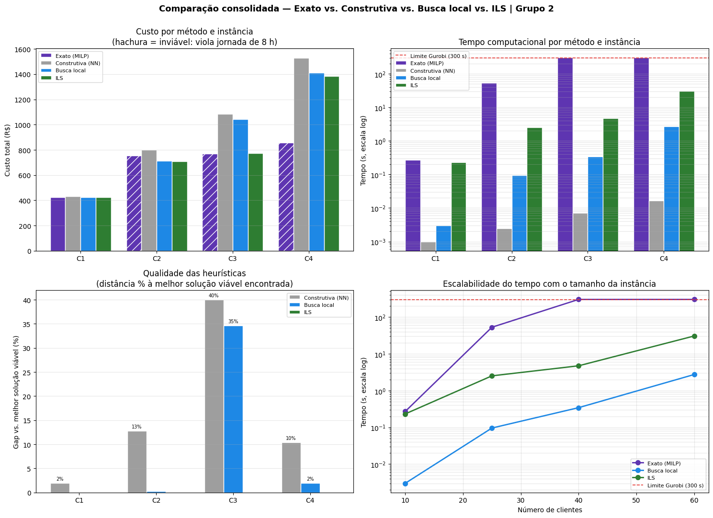

# Análise Comparativa Final — Exato, Construtivo, Busca Local e ILS para o CVRP da Prolog

**ENG 4560 — Projeto Integrado VI: Distribuição Física | Grupo 2**

As Sprints 1 e 2 desenvolveram, em aulas separadas, quatro famílias de método para o CVRP da Prolog: o modelo exato MILP com Gurobi (Aula 4), as heurísticas construtivas Nearest Neighbor e Clarke & Wright (Aula 7), a busca local 2-opt + Relocate + Swap (Aula 8) e a metaheurística Iterated Local Search (Aulas 11 e 12). Cada notebook mediu seus próprios resultados em sessões distintas. Este notebook consolida tudo numa única comparação e responde à pergunta da Sprint 3: qual abordagem é mais adequada para cada tamanho de instância, considerando custo, tempo e qualidade.

A consolidação enfrenta dois problemas de comparabilidade que os notebooks isolados não resolvem. O primeiro é o tempo: medições feitas em sessões diferentes não são comparáveis entre si, porque o relógio depende da carga da máquina. Por isso, as etapas heurísticas de custo computacional não desprezível — busca local e ILS — são reexecutadas aqui numa única sessão, e o custo de toda solução é reavaliado pela mesma função objetivo. O segundo é o gap de otimalidade: o MILP da Aula 4 resolve uma formulação relaxada (frota como tipo único por veículo, capacidade agregada, sem jornada de 8 h) e suas soluções para C2–C4 são inviáveis no problema real. O gap contra o exato só é legítimo onde os regimes coincidem, o que ocorre apenas em C1. Essa restrição, estabelecida na Aula 11, orienta toda a leitura comparativa.

O estudo cobre as quatro instâncias C1–C4 (10, 25, 40 e 60 clientes) e segue esta ordem: (0) ambiente e biblioteca unificada de avaliação; (1) método exato e seus limites; (2) pipeline heurístico reexecutado em sessão única; (3) tabela e gráficos comparativos; (4) síntese e recomendação operacional por tamanho de instância.

## Seção 0 — Ambiente, instâncias e biblioteca unificada

Esta seção prepara o que a comparação consome. As funções de avaliação de custo, viabilidade, busca local e ILS reproduzem o código de referência das Aulas 8 e 12 do professor — a mesma biblioteca usada na análise de sensibilidade —, garantindo que toda solução, de qualquer método, seja medida pela função objetivo idêntica: custo fixo do veículo mais custo variável por quilômetro, com viabilidade exigindo capacidade por rota e jornada de 8 h. Em seguida, carregamos as quatro instâncias C1–C4 (Aula 2) e as soluções salvas de cada método heurístico (construtivas da Aula 7, busca local da Aula 8, ILS da Aula 11) e reavaliamos o custo de cada uma sob essa função única, o que torna os custos diretamente comparáveis independentemente de como cada notebook original os calculou.

    Raiz do projeto: C:\Users\rodri\OneDrive\Documentos\Claude\Cowork\Proj. Distribuição Fisica
    Instancias: ['C1', 'C2', 'C3', 'C4']
    

    Biblioteca de avaliacao e viabilidade carregada.
    

    Biblioteca de busca local e ILS carregada (perturbacao double-bridge, criterio estrito).
    

    Instancias carregadas: {'C1': 10, 'C2': 25, 'C3': 40, 'C4': 60}
    Metodos com solucao salva: ['construtiva', 'busca_local', 'ils']
    Trilhas: ['nn', 'cw']
    

## Seção 1 — O método exato e seus limites

O CVRP é NP-difícil: o esforço para provar otimalidade cresce exponencialmente com o número de clientes. A Aula 4 formulou o problema como um MILP com frota heterogênea e restrições MTZ e o resolveu com o Gurobi, impondo um limite de tempo de 300 s por instância. Os resultados abaixo reproduzem o que aquele notebook registrou; o exato não é reexecutado aqui porque, ao contrário das heurísticas, sua execução não é barata — duas das quatro instâncias esgotam o orçamento de tempo sem prova de otimalidade.

Antes de usar esses números como referência de qualidade, é preciso registrar a divergência de formulação que a Aula 11 documentou. O MILP da Aula 4 trata o conjunto de veículos como tipos com saída única (no máximo uma rota Fiorino e uma rota VUC), usa capacidade agregada e não impõe a jornada de 8 h, validada apenas em pós-processamento. O pipeline heurístico, ao contrário, permite vários Fiorinos, impõe capacidade por rota e respeita a jornada. São problemas diferentes, e por isso o custo do exato não serve como denominador de gap de otimalidade exceto onde os dois regimes coincidem.

<table border="1" class="dataframe">
  <thead>
    <tr style="text-align: right;">
      <th></th>
      <th>n_cli</th>
      <th>custo_rs</th>
      <th>frota</th>
      <th>tempo_s</th>
      <th>status</th>
      <th>viola_jornada</th>
      <th>viavel_real</th>
    </tr>
    <tr>
      <th>instancia</th>
      <th></th>
      <th></th>
      <th></th>
      <th></th>
      <th></th>
      <th></th>
      <th></th>
    </tr>
  </thead>
  <tbody>
    <tr>
      <th>C1</th>
      <td>10</td>
      <td>422.38</td>
      <td>1 FIO</td>
      <td>0.27</td>
      <td>optimal</td>
      <td>0</td>
      <td>True</td>
    </tr>
    <tr>
      <th>C2</th>
      <td>25</td>
      <td>754.04</td>
      <td>1 VUC</td>
      <td>52.69</td>
      <td>optimal</td>
      <td>1</td>
      <td>False</td>
    </tr>
    <tr>
      <th>C3</th>
      <td>40</td>
      <td>769.65</td>
      <td>1 VUC</td>
      <td>300.73</td>
      <td>maxTimeLimit</td>
      <td>1</td>
      <td>False</td>
    </tr>
    <tr>
      <th>C4</th>
      <td>60</td>
      <td>858.31</td>
      <td>1 VUC</td>
      <td>300.88</td>
      <td>maxTimeLimit</td>
      <td>1</td>
      <td>False</td>
    </tr>
  </tbody>
</table>

A tabela expõe os dois limites do método exato. O primeiro é o tempo. Em C1 (10 clientes) o Gurobi prova otimalidade em 0,27 s; em C2 (25 clientes) ainda prova, mas leva 52,69 s — quase duzentas vezes mais para 2,5 vezes mais clientes. Em C3 e C4 o solver atinge o limite de 300 s e retorna com status `maxTimeLimit`: a solução de R$ 769,65 e R$ 858,31 é a melhor encontrada, não a ótima comprovada. É a assinatura da complexidade exponencial do CVRP — o exato deixa de ser viável como ferramenta de decisão a partir de algumas dezenas de clientes.

O segundo limite é a viabilidade. As soluções de C2, C3 e C4 consolidam toda a demanda num único VUC e violam a jornada de 8 h, que o MILP não impôs. O caso é gritante em C3 e C4: 40 e 60 clientes a 0,25 h de atendimento somam 10 h e 15 h só de serviço, muito acima do turno. Essas soluções são operacionalmente inexequíveis. A consequência para a comparação é direta e decisiva: apenas em C1 o exato entrega um ótimo viável no mesmo regime de frota do pipeline heurístico (uma rota Fiorino), e somente ali o gap de otimalidade contra o exato tem significado. Para C2–C4, o número do exato é a solução de um problema mais frouxo, e a referência honesta de qualidade passa a ser a melhor solução viável encontrada pelo pipeline heurístico.

## Seção 2 — Pipeline heurístico reexecutado em sessão única

Para que os tempos sejam comparáveis entre si, as duas etapas de custo computacional não desprezível são reexecutadas aqui, na mesma máquina e na mesma sessão: a busca local (2-opt + Relocate + Swap, partindo da solução construtiva, como na Aula 8) e o ILS (configuração da Equipe 2 — perturbação double-bridge, critério estrito, `k = 2` selecionado na análise de sensibilidade da Aula 12, 100 iterações, semente 42, partindo da solução de busca local). A heurística construtiva não é reexecutada: ela é determinística e roda em frações de segundo, abaixo do que distingue os demais métodos; seu custo é reavaliado da solução salva.

Usamos a trilha Nearest Neighbor, que venceu a Clarke & Wright nas instâncias maiores (C3 e C4) na Aula 11 e empatou nas menores. A coluna `busca_local` reexecutada é confrontada com o custo da solução salva da Aula 8 (`bl_salvo`) para confirmar que a reexecução reproduz fielmente o resultado original.

<table border="1" class="dataframe">
  <thead>
    <tr style="text-align: right;">
      <th></th>
      <th>n_cli</th>
      <th>construtiva</th>
      <th>busca_local</th>
      <th>bl_salvo</th>
      <th>t_bl_s</th>
      <th>ils</th>
      <th>t_ils_s</th>
      <th>viavel_ils</th>
    </tr>
    <tr>
      <th>instancia</th>
      <th></th>
      <th></th>
      <th></th>
      <th></th>
      <th></th>
      <th></th>
      <th></th>
      <th></th>
    </tr>
  </thead>
  <tbody>
    <tr>
      <th>C1</th>
      <td>10</td>
      <td>430.60</td>
      <td>422.38</td>
      <td>422.38</td>
      <td>0.00</td>
      <td>422.38</td>
      <td>0.23</td>
      <td>True</td>
    </tr>
    <tr>
      <th>C2</th>
      <td>25</td>
      <td>801.08</td>
      <td>712.49</td>
      <td>712.49</td>
      <td>0.10</td>
      <td>710.47</td>
      <td>2.51</td>
      <td>True</td>
    </tr>
    <tr>
      <th>C3</th>
      <td>40</td>
      <td>1084.86</td>
      <td>1043.69</td>
      <td>1043.69</td>
      <td>0.34</td>
      <td>775.01</td>
      <td>4.71</td>
      <td>True</td>
    </tr>
    <tr>
      <th>C4</th>
      <td>60</td>
      <td>1527.56</td>
      <td>1410.00</td>
      <td>1410.00</td>
      <td>2.73</td>
      <td>1383.14</td>
      <td>30.51</td>
      <td>True</td>
    </tr>
  </tbody>
</table>

A validação fecha: a busca local reexecutada coincide com a solução salva da Aula 8 em todas as instâncias (C4 = R$ 1.410,00 em ambas as colunas), confirmando que o pipeline reproduz o resultado original e que os tempos medidos aqui descrevem o mesmo cálculo. As soluções do ILS permanecem todas viáveis.

A progressão de custo na trilha NN mostra que o grosso da economia vem da busca local, não da metaheurística. Em C1, a construtiva de R$ 430,60 já cai para o ótimo de R$ 422,38 só com 2-opt + Relocate + Swap, e o ILS não acrescenta nada. Em C2 e C4 o padrão se repete: a queda grande é construtiva → busca local (R$ 801,08 → R$ 712,49 em C2; R$ 1.527,56 → R$ 1.410,00 em C4), e o ILS apara mais alguns reais (R$ 710,47 e R$ 1.383,14). A exceção aparente é C3, onde o ILS derruba o custo de R$ 1.043,69 para R$ 775,01 — uma queda de 25,7%. Como a Aula 12 estabeleceu, esse salto não é mérito das perturbações: é o efeito de não idempotência da busca local. A solução NN-C3 salva na Aula 8 não era um ótimo local de 2-opt + Relocate, e a reaplicação desses operadores na iteração 0 do ILS é o que a melhora; o ganho das perturbações double-bridge propriamente ditas fica abaixo de 1%.

Os tempos confirmam a hierarquia esperada. A busca local roda em menos de 3 s mesmo em C4; o ILS, por reaplicar Relocate a cada uma das 100 iterações, é a etapa cara, partindo de frações de segundo em C1 e chegando à casa dos 30 s em C4. Ainda assim, todo o pipeline heurístico para 60 clientes cabe em torno de meio minuto — uma ordem de grandeza distinta dos 300 s em que o exato sequer prova otimalidade. Os tempos de busca local e ILS são medições de relógio e oscilam alguns por cento entre execuções na mesma máquina; os valores determinísticos de custo e gap não.

## Seção 3 — Comparação consolidada

### 3.1 Tabela método × instância × custo × tempo × gap

A tabela reúne os quatro métodos sobre as quatro instâncias. O custo é o da função objetivo unificada; o tempo segue a procedência descrita acima (exato da Aula 4; construtiva da Aula 7, sub-segundo; busca local e ILS medidos nesta sessão). A coluna `gap_pct` mede a distância percentual à melhor solução **viável** encontrada em cada instância, que é sempre a do ILS. Em C1 essa melhor solução viável coincide com o ótimo provado pelo exato, então ali o gap é o gap de otimalidade no sentido clássico. Em C2–C4, como o exato é inviável, a melhor viável é a referência honesta de qualidade e o gap do exato fica indefinido — registrar um gap de otimalidade contra uma solução que viola a jornada não teria sentido.

<table border="1" class="dataframe">
  <thead>
    <tr style="text-align: right;">
      <th></th>
      <th>metodo</th>
      <th>instancia</th>
      <th>n_cli</th>
      <th>custo_rs</th>
      <th>tempo_s</th>
      <th>viavel</th>
      <th>gap_pct</th>
    </tr>
  </thead>
  <tbody>
    <tr>
      <th>0</th>
      <td>Exato (MILP)</td>
      <td>C1</td>
      <td>10</td>
      <td>422.38</td>
      <td>0.27</td>
      <td>True</td>
      <td>0.00</td>
    </tr>
    <tr>
      <th>1</th>
      <td>Construtiva (NN)</td>
      <td>C1</td>
      <td>10</td>
      <td>430.60</td>
      <td>0.00</td>
      <td>True</td>
      <td>1.94</td>
    </tr>
    <tr>
      <th>2</th>
      <td>Busca local</td>
      <td>C1</td>
      <td>10</td>
      <td>422.38</td>
      <td>0.00</td>
      <td>True</td>
      <td>0.00</td>
    </tr>
    <tr>
      <th>3</th>
      <td>ILS</td>
      <td>C1</td>
      <td>10</td>
      <td>422.38</td>
      <td>0.23</td>
      <td>True</td>
      <td>0.00</td>
    </tr>
    <tr>
      <th>4</th>
      <td>Exato (MILP)</td>
      <td>C2</td>
      <td>25</td>
      <td>754.04</td>
      <td>52.69</td>
      <td>False</td>
      <td>NaN</td>
    </tr>
    <tr>
      <th>5</th>
      <td>Construtiva (NN)</td>
      <td>C2</td>
      <td>25</td>
      <td>801.08</td>
      <td>0.00</td>
      <td>True</td>
      <td>12.75</td>
    </tr>
    <tr>
      <th>6</th>
      <td>Busca local</td>
      <td>C2</td>
      <td>25</td>
      <td>712.49</td>
      <td>0.10</td>
      <td>True</td>
      <td>0.28</td>
    </tr>
    <tr>
      <th>7</th>
      <td>ILS</td>
      <td>C2</td>
      <td>25</td>
      <td>710.47</td>
      <td>2.51</td>
      <td>True</td>
      <td>0.00</td>
    </tr>
    <tr>
      <th>8</th>
      <td>Exato (MILP)</td>
      <td>C3</td>
      <td>40</td>
      <td>769.65</td>
      <td>300.73</td>
      <td>False</td>
      <td>NaN</td>
    </tr>
    <tr>
      <th>9</th>
      <td>Construtiva (NN)</td>
      <td>C3</td>
      <td>40</td>
      <td>1084.86</td>
      <td>0.01</td>
      <td>True</td>
      <td>39.98</td>
    </tr>
    <tr>
      <th>10</th>
      <td>Busca local</td>
      <td>C3</td>
      <td>40</td>
      <td>1043.69</td>
      <td>0.34</td>
      <td>True</td>
      <td>34.67</td>
    </tr>
    <tr>
      <th>11</th>
      <td>ILS</td>
      <td>C3</td>
      <td>40</td>
      <td>775.01</td>
      <td>4.71</td>
      <td>True</td>
      <td>0.00</td>
    </tr>
    <tr>
      <th>12</th>
      <td>Exato (MILP)</td>
      <td>C4</td>
      <td>60</td>
      <td>858.31</td>
      <td>300.88</td>
      <td>False</td>
      <td>NaN</td>
    </tr>
    <tr>
      <th>13</th>
      <td>Construtiva (NN)</td>
      <td>C4</td>
      <td>60</td>
      <td>1527.56</td>
      <td>0.02</td>
      <td>True</td>
      <td>10.44</td>
    </tr>
    <tr>
      <th>14</th>
      <td>Busca local</td>
      <td>C4</td>
      <td>60</td>
      <td>1410.00</td>
      <td>2.73</td>
      <td>True</td>
      <td>1.94</td>
    </tr>
    <tr>
      <th>15</th>
      <td>ILS</td>
      <td>C4</td>
      <td>60</td>
      <td>1383.14</td>
      <td>30.51</td>
      <td>True</td>
      <td>0.00</td>
    </tr>
  </tbody>
</table>

A tabela separa três regimes. Em C1, todos convergem para o mesmo valor: o exato prova o ótimo de R$ 422,38 em 0,27 s, e a busca local e o ILS alcançam exatamente esse valor — gap de 0%. Para dez clientes, o exato é a ferramenta certa, rápido e ótimo, e as heurísticas apenas o igualam. A construtiva fica 1,94% acima, distância que a busca local fecha sozinha.

Em C2 o exato já se desqualifica como referência. Seu "ótimo" de R$ 754,04 é simultaneamente inviável (viola a jornada) e mais caro que a solução heurística de R$ 710,47, porque a formulação do MILP obriga um único VUC (R$ 550 de custo fixo) onde o pipeline usa dois Fiorinos (R$ 500). A heurística não supera o ótimo: ela opera num espaço de frota que o MILP proíbe e que é mais barato. O gap do exato é, por isso, deixado indefinido.

C3 e C4 expõem o custo da intratabilidade do exato e a divisão de trabalho dentro do pipeline. O exato estoura os 300 s sem provar otimalidade e devolve soluções de um único VUC com 10 h e 15 h de jornada — inúteis na operação. Entre as heurísticas, a busca local faz a maior parte: em C4 ela leva a construtiva de 10,44% para 1,94% acima do melhor viável, e o ILS apara o restante até R$ 1.383,14. C3 é o único caso em que a busca local fica longe (34,67% acima do ILS), e a Seção 2 já explicou a causa — a solução NN-C3 salva na Aula 8 não era um ótimo local, e é a reaplicação de 2-opt + Relocate na iteração 0 do ILS, não as perturbações, que recupera a diferença. O ILS é a melhor solução viável em todas as instâncias, ao custo de um tempo que cresce de frações de segundo em C1 à casa dos 30 s em C4.

### 3.2 Gráficos comparativos

Quatro recortes traduzem a tabela. O primeiro painel mostra o custo por método e instância, com as barras do exato hachuradas onde a solução é inviável. O segundo mostra o tempo em escala logarítmica, com a linha do limite de 300 s do Gurobi. O terceiro isola a qualidade das heurísticas, medida como distância à melhor solução viável. O quarto traça o tempo contra o número de clientes, para expor como cada método escala.

    

    

O painel de custo mostra que, fora de C1, o exato (roxo, hachurado) nunca entrega uma solução utilizável: em C2 sua barra é mais alta que a das heurísticas, e em C3 e C4 ela é mais baixa apenas porque viola a jornada. As barras viáveis — construtiva, busca local e ILS — contam a história relevante, com a construtiva sempre acima e busca local e ILS quase coladas, exceto em C3.

Os dois painéis de tempo são o argumento mais forte contra o exato. Em escala logarítmica, o tempo do Gurobi salta de 0,27 s em C1 para a barreira dos 300 s já em C3, encostando na linha vermelha do limite. A curva de escalabilidade deixa o ponto de virada explícito: entre 25 e 40 clientes o exato cruza para o platô de timeout, enquanto a busca local e o ILS crescem de forma suave e permanecem duas a três ordens de grandeza abaixo. Para o porte de operação da Prolog, o exato está fora de questão por tempo antes mesmo de entrar a questão da viabilidade.

O painel de qualidade resume a divisão de trabalho entre as heurísticas. O ILS é a referência viável (gap zero) em todas as instâncias. A busca local sozinha já chega muito perto — 0% em C1, 0,28% em C2, 2% em C4 —, e o único ponto em que destoa é C3 (35%), o artefato de não idempotência discutido nas Seções 2 e 3. A construtiva pura deixa de 2% a 40% sobre a mesa, o que justifica sempre encadear ao menos a busca local. O ILS agrega um polimento final consistente, porém pequeno fora de C3.

## Seção 4 — Síntese e recomendação por tamanho de instância

A pergunta de abertura era qual abordagem é mais adequada a cada tamanho de instância. A comparação consolidada responde por faixas.

Para instâncias muito pequenas, da ordem de dez clientes, o método exato é a escolha natural: em C1 o Gurobi prova o ótimo de R$ 422,38 em 0,27 s, e essa garantia de otimalidade é um ativo que nenhuma heurística oferece. Vale notar, porém, que a busca local e o ILS alcançam o mesmo valor em tempo igualmente desprezível — o exato ganha pela prova, não pelo custo.

Para instâncias médias, a partir de 25 clientes, o exato já perde nos dois critérios que importam. Em C2 ele consome 52,69 s, quase duzentas vezes o tempo de C1, e devolve uma solução que viola a jornada e ainda custa mais que a heurística (R$ 754,04 contra R$ 710,47), porque sua formulação relaxada o empurra para um único VUC. O ponto de virada da intratabilidade fica entre 25 e 40 clientes: em C3 e C4 o solver esgota os 300 s sem provar otimalidade e produz rotas de 10 h e 15 h, inexequíveis. Daí em diante o exato deixa de ser uma opção de planejamento e passa, no máximo, a um limite inferior de referência caso seja reformulado com capacidade por rota e jornada.

Para a operação real da Prolog, em qualquer porte, a recomendação é o pipeline heurístico. A heurística construtiva Nearest Neighbor dá um ponto de partida em frações de segundo, mas deixa de 2% a 40% sobre a mesa e nunca deve ser usada isolada. A busca local 2-opt + Relocate + Swap é a etapa que mais reduz custo e roda em menos de 3 s mesmo em C4; ela é a base obrigatória. O ILS com a configuração da Equipe 2 — double-bridge, critério estrito, `k = 2`, 50 a 100 iterações — entrega o polimento final e a melhor solução viável em todas as instâncias, ao custo de até cerca de meio minuto em C4. Esse polimento é pequeno fora de C3, mas barato o suficiente para se justificar sempre que houver janela de cálculo. A leitura central das Sprints 2 e 3 se confirma: a busca local faz o grosso do trabalho, o ILS refina, e o exato serve de garantia apenas onde o problema é pequeno o bastante para ser resolvido e sua formulação coincide com as restrições reais — o que, nesta base, ocorre somente em C1.

### 4.1 Salvamento de artefatos

A tabela consolidada e a figura comparativa são gravadas em `files/` e `images/` para alimentar o relatório de análise comparativa final da Sprint 3 (EAP 1.4.3). São exportações justificadas por consumo externo — o relatório —, não armazenamento de resultados intermediários.

    Arquivos gravados:
     - files/ comparacao_consolidada.csv
     - images/ comparacao_consolidada.png
    
