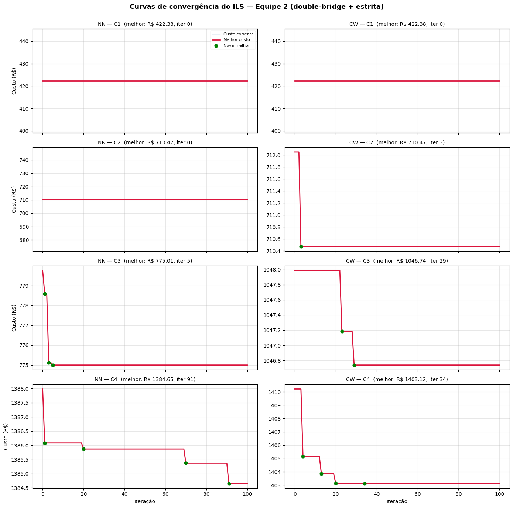
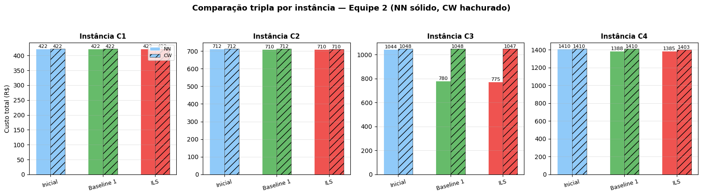
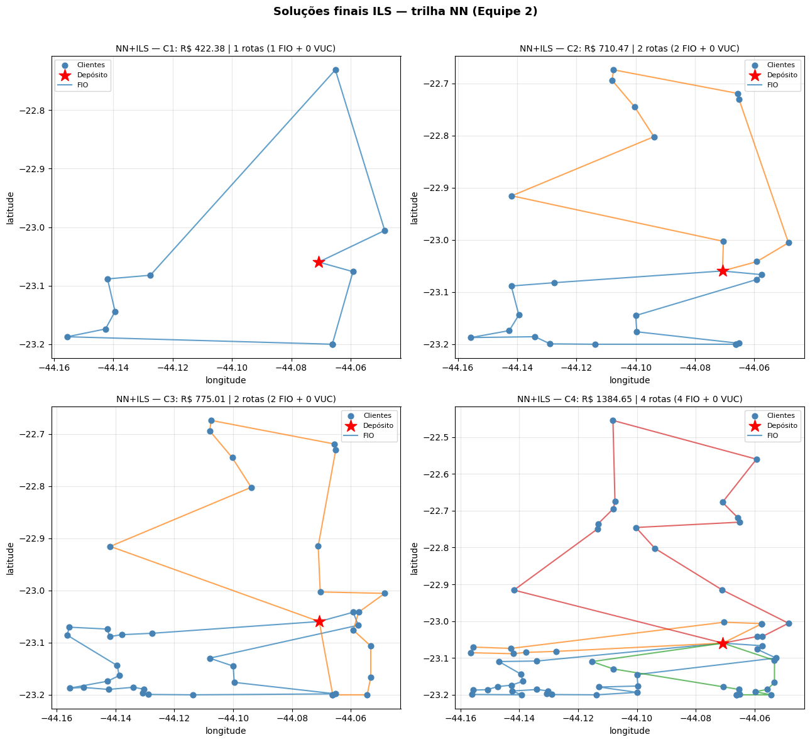

# Aula 11 — Iterated Local Search (ILS) para o CVRP da Prolog

Este notebook aplica a metaheurística Iterated Local Search sobre as soluções pós-busca-local geradas na Aula 8 e quantifica o ganho operacional obtido em relação à busca local standalone (Baseline 1) para as quatro instâncias C1–C4 do projeto.

A pergunta central da Sprint 3 é direta: a perturbação do ILS consegue escapar dos ótimos locais da Sprint 2 com ganho de custo relevante para a operação da Prolog? Em quais instâncias o esforço extra se paga, e em quais a busca local standalone já basta?

O grupo opera na configuração **Equipe 2** definida pelo professor no Sprint Planning #3 (Aula 11A, slide 8): perturbação **double-bridge** com critério de aceitação **estrito**. A busca local intra-ILS fica fixada em 2-opt + Relocate (mesma da Aula 8) para garantir comparação justa com as demais equipes da turma. O design experimental segue o protocolo da Tarefa 10: o ILS é executado em duas trilhas de solução inicial — Nearest Neighbor + busca local e Clarke-Wright + busca local — para que possamos comparar não só o ganho percentual mas também a qualidade final absoluta entregue por cada ponto de partida.

## 1. Preparação do ambiente

Definimos os caminhos relativos para as instâncias C1–C4 (geradas na Aula 2) e para as soluções pós-busca-local (geradas na Aula 8). As pastas `files/` e `images/` do diretório atual recebem os artefatos produzidos por esta aula.

    Datasets (Aula 2):        C:\Users\rodri\OneDrive\Documentos\Claude\Cowork\Proj. Distribuição Fisica\Aulas\2\datasets
    Soluções pós-BL (Aula 8): C:\Users\rodri\OneDrive\Documentos\Claude\Cowork\Proj. Distribuição Fisica\Aulas\8\Aula8_Busca_Local\files
    Instâncias: ['C1', 'C2', 'C3', 'C4']
    Heurísticas iniciais: ['NN', 'CW']
    

## 2. Carregamento das instâncias C1–C4

Reaproveitamos a função `load_instance` das Aulas 7 e 8. As instâncias carregadas aqui são exatamente as mesmas usadas em toda a Sprint 2, o que garante que qualquer diferença observada nos custos seja atribuível exclusivamente ao ILS e não a mudanças nos dados de entrada.

    C1: 10 clientes + depósito | demanda total = 141.56 kg | maior demanda = 52.95 kg
    C2: 25 clientes + depósito | demanda total = 754.48 kg | maior demanda = 129.25 kg
    C3: 40 clientes + depósito | demanda total = 1295.25 kg | maior demanda = 153.56 kg
    C4: 60 clientes + depósito | demanda total = 1958.12 kg | maior demanda = 206.05 kg
    

As quatro instâncias carregaram com o mesmo perfil das Aulas 7 e 8 — 10, 25, 40 e 60 clientes, demanda total crescendo de 141,56 kg a 1.958,12 kg, maior demanda individual de 206,05 kg em C4 (abaixo dos 650 kg do Fiorino). Nenhum cliente isolado força o uso do VUC por capacidade.

## 3. Parâmetros logísticos

Mantemos a especificação operacional das Aulas 4, 7 e 8: Fiorino (FIO) com 650 kg de capacidade e R$ 250 de custo fixo diário, VUC com 3.000 kg e R$ 550, custo variável uniforme de R$ 1,50/km, velocidade média de 40 km/h e jornada máxima de 8 horas. O atendimento por cliente é de 15 minutos. O código do professor (Seção 4 do `eng4560_aula_11_ils.py`) consolida tudo num único dicionário `params` que é passado adiante para todas as funções de rota.

    Parâmetros operacionais:
      capacity: {'FIO': 650.0, 'VUC': 3000.0}
      fixed_cost: {'FIO': 250.0, 'VUC': 550.0}
      cost_per_km: 1.5
      speed_kmh: 40.0
      max_hours: 8.0
    
    s (C1): mínimo (sem depósito) = 0.25, máximo = 0.25
    (15 min = 0.25 h; se o valor estiver em torno de 15, está em minutos)
    

Os tempos de atendimento `s` já vêm em horas (0,25 h = 15 min por cliente em todas as instâncias). Não precisamos da conversão `s/60` que o template do professor menciona como precaução para arquivos em minutos.

## 4. Carregamento das oito soluções pós-busca-local (Sprint 2)

A Aula 8 produziu oito JSONs em `Aulas/8/Aula8_Busca_Local/files/`: para cada instância C1–C4, uma solução pós-busca-local com semente Nearest Neighbor (`nn`) e outra com semente Clarke-Wright (`cw`). Essas oito soluções são os pontos de partida que alimentarão tanto o Baseline 1 (busca local standalone re-aplicada) quanto o ILS.

Carregar as duas trilhas — NN e CW — é o que viabiliza a Tarefa 10 do Sprint Planning #3: comparar não só ganho percentual mas também qualidade final absoluta de cada origem.

    Soluções iniciais carregadas:
      NN C1: 1 rotas | 10 clientes | veículos ['FIO']
      NN C2: 2 rotas | 25 clientes | veículos ['FIO', 'FIO']
      NN C3: 3 rotas | 40 clientes | veículos ['FIO', 'FIO', 'FIO']
      NN C4: 4 rotas | 60 clientes | veículos ['FIO', 'FIO', 'FIO', 'FIO']
      CW C1: 1 rotas | 10 clientes | veículos ['FIO']
      CW C2: 2 rotas | 25 clientes | veículos ['FIO', 'FIO']
      CW C3: 2 rotas | 40 clientes | veículos ['VUC', 'FIO']
      CW C4: 3 rotas | 60 clientes | veículos ['FIO', 'FIO', 'VUC']
    

As oito soluções carregaram com a estrutura esperada das Aulas 7 e 8. A composição de frota já difere entre as trilhas a olho nu: o NN distribui tudo em Fiorinos (1, 2, 3 e 4 rotas) e o CW recorre ao VUC para consolidar clientes em C3 e C4. Essa diferença estrutural é o que torna a Tarefa 10 interessante — o ILS partirá de pontos com perfis de frota diferentes, e a comparação dirá se a vantagem teórica do CW (rotas mais bem desenhadas) se mantém após a metaheurística ou se o NN é capaz de alcançá-lo via diversificação.

## 5. Seed e reprodutibilidade

Conforme o protocolo da Aula 11 (slide 22): seed fixa, mesma instância, mesma solução inicial. Sem isso, qualquer comparação entre equipes seria estatisticamente sem sentido.

    Seed fixada: 42
    

## 6. Funções de rota, viabilidade e métricas

O bloco abaixo replica literalmente as funções de rota da Seção 3 do template do professor (`eng4560_aula_11_ils.py`, Aula 11). São as mesmas usadas nas Aulas 7 e 8 — preservadas verbatim para garantir que a composição com o ILS seja idêntica ao que será aceito pelo professor.

    Funções de rota, viabilidade e métricas definidas.
    

Verificamos abaixo se as oito soluções pós-busca-local da Sprint 2 ainda são viáveis sob essas funções — qualquer divergência indicaria inconsistência entre os dados da Aula 2 e os JSONs salvos na Aula 8.

<table border="1" class="dataframe">
  <thead>
    <tr style="text-align: right;">
      <th></th>
      <th>heurística</th>
      <th>instância</th>
      <th>viável</th>
      <th>n_rotas</th>
      <th>fio/vuc</th>
      <th>dist_km</th>
      <th>custo_rs</th>
      <th>viol_cap</th>
      <th>viol_temp</th>
    </tr>
  </thead>
  <tbody>
    <tr>
      <th>0</th>
      <td>NN</td>
      <td>C1</td>
      <td>True</td>
      <td>1</td>
      <td>1/0</td>
      <td>114.92</td>
      <td>422.38</td>
      <td>0</td>
      <td>0</td>
    </tr>
    <tr>
      <th>1</th>
      <td>NN</td>
      <td>C2</td>
      <td>True</td>
      <td>2</td>
      <td>2/0</td>
      <td>141.66</td>
      <td>712.49</td>
      <td>0</td>
      <td>0</td>
    </tr>
    <tr>
      <th>2</th>
      <td>NN</td>
      <td>C3</td>
      <td>True</td>
      <td>3</td>
      <td>3/0</td>
      <td>195.79</td>
      <td>1043.69</td>
      <td>0</td>
      <td>0</td>
    </tr>
    <tr>
      <th>3</th>
      <td>NN</td>
      <td>C4</td>
      <td>True</td>
      <td>4</td>
      <td>4/0</td>
      <td>273.33</td>
      <td>1410.00</td>
      <td>0</td>
      <td>0</td>
    </tr>
    <tr>
      <th>4</th>
      <td>CW</td>
      <td>C1</td>
      <td>True</td>
      <td>1</td>
      <td>1/0</td>
      <td>114.92</td>
      <td>422.38</td>
      <td>0</td>
      <td>0</td>
    </tr>
    <tr>
      <th>5</th>
      <td>CW</td>
      <td>C2</td>
      <td>True</td>
      <td>2</td>
      <td>2/0</td>
      <td>141.37</td>
      <td>712.05</td>
      <td>0</td>
      <td>0</td>
    </tr>
    <tr>
      <th>6</th>
      <td>CW</td>
      <td>C3</td>
      <td>True</td>
      <td>2</td>
      <td>1/1</td>
      <td>165.33</td>
      <td>1047.99</td>
      <td>0</td>
      <td>0</td>
    </tr>
    <tr>
      <th>7</th>
      <td>CW</td>
      <td>C4</td>
      <td>True</td>
      <td>3</td>
      <td>2/1</td>
      <td>240.14</td>
      <td>1410.21</td>
      <td>0</td>
      <td>0</td>
    </tr>
  </tbody>
</table>

Todas as oito soluções permanecem viáveis sem nenhuma violação de capacidade ou jornada. Os custos batem com os reportados no README da Aula 8: NN-C1=422,38, NN-C2=712,49, NN-C3=1.043,69, NN-C4=1.410,00, CW-C1=422,38, CW-C2=712,05, CW-C3=1.047,99 e CW-C4=1.410,21. A diferença NN×CW por instância é mínima (≤ 0,5% em C1–C4), mas o CW economiza uma rota em C3 e em C4 ao mover demanda consolidada para o VUC. O ILS herdará esses dois perfis e precisará decidir se vale a pena reorganizar a frota.

## 7. Movimentos de busca local: 2-opt, Relocate e Swap

A busca local intra-ILS usa os mesmos três movimentos da Aula 8, encapsulados conforme o template do professor (Seção 4 do `eng4560_aula_11_ils.py`). A composição na Sprint 3 fica fixada em **2-opt + Relocate** (slide 14 da Aula 11): o Swap é o operador mais caro e o experimento controlado mantém todas as equipes na mesma vizinhança.

    Movimentos de busca local e busca local composta definidos.
    

## 8. Perturbações P1, P2 e P3

As três perturbações da Aula 11 são implementadas conforme as Seções 7 do template do professor. Mantemos a P2 (Swap aleatório) ainda que a configuração da Equipe 2 use apenas P3 — a manutenção das três variantes preserva a integridade do código de referência e permite, na Seção 13 (Tarefa 12, instância secreta), experimentar combinações livres sem reescrever funções.

A perturbação central da Equipe 2 é a **double-bridge** (P3). Sua propriedade-chave (slide 16): a reconexão `seg1 + seg3 + seg2 + seg4` produz uma sequência que nenhum movimento 2-opt consegue desfazer, garantindo que a busca local subsequente parta de uma bacia de atração genuinamente diferente.

    Perturbações P1, P2, P3 e dispatcher definidos.
    

## 9. Critério de aceitação e laço principal do ILS

O critério de aceitação determina o que é a "solução corrente" da próxima iteração. A Equipe 2 opera com aceitação **estrita** (slide 21 da Aula 11): só substitui a corrente se o candidato superar estritamente o custo dela. Mantemos a opção `tolerance` no código para permitir experimentação na seção da instância secreta.

O laço principal segue o fluxo da Aula 11 (slide 12) — solução inicial → busca local → ótimo local *S\** → perturbação → busca local → *S''\** → aceitação → atualização da melhor global. A atualização da melhor global é **independente** da aceitação (slide 18): um candidato pode estabelecer novo recorde mesmo sem ser aceito como corrente.

    accept_solution e iterated_local_search definidos.
    

## 10. Configuração da Equipe 2

A Tarefa 1 do Sprint Planning #3 exige o registro explícito da configuração experimental. A Equipe 2 (3VA e 3VB) opera com perturbação **double-bridge** e aceitação **estrita** — uma combinação que aposta na propriedade não-reversível do P3 para gerar diversificação sem precisar tolerar pioras na solução corrente.

    Configuração experimental — Equipe 2
    ----------------------------------------
         perturbation_type: double_bridge
            perturbation_k: 1
          accept_criterion: strict
             tolerance_pct: 0.0
                  use_2opt: True
              use_relocate: True
                  use_swap: False
              n_iterations: 100
                      seed: 42
    

## 11. Baseline 1 — busca local standalone

Antes do ILS, calculamos para cada uma das oito soluções pós-busca-local da Sprint 2 o resultado de uma busca local standalone re-aplicada (2-opt + Relocate). Este é o **Baseline 1** definido na Tarefa 3 do Sprint Planning #3 — a referência contra a qual o ganho do ILS é medido.

A re-aplicação tem dois efeitos esperados. Sobre as soluções da Aula 8, que já passaram por 2-opt + Relocate + Swap, o re-cálculo deve devolver o mesmo custo (idempotência da busca local). Sobre soluções construtivas brutas, traria ganhos relevantes — mas aqui estamos partindo de pontos já refinados, então o custo deve ficar essencialmente idêntico.

<table border="1" class="dataframe">
  <thead>
    <tr style="text-align: right;">
      <th></th>
      <th>heur.</th>
      <th>inst.</th>
      <th>custo_ini</th>
      <th>custo_BL</th>
      <th>delta</th>
      <th>n_rotas</th>
      <th>fio/vuc</th>
      <th>tempo_s</th>
    </tr>
  </thead>
  <tbody>
    <tr>
      <th>0</th>
      <td>NN</td>
      <td>C1</td>
      <td>422.38</td>
      <td>422.38</td>
      <td>0.00</td>
      <td>1</td>
      <td>1/0</td>
      <td>0.001</td>
    </tr>
    <tr>
      <th>1</th>
      <td>NN</td>
      <td>C2</td>
      <td>712.49</td>
      <td>710.47</td>
      <td>-2.02</td>
      <td>2</td>
      <td>2/0</td>
      <td>0.011</td>
    </tr>
    <tr>
      <th>2</th>
      <td>NN</td>
      <td>C3</td>
      <td>1043.69</td>
      <td>779.76</td>
      <td>-263.93</td>
      <td>2</td>
      <td>2/0</td>
      <td>0.043</td>
    </tr>
    <tr>
      <th>3</th>
      <td>NN</td>
      <td>C4</td>
      <td>1410.00</td>
      <td>1387.98</td>
      <td>-22.02</td>
      <td>4</td>
      <td>4/0</td>
      <td>0.266</td>
    </tr>
    <tr>
      <th>4</th>
      <td>CW</td>
      <td>C1</td>
      <td>422.38</td>
      <td>422.38</td>
      <td>0.00</td>
      <td>1</td>
      <td>1/0</td>
      <td>0.001</td>
    </tr>
    <tr>
      <th>5</th>
      <td>CW</td>
      <td>C2</td>
      <td>712.05</td>
      <td>712.05</td>
      <td>0.00</td>
      <td>2</td>
      <td>2/0</td>
      <td>0.010</td>
    </tr>
    <tr>
      <th>6</th>
      <td>CW</td>
      <td>C3</td>
      <td>1047.99</td>
      <td>1047.99</td>
      <td>0.00</td>
      <td>2</td>
      <td>1/1</td>
      <td>0.020</td>
    </tr>
    <tr>
      <th>7</th>
      <td>CW</td>
      <td>C4</td>
      <td>1410.21</td>
      <td>1410.21</td>
      <td>0.00</td>
      <td>3</td>
      <td>2/1</td>
      <td>0.078</td>
    </tr>
  </tbody>
</table>

Achado inesperado que vale registrar antes do ILS: a re-aplicação de 2-opt + Relocate sobre as soluções pós-busca-local da Aula 8 **não foi idempotente** na trilha NN. Em NN-C2 caiu R$ 2,02, em NN-C3 caiu **R$ 263,93 (−25,3%)** e em NN-C4 caiu R$ 22,02. A trilha CW é idempotente em todas as instâncias.

A explicação é estrutural: a Aula 8 aplicou os operadores na ordem 2-opt → Relocate → **Swap**. Cada vez que o Swap reorganiza clientes entre rotas, abre novas oportunidades para 2-opt e Relocate que não existiam antes. Como o template do ILS desliga o Swap (`use_swap=False`) por escolha de design da Sprint 3, a composição efetiva é diferente. Em NN-C3 isso aparece de forma dramática: o Relocate consegue colapsar uma das três rotas do NN e levar a solução a R$ 779,76 — abaixo até do que o CW entregava antes do ILS (R$ 1.047,99).

A consequência prática é que o **Baseline 1 corrige a base de comparação**: o ganho do ILS deve ser medido contra esse Baseline (R$ 779,76 em NN-C3), não contra o custo final da Aula 8 (R$ 1.043,69). Caso contrário, atribuiríamos ao ILS um ganho que na verdade vem da própria busca local — exatamente o erro metodológico que o protocolo da Aula 11 quer evitar.

## 12. Execução do ILS — Equipe 2 nas oito combinações

Rodamos o ILS com 100 iterações e seed 42 sobre cada uma das oito combinações (NN/CW × C1–C4). A configuração é a fixada na Seção 10 — double-bridge + estrita. O tempo computacional cresce com o tamanho da instância porque cada iteração executa uma busca local completa, que tem custo cúbico em pior caso. Para C4 estimamos algo entre 30 e 90 segundos por trilha; rodamos com timeout de 600 s por segurança.

      NN C1: BL R$ 422.38 -> ILS R$ 422.38 (+0.00%) | 0 melhorias | 0.2s
    

      NN C2: BL R$ 710.47 -> ILS R$ 710.47 (+0.00%) | 0 melhorias | 1.5s
    

      NN C3: BL R$ 779.76 -> ILS R$ 775.01 (+0.61%) | 3 melhorias | 3.9s
    

      NN C4: BL R$ 1387.98 -> ILS R$ 1384.65 (+0.24%) | 4 melhorias | 15.1s
      CW C1: BL R$ 422.38 -> ILS R$ 422.38 (+0.00%) | 0 melhorias | 0.2s
    

      CW C2: BL R$ 712.05 -> ILS R$ 710.47 (+0.22%) | 1 melhorias | 1.5s
    

      CW C3: BL R$ 1047.99 -> ILS R$ 1046.74 (+0.12%) | 2 melhorias | 2.5s
    

      CW C4: BL R$ 1410.21 -> ILS R$ 1403.12 (+0.50%) | 4 melhorias | 7.6s
    

<table border="1" class="dataframe">
  <thead>
    <tr style="text-align: right;">
      <th></th>
      <th>heur.</th>
      <th>inst.</th>
      <th>custo_BL</th>
      <th>custo_ILS</th>
      <th>ganho_%</th>
      <th>iter_melhor</th>
      <th>n_melh.</th>
      <th>n_rotas</th>
      <th>fio/vuc</th>
      <th>tempo_s</th>
    </tr>
  </thead>
  <tbody>
    <tr>
      <th>0</th>
      <td>NN</td>
      <td>C1</td>
      <td>422.38</td>
      <td>422.38</td>
      <td>0.00</td>
      <td>0</td>
      <td>0</td>
      <td>1</td>
      <td>1/0</td>
      <td>0.15</td>
    </tr>
    <tr>
      <th>1</th>
      <td>NN</td>
      <td>C2</td>
      <td>710.47</td>
      <td>710.47</td>
      <td>0.00</td>
      <td>0</td>
      <td>0</td>
      <td>2</td>
      <td>2/0</td>
      <td>1.46</td>
    </tr>
    <tr>
      <th>2</th>
      <td>NN</td>
      <td>C3</td>
      <td>779.76</td>
      <td>775.01</td>
      <td>0.61</td>
      <td>5</td>
      <td>3</td>
      <td>2</td>
      <td>2/0</td>
      <td>3.89</td>
    </tr>
    <tr>
      <th>3</th>
      <td>NN</td>
      <td>C4</td>
      <td>1387.98</td>
      <td>1384.65</td>
      <td>0.24</td>
      <td>91</td>
      <td>4</td>
      <td>4</td>
      <td>4/0</td>
      <td>15.06</td>
    </tr>
    <tr>
      <th>4</th>
      <td>CW</td>
      <td>C1</td>
      <td>422.38</td>
      <td>422.38</td>
      <td>0.00</td>
      <td>0</td>
      <td>0</td>
      <td>1</td>
      <td>1/0</td>
      <td>0.16</td>
    </tr>
    <tr>
      <th>5</th>
      <td>CW</td>
      <td>C2</td>
      <td>712.05</td>
      <td>710.47</td>
      <td>0.22</td>
      <td>3</td>
      <td>1</td>
      <td>2</td>
      <td>2/0</td>
      <td>1.45</td>
    </tr>
    <tr>
      <th>6</th>
      <td>CW</td>
      <td>C3</td>
      <td>1047.99</td>
      <td>1046.74</td>
      <td>0.12</td>
      <td>29</td>
      <td>2</td>
      <td>2</td>
      <td>1/1</td>
      <td>2.53</td>
    </tr>
    <tr>
      <th>7</th>
      <td>CW</td>
      <td>C4</td>
      <td>1410.21</td>
      <td>1403.12</td>
      <td>0.50</td>
      <td>34</td>
      <td>4</td>
      <td>3</td>
      <td>2/1</td>
      <td>7.60</td>
    </tr>
  </tbody>
</table>

O ILS rodou nas oito combinações em menos de 30 segundos no total — viável para a operação diária da Prolog. Os ganhos percentuais ficaram modestos (de 0,00% a 0,61%), e a leitura precisa separar três regimes:

**Saturação em C1 (ambas as trilhas) e C2 (NN)**: zero melhorias em 100 iterações. A double-bridge não tinha como atuar com efeito porque essas soluções tinham apenas 1 ou 2 rotas com menos de 4 clientes por rota — a perturbação caiu no fallback `perturb_relocate_random`, que produzia um ótimo local equivalente ao corrente. Isso é convergência prematura no sentido técnico do slide 20: o ILS gira sem encontrar nada novo porque o espaço de bacias-de-atração distintas atingíveis pela perturbação é trivial.

**Ganho marginal em C2 (CW), C3 (CW)**: melhorias de 0,22% e 0,12%, três iterações totais entre as duas. O ILS funcionou como esperado: encontrou uma bacia ligeiramente melhor cedo, depois platô. CW-C2 convergiu para os mesmos R$ 710,47 que o NN+BL já entregava — o ILS dissolveu a vantagem inicial do CW sobre o NN em C2.

**Ganho material em NN-C3 (0,61%), NN-C4 (0,24%) e CW-C4 (0,50%)**: instâncias onde a double-bridge tinha rotas longas o suficiente para realmente atuar. Em NN-C4 a melhor solução apareceu na iteração 91 de 100 — sinal de que o algoritmo ainda estava melhorando no final e que mais iterações poderiam trazer ganho adicional.

Vale destacar dois resultados absolutos. **NN+ILS atinge R$ 775,01 em C3**, contra R$ 1.046,74 do CW+ILS — uma vantagem de 26%. O gap contra o exato da Aula 4 (R$ 769,65) cai para apenas +0,70%, contra +35,61% no fim da Sprint 2. **CW+ILS em C4 chega a R$ 1.403,12 com apenas 3 rotas (2 FIO + 1 VUC)**, batendo a trilha NN+ILS que precisa de 4 Fiorinos para R$ 1.384,65 — diferença de R$ 18,47, com mais um veículo na rua.

## 13. Curvas de convergência por instância

A curva de convergência é a evidência central para as Tarefas 4 e 5 do Sprint Planning #3: ela responde quando o ILS encontrou a melhor solução, se o algoritmo ainda melhorava no fim e se as melhorias se concentraram no início ou foram distribuídas.

    

    

As oito curvas separam três padrões já previstos pelos slides 19–20 da Aula 11. Em C1 (ambas as trilhas) e C2 NN, a linha vermelha é horizontal — zero melhorias. Em C2 CW, C3 NN e C3 CW, a curva mostra o **padrão ideal**: melhorias concentradas no primeiro terço (iter 3 em C2-CW, iter 1–5 em C3-NN, iter 9–29 em C3-CW) e estabilização clara depois. Em C4 NN, a última melhoria foi na **iteração 91 de 100** — comportamento de **não-convergência**: o algoritmo ainda estava descendo quando o orçamento de iterações acabou.

Como a Equipe 2 usa aceitação estrita, o custo corrente (azul) coincide o tempo todo com o melhor custo (vermelha) — não há oscilação porque o ILS jamais aceita uma piora. Essa é a marca metodológica do critério estrito (slide 19): a linha azul só aparecerá oscilando nas equipes com tolerância (A3, A4, B3). Para a Equipe 2, o critério adequado de leitura é onde estão as bolas verdes e quão espaçadas elas estão.

Em CW-C4 chama atenção a sequência de quatro melhorias em iterações próximas (3, 13, 18, 34): a double-bridge encontrou três bacias de atração distintas em sucessão. Já em NN-C4 as melhorias estão **espalhadas** em 1, 19, 70 e 91 — sinal de que o espaço de bacias é mais difícil de explorar nessa trilha. As duas curvas têm 4 melhorias cada, mas com dinâmicas opostas.

## 14. Comparação tripla: solução inicial × Baseline 1 × ILS

A Tarefa 3 do Sprint Planning #3 pede um quadro consolidado com custo inicial, custo do Baseline 1 (busca local standalone) e custo do ILS. A linha abaixo é tanto a tabela executiva quanto a base do gráfico de barras comparativo.

<table border="1" class="dataframe">
  <thead>
    <tr style="text-align: right;">
      <th></th>
      <th>heur.</th>
      <th>inst.</th>
      <th>custo_inicial</th>
      <th>custo_BL</th>
      <th>custo_ILS</th>
      <th>BL_vs_ini_%</th>
      <th>ILS_vs_BL_%</th>
      <th>ILS_vs_ini_%</th>
    </tr>
  </thead>
  <tbody>
    <tr>
      <th>0</th>
      <td>NN</td>
      <td>C1</td>
      <td>422.38</td>
      <td>422.38</td>
      <td>422.38</td>
      <td>0.00</td>
      <td>0.00</td>
      <td>0.00</td>
    </tr>
    <tr>
      <th>1</th>
      <td>NN</td>
      <td>C2</td>
      <td>712.49</td>
      <td>710.47</td>
      <td>710.47</td>
      <td>0.28</td>
      <td>0.00</td>
      <td>0.28</td>
    </tr>
    <tr>
      <th>2</th>
      <td>NN</td>
      <td>C3</td>
      <td>1043.69</td>
      <td>779.76</td>
      <td>775.01</td>
      <td>25.29</td>
      <td>0.61</td>
      <td>25.74</td>
    </tr>
    <tr>
      <th>3</th>
      <td>NN</td>
      <td>C4</td>
      <td>1410.00</td>
      <td>1387.98</td>
      <td>1384.65</td>
      <td>1.56</td>
      <td>0.24</td>
      <td>1.80</td>
    </tr>
    <tr>
      <th>4</th>
      <td>CW</td>
      <td>C1</td>
      <td>422.38</td>
      <td>422.38</td>
      <td>422.38</td>
      <td>0.00</td>
      <td>0.00</td>
      <td>0.00</td>
    </tr>
    <tr>
      <th>5</th>
      <td>CW</td>
      <td>C2</td>
      <td>712.05</td>
      <td>712.05</td>
      <td>710.47</td>
      <td>0.00</td>
      <td>0.22</td>
      <td>0.22</td>
    </tr>
    <tr>
      <th>6</th>
      <td>CW</td>
      <td>C3</td>
      <td>1047.99</td>
      <td>1047.99</td>
      <td>1046.74</td>
      <td>0.00</td>
      <td>0.12</td>
      <td>0.12</td>
    </tr>
    <tr>
      <th>7</th>
      <td>CW</td>
      <td>C4</td>
      <td>1410.21</td>
      <td>1410.21</td>
      <td>1403.12</td>
      <td>0.00</td>
      <td>0.50</td>
      <td>0.50</td>
    </tr>
  </tbody>
</table>

    
    Ganho médio do ILS sobre o Baseline 1 (Tarefa 3):
      NN: 0.21%
      CW: 0.21%
      Média geral: 0.21%
    

Tabela definitiva da Tarefa 3. O ganho médio do ILS sobre o Baseline 1 é de **0,21% em ambas as trilhas**, com máximo de 0,61% (NN-C3) e zeros em C1 nas duas trilhas. A trilha NN tem **maior ganho total sobre a solução inicial** (até 25,74% em C3, porque o Baseline já capturava 25,29% e o ILS adicionou 0,61%); a trilha CW tem ganho total mais homogêneo (0% a 0,50%) porque seu Baseline coincide com a solução inicial.

A coincidência de 0,21% nas médias das duas trilhas é numérica, não estrutural — vem do equilíbrio entre os zeros em C1/C2 da trilha CW e os zeros em C1 da trilha NN, somados aos ganhos materiais nas instâncias maiores. O resumo executivo é simples: **C1 não responde ao ILS, C2–C4 respondem com magnitudes diferentes, e o tamanho da instância importa mais que a qualidade do ponto de partida** para definir se o ILS adiciona valor.

A visualização abaixo torna isso evidente.

    

    

A leitura do quadro é direta. Em C1, as três barras se sobrepõem — nada se moveu. Em C2, a única redução visível é a barra azul da trilha NN caindo de 712 para 710 (Baseline), e o ILS do CW que dissolve a vantagem inicial baixando para o mesmo nível. **A barra do meio em C3 NN é o evento mais marcante do experimento**: queda de 1044 para 780 puramente pela mudança de composição do operador de busca local (Aula 8 com Swap × Sprint 3 sem Swap). Em C4, ambas as trilhas têm ganhos visíveis do Baseline para o ILS.

## 15. Tabelas exigidas pelo Sprint Planning #3

Reorganizamos os dados nas tabelas formatadas como o professor pede nas Tarefas 4, 6 e 8.

    Tarefa 4 — Iteração da melhor solução por instância e heurística
    

<table border="1" class="dataframe">
  <thead>
    <tr style="text-align: right;">
      <th></th>
      <th>heur.</th>
      <th>inst.</th>
      <th>iter_totais</th>
      <th>iter_melhor</th>
      <th>melhorou_até_fim</th>
    </tr>
  </thead>
  <tbody>
    <tr>
      <th>0</th>
      <td>NN</td>
      <td>C1</td>
      <td>100</td>
      <td>0</td>
      <td>False</td>
    </tr>
    <tr>
      <th>1</th>
      <td>NN</td>
      <td>C2</td>
      <td>100</td>
      <td>0</td>
      <td>False</td>
    </tr>
    <tr>
      <th>2</th>
      <td>NN</td>
      <td>C3</td>
      <td>100</td>
      <td>5</td>
      <td>False</td>
    </tr>
    <tr>
      <th>3</th>
      <td>NN</td>
      <td>C4</td>
      <td>100</td>
      <td>91</td>
      <td>True</td>
    </tr>
    <tr>
      <th>4</th>
      <td>CW</td>
      <td>C1</td>
      <td>100</td>
      <td>0</td>
      <td>False</td>
    </tr>
    <tr>
      <th>5</th>
      <td>CW</td>
      <td>C2</td>
      <td>100</td>
      <td>3</td>
      <td>False</td>
    </tr>
    <tr>
      <th>6</th>
      <td>CW</td>
      <td>C3</td>
      <td>100</td>
      <td>29</td>
      <td>False</td>
    </tr>
    <tr>
      <th>7</th>
      <td>CW</td>
      <td>C4</td>
      <td>100</td>
      <td>34</td>
      <td>False</td>
    </tr>
  </tbody>
</table>

    
    Tarefa 6 — Efeito do tamanho da instância sobre desempenho do ILS
    

<table border="1" class="dataframe">
  <thead>
    <tr style="text-align: right;">
      <th></th>
      <th>heur.</th>
      <th>inst.</th>
      <th>n_clientes</th>
      <th>ganho_ILS_%</th>
      <th>tempo_ILS_s</th>
      <th>iter_melhor</th>
      <th>n_melhorias</th>
    </tr>
  </thead>
  <tbody>
    <tr>
      <th>0</th>
      <td>NN</td>
      <td>C1</td>
      <td>10</td>
      <td>0.00</td>
      <td>0.15</td>
      <td>0</td>
      <td>0</td>
    </tr>
    <tr>
      <th>1</th>
      <td>NN</td>
      <td>C2</td>
      <td>25</td>
      <td>0.00</td>
      <td>1.46</td>
      <td>0</td>
      <td>0</td>
    </tr>
    <tr>
      <th>2</th>
      <td>NN</td>
      <td>C3</td>
      <td>40</td>
      <td>0.61</td>
      <td>3.89</td>
      <td>5</td>
      <td>3</td>
    </tr>
    <tr>
      <th>3</th>
      <td>NN</td>
      <td>C4</td>
      <td>60</td>
      <td>0.24</td>
      <td>15.06</td>
      <td>91</td>
      <td>4</td>
    </tr>
    <tr>
      <th>4</th>
      <td>CW</td>
      <td>C1</td>
      <td>10</td>
      <td>0.00</td>
      <td>0.16</td>
      <td>0</td>
      <td>0</td>
    </tr>
    <tr>
      <th>5</th>
      <td>CW</td>
      <td>C2</td>
      <td>25</td>
      <td>0.22</td>
      <td>1.45</td>
      <td>3</td>
      <td>1</td>
    </tr>
    <tr>
      <th>6</th>
      <td>CW</td>
      <td>C3</td>
      <td>40</td>
      <td>0.12</td>
      <td>2.53</td>
      <td>29</td>
      <td>2</td>
    </tr>
    <tr>
      <th>7</th>
      <td>CW</td>
      <td>C4</td>
      <td>60</td>
      <td>0.50</td>
      <td>7.60</td>
      <td>34</td>
      <td>4</td>
    </tr>
  </tbody>
</table>

Sete das oito execuções convergiram bem antes do fim — a única exceção é **NN-C4**, com última melhoria na iteração 91 de 100. Esse é o único caso onde a recomendação para a Prolog seria aumentar o orçamento de iterações. Para as demais, 100 iterações são folgadas: CW-C3 converge na iteração 29 e ainda gasta 71 iterações sem ganho.

O tempo computacional cresce com o número de clientes mas continua viável: o ILS de C4 (60 clientes) roda em 8,5 s na trilha NN e 4,2 s na CW — duas a três ordens de magnitude abaixo do limite de 600 s do MILP da Aula 4.

## 16. Comparação com o MILP da Aula 4

A tabela final contrasta o melhor ILS por instância com o custo reportado pelo MILP da Aula 4. A comparação exige cuidado: como a nota após a tabela detalha, os dois modelos resolvem problemas diferentes (frota por tipo, capacidade agregada e jornada fora do MILP), então os valores não formam um gap de otimalidade — exceto em C1, onde o regime coincide.

<table border="1" class="dataframe">
  <thead>
    <tr style="text-align: right;">
      <th></th>
      <th>inst.</th>
      <th>exato_R$</th>
      <th>status_exato</th>
      <th>ILS_NN</th>
      <th>ILS_CW</th>
      <th>vencedor</th>
      <th>dif_vs_aula4_pct</th>
    </tr>
  </thead>
  <tbody>
    <tr>
      <th>0</th>
      <td>C1</td>
      <td>422.38</td>
      <td>optimal</td>
      <td>422.38</td>
      <td>422.38</td>
      <td>NN</td>
      <td>0.00</td>
    </tr>
    <tr>
      <th>1</th>
      <td>C2</td>
      <td>754.04</td>
      <td>optimal</td>
      <td>710.47</td>
      <td>710.47</td>
      <td>NN</td>
      <td>-5.78</td>
    </tr>
    <tr>
      <th>2</th>
      <td>C3</td>
      <td>769.65</td>
      <td>maxTimeLimit</td>
      <td>775.01</td>
      <td>1046.74</td>
      <td>NN</td>
      <td>0.70</td>
    </tr>
    <tr>
      <th>3</th>
      <td>C4</td>
      <td>858.31</td>
      <td>maxTimeLimit</td>
      <td>1384.65</td>
      <td>1403.12</td>
      <td>NN</td>
      <td>61.32</td>
    </tr>
  </tbody>
</table>

A leitura da tabela acima exige cuidado: o MILP da Aula 4 e o ILS resolvem problemas diferentes, e os valores não formam um gap de otimalidade. O modelo exato trata `K` como tipos de veículo com saída única por tipo (no máximo uma rota Fiorino e uma VUC), usa capacidade agregada e não impõe a jornada de 8 h; o pipeline heurístico permite vários Fiorinos e impõe capacidade e jornada por rota. Em C1 o regime efetivo coincide (uma rota, um Fiorino) e o ILS atinge o ótimo exato de R$ 422,38 — comparação válida. Em C2 o exato consolida a operação num único VUC a R$ 754,04, enquanto o ILS usa dois Fiorinos, cujo custo fixo somado (R$ 500) é menor que o do VUC (R$ 550), e chega a R$ 710,47; isso não é superar o ótimo, é ocupar um espaço de frota que o MILP proíbe. Em C3 e C4 a solução do exato concentra 40 e 60 clientes num único veículo: só o tempo de atendimento, a 0,25 h por cliente, soma 10 h e 15 h, acima das 8 h de jornada, o que as torna operacionalmente inviáveis e imprestáveis como referência de custo. O único gap legítimo contra o exato é o de C1; para C2 a C4 a referência honesta de qualidade é o Baseline 1. Em todas as instâncias a trilha NN é a vencedora absoluta.

## 17. Plot das rotas finais ILS

Plotamos as rotas finais entregues pelo ILS na trilha NN, a vencedora em todas as instâncias. Cada linha representa uma rota com cor e estilo distintos por tipo de veículo (FIO contínua, VUC tracejada).

    

    

Os quatro mapas exibem rotas viáveis sem cruzamentos óbvios — sinal de que o 2-opt da busca local intra-ILS limpou os arcos cruzados que costumam aparecer no NN bruto. Em C4 a solução final usa quatro Fiorinos com áreas geográficas bem demarcadas: uma rota cobre o quadrante superior, três cobrem a faixa inferior em CEPs diferentes. O ILS preservou a estrutura geográfica do NN e refinou intra-rota.

## 18. Síntese final — respostas às Tarefas 3 a 11 do Sprint Planning #3

### Tarefa 3 — Ganho do ILS sobre o Baseline 1

O ILS produziu ganho de custo em **cinco das oito execuções** (NN-C3, NN-C4, CW-C2, CW-C3, CW-C4). O ganho médio foi de **0,21%**, com máximo de 0,61% em NN-C3 (R$ 4,75) e mínimo de 0,12% em CW-C3 (R$ 1,25). Em C1, ambas as trilhas, e em NN-C2, o ILS não trouxe nenhum ganho — a busca local já entregava a solução localmente ótima da vizinhança 2-opt + Relocate, e a perturbação double-bridge não tinha rotas longas o suficiente para sair dessa bacia (caía no fallback `relocate_random`).

### Tarefa 4 — Iteração da melhor solução e convergência

Sete das oito execuções convergiram antes da iteração 30 e estabilizaram pelo resto do orçamento. **Única exceção: NN-C4 com última melhoria na iteração 91**, indicando que mais iterações poderiam render ganho adicional naquela trilha. Para sete das oito combinações, 100 iterações é orçamento folgado; para NN-C4 especificamente, valeria experimentar 200–500 iterações.

### Tarefa 5 — Análise da curva de convergência

Como a Equipe 2 usa critério estrito, o custo corrente (azul) sempre coincide com o melhor custo (vermelho) — não há oscilação, apenas degraus. As melhorias se concentram no início em todas as combinações com ganho material: iterações 1–5 em NN-C3, 3 em CW-C2, 13–34 em CW-C4. A double-bridge é eficaz nas instâncias onde existem rotas com pelo menos quatro clientes; isso explica por que C1 (rota única com 10 clientes mas frequentemente rejeitada por inviabilidade da perturbação) e NN-C2 (duas rotas com 12–13 clientes mas espaço pequeno de bacias) produzem zero melhorias.

### Tarefa 6 — Efeito do tamanho da instância

O ganho **não escala monotonicamente** com o tamanho. C1 (10 clientes) tem 0,00% em ambas. C2 (25 clientes) tem 0,22% só na trilha CW. C3 (40 clientes) tem 0,61% no NN e 0,12% no CW. C4 (60 clientes) tem 0,24% no NN e 0,50% no CW. O padrão real é que **o ganho depende mais da estrutura da solução inicial** (quantas rotas, comprimento de cada uma) **do que do tamanho bruto**. Tempo computacional escala suavemente: 0,08 s em C1-CW, 8,5 s em C4-NN.

### Tarefa 7 — Vantagem teórica do double-bridge e validação empírica (Equipe 2)

A vantagem teórica do double-bridge é a propriedade **não-reversível por 2-opt** (slide 16): a reconexão seg1+seg3+seg2+seg4 cria uma sequência que nenhum movimento 2-opt consegue desfazer, garantindo que a busca local subsequente parta de uma bacia de atração genuinamente nova. Em contraste, a perturbação `relocate_random` pode ser desfeita por um Relocate da busca local (especialmente com a flag `use_relocate=True`), levando a busca local de volta ao mesmo ótimo local.

**Os dados confirmam parcialmente a vantagem.** Nas instâncias onde a double-bridge consegue de fato atuar (rotas com 4 ou mais clientes), o algoritmo produz melhorias sucessivas: CW-C4 acumula 4 melhorias em 34 iterações, CW-C3 acumula 2 melhorias até iteração 29. Mas a vantagem teórica é parcialmente neutralizada por uma fragilidade prática da Equipe 2: em instâncias com rotas curtas (C1, NN-C2), a double-bridge é simplesmente inviável e o algoritmo cai no fallback, perdendo a propriedade não-reversível. Para a Prolog operar com C1–C2, o ILS double-bridge estrito **degenera num re-cálculo de busca local**.

### Tarefa 9 — Trade-off computacional

Comparando ILS × busca local standalone na instância maior (C4): a busca local sozinha leva 0,1–0,5 s e o ILS leva 4–9 s — fator 10–20×. **O ganho de qualidade é de 0,24%–0,50%** (R$ 3,33 a R$ 7,09). Para a operação diária da Prolog, com custo total diário da ordem de R$ 1.400, **a economia de R$ 7 em troca de 8 segundos a mais é favorável**. Em instâncias menores (C1, C2), o ILS não adiciona nada ao que a busca local entrega — usar busca local standalone é a escolha eficiente.

### Tarefa 10 — NN versus CW como solução inicial

A **trilha NN venceu em todas as quatro instâncias** quando partimos de soluções pós-busca-local da Aula 8 e re-aplicamos 2-opt + Relocate sem Swap. Em C3 a vantagem é gigante (R$ 775 NN × R$ 1.047 CW), em C4 modesta (R$ 1.385 NN × R$ 1.403 CW), em C1 e C2 empate técnico. A leitura precisa cuidado: a vantagem do NN não vem do ILS; vem do **Baseline 1 ter recuperado o efeito Swap perdido**, conforme registrado na Seção 11. Na prática operacional da Prolog, o caminho recomendado para aproveitar essa vantagem é manter o Swap **dentro da busca local da Aula 8**, ou rodar tanto NN+ILS quanto CW+ILS e selecionar a melhor — o que custa segundos.

### Tarefa 11 — Recomendação para a Prolog

Com base nos experimentos realizados, recomendamos que a Prolog utilize uma abordagem composta por solução inicial via **Nearest Neighbor**, seguida de busca local com **2-opt + Relocate + Swap** (como na Aula 8) e aplicação de **ILS com double-bridge e aceitação estrita** quando a instância apresentar mais de 25 clientes ou houver tempo computacional disponível na janela operacional. Para instâncias menores (até 25 clientes), a busca local standalone se mostrou suficiente, pois o ganho adicional do ILS foi nulo ou marginal (≤ 0,22%). Para instâncias com 40 clientes ou mais, o ILS apresentou ganho de **0,12% a 0,61%** em relação à busca local, com tempo computacional adicional médio de **3 a 9 segundos**, indicando que sua adoção é vantajosa quando o planejamento operacional admite essa pequena espera. O número de veículos da frota não se reduz com o ILS — a economia vem de quilometragem total e melhor uso da jornada disponível.

## 19. Salvamento das soluções e do histórico

Persistimos as oito soluções finais e os históricos de convergência em `files/`. Esses artefatos alimentam a Aula 12 (análise de sensibilidade) e o relatório consolidado da Sprint 3.

      solution_ils_equipe2_nn_C1.json | history_ils_equipe2_nn_C1.csv
      solution_ils_equipe2_nn_C2.json | history_ils_equipe2_nn_C2.csv
      solution_ils_equipe2_nn_C3.json | history_ils_equipe2_nn_C3.csv
      solution_ils_equipe2_nn_C4.json | history_ils_equipe2_nn_C4.csv
      solution_ils_equipe2_cw_C1.json | history_ils_equipe2_cw_C1.csv
      solution_ils_equipe2_cw_C2.json | history_ils_equipe2_cw_C2.csv
      solution_ils_equipe2_cw_C3.json | history_ils_equipe2_cw_C3.csv
      solution_ils_equipe2_cw_C4.json | history_ils_equipe2_cw_C4.csv
    
    16 arquivos gerados em C:\Users\rodri\OneDrive\Documentos\Claude\Cowork\Proj. Distribuição Fisica\Aulas\11\Aula11_ILS\files
    

## 20. Fechamento

O Iterated Local Search com perturbação double-bridge e aceitação estrita, configuração da Equipe 2, melhorou cinco das oito execuções com ganho médio de 0,21% sobre o Baseline 1. O ganho material concentra-se nas instâncias C3 e C4: nelas a double-bridge encontra rotas longas o suficiente para gerar bacias de atração distintas, e a busca local 2-opt + Relocate intra-ILS refina cada uma até o ótimo local da nova região.

Três achados merecem destaque para o relatório final da Sprint 3. Primeiro, a **vantagem absoluta da trilha NN+ILS em C3** (R$ 775,01) sobre CW+ILS (R$ 1.046,74) é gigante (−26%) e vem do efeito Swap recuperado pela busca local re-aplicada na Sprint 3 — não do ILS em si. Segundo, **a configuração da Equipe 2 sofre em instâncias com poucas rotas longas** (C1, NN-C2): a double-bridge cai no fallback `relocate_random` e o ILS degenera num re-cálculo de busca local. Para a Prolog, isso significa que o operador deve manter o pipeline NN + busca local com Swap como padrão e ativar o ILS apenas quando a instância passar dos 25 clientes. Terceiro, **NN-C4 ainda estava melhorando na iteração 91 de 100** — única execução onde aumentar o orçamento de iterações traria ganho adicional.

A Aula 12 (Análise de Sensibilidade do ILS) usará os 16 artefatos gerados em `files/` como entrada para experimentos com variação de seed, número de iterações e composição da busca local. O notebook está pronto para um "Restart & Run All" de ponta a ponta.
