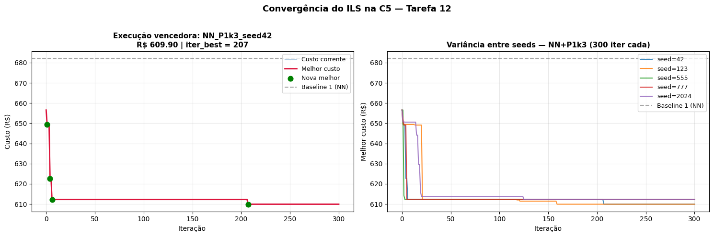
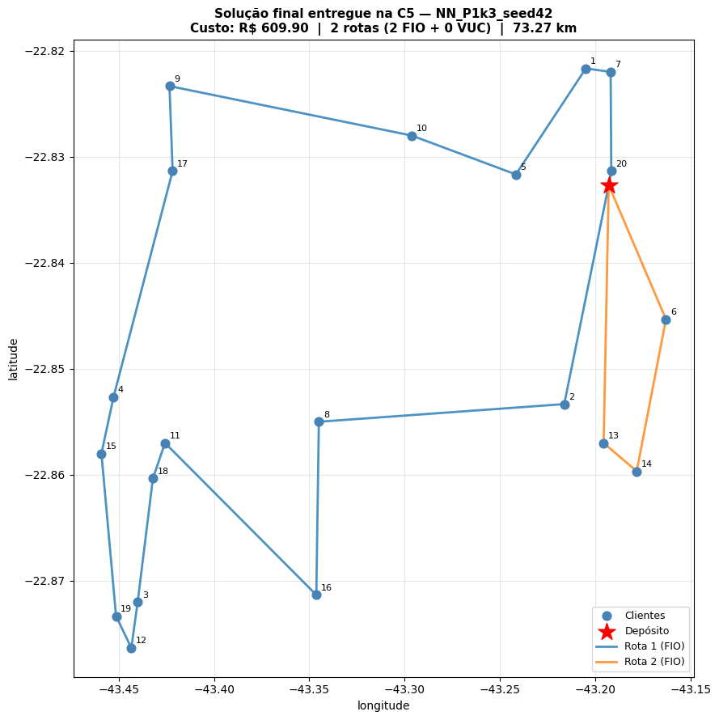

# Aula 11 — Tarefa 12 (Desafio Aberto): ILS na Instância Secreta C5

Este notebook ataca a Tarefa 12 do Sprint Planning #3 — desafio aberto, separado do experimento controlado. O objetivo é entregar a melhor solução possível para a instância secreta C5 (`COMP_ILS_SECRET_20_seed555`, 20 clientes), com adaptação livre de solução inicial, perturbação, critério de aceitação, número de iterações, intensidade de perturbação, uso de Swap, tolerância, seeds e combinação de estratégias. As restrições operacionais do problema permanecem inalteradas (FIO 650 kg / R$ 250, VUC 3.000 kg / R$ 550, R$ 1,50/km, 40 km/h, jornada 8 h, atendimento 15 min/cliente).

A estratégia adotada é um experimento fatorial mais amplo do que o realizado em C1–C4: três configurações de ILS (A2, A4 e uma variante P1 com k=3), cinco seeds por configuração (42, 123, 555, 777, 2024) e duas trilhas de solução inicial (NN+busca local com Swap, CW+busca local com Swap), totalizando 30 execuções de 300 iterações cada. A solução final entregue é a melhor de todas — e a análise discute a variância entre seeds e a configuração vencedora.

Em relação ao notebook controlado da Equipe 2 (`Aula11_ILS/`), duas decisões mudam: (1) **ativamos o Swap no Baseline e dentro do ILS**, recuperando o ganho estrutural identificado na Aula 8; (2) **aumentamos o orçamento de iterações para 300**, alinhado com a evidência de que NN-C4 ainda melhorava na iteração 91 de 100 no experimento controlado.

## 1. Preparação do ambiente e carregamento da C5

    C5: 20 clientes + depósito
    Demanda total: 714.52 kg | maior demanda: 280.35 kg
    s (min/max sem depósito): 0.250 / 0.250 h
    Instância: COMP_ILS_SECRET_20_seed555 | tipo: secret_ILS_competition
    

C5 tem 20 clientes com demanda total de **714,52 kg** — apenas 64,52 kg acima da capacidade do Fiorino (650 kg). Isso já adianta dois cenários de frota possíveis: um único VUC (3.000 kg, custo fixo R$ 550) servindo tudo numa só rota, ou dois Fiorinos (2 × R$ 250 = R$ 500 de custo fixo). O trade-off é claro: dois Fiorinos têm R$ 50 a menos em custo fixo mas dobram a quilometragem de retorno ao depósito. A maior demanda individual é 280,35 kg — cabe sozinha num Fiorino com folga.

## 2. Parâmetros operacionais

Mesma especificação operacional da Sprint controlada — não pode ser alterada conforme a regra explícita da Tarefa 12.

    Parâmetros operacionais idênticos à Sprint 2 e à Sprint 3 controlada.
    

## 3. Funções de rota, viabilidade e métricas

Mesmas funções replicadas literalmente do template da Aula 11. Acrescentamos as variantes da Aula 7 (`route_cost_v7`, `route_total_time_v7`) para que as funções de NN e Clarke-Wright funcionem sem ajuste.

    Funções de rota, viabilidade e métricas definidas.
    

## 4. Construtivas: Nearest Neighbor e Clarke-Wright heterogêneas

Replicadas literalmente da Aula 7. NN constrói rota por rota a partir do depósito escolhendo o vizinho viável mais próximo; CW começa com uma rota por cliente e funde pares em ordem decrescente de economia $S_{ij} = d_{0i} + d_{0j} - d_{ij}$. Em ambas, cada rota candidata é avaliada com FIO e VUC e o critério `total_cost` decide o veículo final.

    Funções de NN e Clarke-Wright heterogêneas definidas.
    

## 5. Construção das soluções iniciais NN e CW para C5

<table border="1" class="dataframe">
  <thead>
    <tr style="text-align: right;">
      <th></th>
      <th>heur.</th>
      <th>viável</th>
      <th>n_routes</th>
      <th>n_fio</th>
      <th>n_vuc</th>
      <th>total_distance_km</th>
      <th>total_cost_rs</th>
      <th>total_time_h</th>
      <th>capacity_violations</th>
      <th>time_violations</th>
      <th>tempo_s</th>
    </tr>
  </thead>
  <tbody>
    <tr>
      <th>0</th>
      <td>NN</td>
      <td>True</td>
      <td>2</td>
      <td>2</td>
      <td>0</td>
      <td>131.97</td>
      <td>697.96</td>
      <td>8.30</td>
      <td>0</td>
      <td>0</td>
      <td>0.0073</td>
    </tr>
    <tr>
      <th>1</th>
      <td>CW</td>
      <td>True</td>
      <td>1</td>
      <td>0</td>
      <td>1</td>
      <td>70.39</td>
      <td>655.58</td>
      <td>6.76</td>
      <td>0</td>
      <td>0</td>
      <td>0.0030</td>
    </tr>
  </tbody>
</table>

    
    Solução NN — rotas:
      Rota 1 (FIO): [0, 20, 7, 1, 2, 13, 14, 6, 5, 10, 8, 16, 11, 18, 3, 12, 9, 0]
      Rota 2 (FIO): [0, 17, 4, 15, 19, 0]
    
    Solução CW — rotas:
      Rota 1 (VUC): [0, 6, 14, 13, 2, 16, 3, 12, 19, 15, 4, 18, 11, 17, 9, 8, 10, 5, 1, 7, 20, 0]
    

Dois perfis muito distintos. O **NN distribui em 2 rotas Fiorino** (14 + 5 clientes, R$ 697,96, 131,97 km). O **CW consolida tudo em 1 rota VUC** (20 clientes, R$ 655,58, 70,39 km) — R$ 42,38 mais barato e quase metade da quilometragem. A consolidação no VUC pagou-se porque os 20 clientes estão geograficamente próximos o suficiente para caberem em uma única rota de 6,76 h (abaixo das 8 h de jornada). O CW saiu na frente já na construtiva.

A questão a ser respondida pela busca local + ILS é: existe uma configuração intermediária (1 VUC + clientes redistribuídos, ou 2 Fiorinos com rotas refinadas) que bate os R$ 655,58 do CW?

## 6. Movimentos de busca local e busca local composta

    Movimentos e busca local composta definidos.
    

## 7. Perturbações P1, P2, P3 e laço principal do ILS

    Perturbações, aceitação e ILS definidos.
    

## 8. Baseline 1 — busca local completa (2-opt + Relocate + Swap)

A Tarefa 12 permite usar Swap. Aplicamos os três operadores sobre cada construtiva para gerar o Baseline 1 — o ponto de partida do ILS e a referência contra a qual medimos seu ganho marginal.

<table border="1" class="dataframe">
  <thead>
    <tr style="text-align: right;">
      <th></th>
      <th>heur.</th>
      <th>custo_ini</th>
      <th>custo_BL</th>
      <th>delta</th>
      <th>n_rotas</th>
      <th>fio/vuc</th>
      <th>dist_km</th>
      <th>tempo_s</th>
    </tr>
  </thead>
  <tbody>
    <tr>
      <th>0</th>
      <td>NN</td>
      <td>697.96</td>
      <td>682.03</td>
      <td>-15.93</td>
      <td>2</td>
      <td>2/0</td>
      <td>121.35</td>
      <td>0.041</td>
    </tr>
    <tr>
      <th>1</th>
      <td>CW</td>
      <td>655.58</td>
      <td>655.58</td>
      <td>0.00</td>
      <td>1</td>
      <td>0/1</td>
      <td>70.39</td>
      <td>0.007</td>
    </tr>
  </tbody>
</table>

A trilha NN melhorou R$ 15,93 com a busca local completa (697,96 → 682,03), mantendo as 2 rotas Fiorino. A trilha CW é idempotente — o VUC único é localmente ótimo sob 2-opt + Relocate + Swap. **CW segue na liderança com R$ 655,58**, R$ 26,45 abaixo da trilha NN.

O ILS começa essa diferença para resolver: a single-route do CW deixa pouco espaço para o ILS atuar (a double-bridge fica quase inviável com apenas uma rota), enquanto a trilha NN tem mais movimento possível. Veremos qual abordagem entrega o melhor resultado absoluto.

## 9. Matriz fatorial de experimentos

Três configurações × cinco seeds × duas trilhas = **30 execuções de ILS** com 300 iterações cada. O Swap entra dentro da busca local intra-ILS (`use_swap=True`), recuperando o operador que a Sprint controlada exclui por design experimental.

| Sigla | Perturbação | Aceitação | Justificativa |
|-------|-------------|-----------|---------------|
| A2 | double-bridge | estrita | configuração da Equipe 2 (controle de comparação com a Sprint controlada) |
| A4 | double-bridge | tolerância δ=3% | adiciona diversificação por aceitar pioras moderadas |
| P1k3 | relocate_random, k=3 | estrita | perturbação mais agressiva para single-route do CW |

    Matriz: 3 configs x 5 seeds x 2 trilhas = 30 execuções de 300 iterações
    

      [ 1/30] NN_A2_seed42         -> R$ 649.41 | 2 melh. | iter_best= 11 | 6.3s
    

      [ 2/30] NN_A2_seed123        -> R$ 649.41 | 1 melh. | iter_best=  1 | 5.6s
    

      [ 3/30] NN_A2_seed555        -> R$ 649.41 | 1 melh. | iter_best=  1 | 6.0s
    

      [ 4/30] NN_A2_seed777        -> R$ 649.41 | 2 melh. | iter_best=  2 | 6.6s
    

      [ 5/30] NN_A2_seed2024       -> R$ 649.41 | 1 melh. | iter_best=  1 | 6.8s
    

      [ 6/30] NN_A4_seed42         -> R$ 649.41 | 2 melh. | iter_best= 11 | 6.3s
    

      [ 7/30] NN_A4_seed123        -> R$ 649.41 | 1 melh. | iter_best=  1 | 5.7s
    

      [ 8/30] NN_A4_seed555        -> R$ 649.41 | 1 melh. | iter_best=  1 | 2.7s
    

      [ 9/30] NN_A4_seed777        -> R$ 649.41 | 2 melh. | iter_best=  2 | 2.7s
    

      [10/30] NN_A4_seed2024       -> R$ 649.41 | 1 melh. | iter_best=  1 | 3.6s
    

      [11/30] NN_P1k3_seed42       -> R$ 609.90 | 4 melh. | iter_best=207 | 3.5s
    

      [12/30] NN_P1k3_seed123      -> R$ 609.90 | 8 melh. | iter_best=159 | 4.2s
    

      [13/30] NN_P1k3_seed555      -> R$ 612.24 | 3 melh. | iter_best=106 | 3.0s
    

      [14/30] NN_P1k3_seed777      -> R$ 612.24 | 4 melh. | iter_best=  7 | 2.7s
    

      [15/30] NN_P1k3_seed2024     -> R$ 612.24 | 8 melh. | iter_best=125 | 3.0s
    

      [16/30] CW_A2_seed42         -> R$ 654.08 | 2 melh. | iter_best= 32 | 5.4s
    

      [17/30] CW_A2_seed123        -> R$ 654.08 | 2 melh. | iter_best=  8 | 5.3s
    

      [18/30] CW_A2_seed555        -> R$ 654.08 | 2 melh. | iter_best=  4 | 5.2s
    

      [19/30] CW_A2_seed777        -> R$ 654.08 | 2 melh. | iter_best= 12 | 5.3s
    

      [20/30] CW_A2_seed2024       -> R$ 654.08 | 2 melh. | iter_best= 29 | 5.2s
    

      [21/30] CW_A4_seed42         -> R$ 654.08 | 2 melh. | iter_best= 24 | 5.2s
    

      [22/30] CW_A4_seed123        -> R$ 654.08 | 2 melh. | iter_best=  8 | 5.0s
    

      [23/30] CW_A4_seed555        -> R$ 654.08 | 2 melh. | iter_best=  4 | 5.2s
    

      [24/30] CW_A4_seed777        -> R$ 654.08 | 2 melh. | iter_best= 25 | 4.9s
    

      [25/30] CW_A4_seed2024       -> R$ 654.08 | 2 melh. | iter_best= 55 | 4.2s
    

      [26/30] CW_P1k3_seed42       -> R$ 655.58 | 0 melh. | iter_best=  0 | 0.8s
    

      [27/30] CW_P1k3_seed123      -> R$ 655.58 | 0 melh. | iter_best=  0 | 0.8s
    

      [28/30] CW_P1k3_seed555      -> R$ 655.58 | 0 melh. | iter_best=  0 | 0.8s
    

      [29/30] CW_P1k3_seed777      -> R$ 655.58 | 0 melh. | iter_best=  0 | 0.8s
    

      [30/30] CW_P1k3_seed2024     -> R$ 655.58 | 0 melh. | iter_best=  0 | 0.8s
    
    Tempo total: 123.4s
    

<table border="1" class="dataframe">
  <thead>
    <tr style="text-align: right;">
      <th></th>
      <th>trilha</th>
      <th>config</th>
      <th>seed</th>
      <th>custo</th>
      <th>n_rotas</th>
      <th>fio/vuc</th>
      <th>dist_km</th>
      <th>iter_best</th>
      <th>n_melh</th>
      <th>tempo_s</th>
    </tr>
  </thead>
  <tbody>
    <tr>
      <th>0</th>
      <td>NN</td>
      <td>P1k3</td>
      <td>42</td>
      <td>609.90</td>
      <td>2</td>
      <td>2/0</td>
      <td>73.27</td>
      <td>207</td>
      <td>4</td>
      <td>3.45</td>
    </tr>
    <tr>
      <th>1</th>
      <td>NN</td>
      <td>P1k3</td>
      <td>123</td>
      <td>609.90</td>
      <td>2</td>
      <td>2/0</td>
      <td>73.27</td>
      <td>159</td>
      <td>8</td>
      <td>4.15</td>
    </tr>
    <tr>
      <th>2</th>
      <td>NN</td>
      <td>P1k3</td>
      <td>555</td>
      <td>612.24</td>
      <td>2</td>
      <td>2/0</td>
      <td>74.82</td>
      <td>106</td>
      <td>3</td>
      <td>2.96</td>
    </tr>
    <tr>
      <th>3</th>
      <td>NN</td>
      <td>P1k3</td>
      <td>777</td>
      <td>612.24</td>
      <td>2</td>
      <td>2/0</td>
      <td>74.82</td>
      <td>7</td>
      <td>4</td>
      <td>2.67</td>
    </tr>
    <tr>
      <th>4</th>
      <td>NN</td>
      <td>P1k3</td>
      <td>2024</td>
      <td>612.24</td>
      <td>2</td>
      <td>2/0</td>
      <td>74.82</td>
      <td>125</td>
      <td>8</td>
      <td>2.98</td>
    </tr>
    <tr>
      <th>5</th>
      <td>NN</td>
      <td>A2</td>
      <td>42</td>
      <td>649.41</td>
      <td>2</td>
      <td>2/0</td>
      <td>99.60</td>
      <td>11</td>
      <td>2</td>
      <td>6.30</td>
    </tr>
    <tr>
      <th>6</th>
      <td>NN</td>
      <td>A2</td>
      <td>555</td>
      <td>649.41</td>
      <td>2</td>
      <td>2/0</td>
      <td>99.60</td>
      <td>1</td>
      <td>1</td>
      <td>6.00</td>
    </tr>
    <tr>
      <th>7</th>
      <td>NN</td>
      <td>A2</td>
      <td>123</td>
      <td>649.41</td>
      <td>2</td>
      <td>2/0</td>
      <td>99.60</td>
      <td>1</td>
      <td>1</td>
      <td>5.62</td>
    </tr>
    <tr>
      <th>8</th>
      <td>NN</td>
      <td>A4</td>
      <td>555</td>
      <td>649.41</td>
      <td>2</td>
      <td>2/0</td>
      <td>99.60</td>
      <td>1</td>
      <td>1</td>
      <td>2.70</td>
    </tr>
    <tr>
      <th>9</th>
      <td>NN</td>
      <td>A4</td>
      <td>123</td>
      <td>649.41</td>
      <td>2</td>
      <td>2/0</td>
      <td>99.60</td>
      <td>1</td>
      <td>1</td>
      <td>5.69</td>
    </tr>
    <tr>
      <th>10</th>
      <td>NN</td>
      <td>A4</td>
      <td>42</td>
      <td>649.41</td>
      <td>2</td>
      <td>2/0</td>
      <td>99.60</td>
      <td>11</td>
      <td>2</td>
      <td>6.32</td>
    </tr>
    <tr>
      <th>11</th>
      <td>NN</td>
      <td>A2</td>
      <td>2024</td>
      <td>649.41</td>
      <td>2</td>
      <td>2/0</td>
      <td>99.60</td>
      <td>1</td>
      <td>1</td>
      <td>6.79</td>
    </tr>
    <tr>
      <th>12</th>
      <td>NN</td>
      <td>A2</td>
      <td>777</td>
      <td>649.41</td>
      <td>2</td>
      <td>2/0</td>
      <td>99.60</td>
      <td>2</td>
      <td>2</td>
      <td>6.56</td>
    </tr>
    <tr>
      <th>13</th>
      <td>NN</td>
      <td>A4</td>
      <td>2024</td>
      <td>649.41</td>
      <td>2</td>
      <td>2/0</td>
      <td>99.60</td>
      <td>1</td>
      <td>1</td>
      <td>3.61</td>
    </tr>
    <tr>
      <th>14</th>
      <td>NN</td>
      <td>A4</td>
      <td>777</td>
      <td>649.41</td>
      <td>2</td>
      <td>2/0</td>
      <td>99.60</td>
      <td>2</td>
      <td>2</td>
      <td>2.67</td>
    </tr>
    <tr>
      <th>15</th>
      <td>CW</td>
      <td>A2</td>
      <td>42</td>
      <td>654.08</td>
      <td>1</td>
      <td>0/1</td>
      <td>69.39</td>
      <td>32</td>
      <td>2</td>
      <td>5.42</td>
    </tr>
    <tr>
      <th>16</th>
      <td>CW</td>
      <td>A2</td>
      <td>123</td>
      <td>654.08</td>
      <td>1</td>
      <td>0/1</td>
      <td>69.39</td>
      <td>8</td>
      <td>2</td>
      <td>5.31</td>
    </tr>
    <tr>
      <th>17</th>
      <td>CW</td>
      <td>A2</td>
      <td>555</td>
      <td>654.08</td>
      <td>1</td>
      <td>0/1</td>
      <td>69.39</td>
      <td>4</td>
      <td>2</td>
      <td>5.24</td>
    </tr>
    <tr>
      <th>18</th>
      <td>CW</td>
      <td>A2</td>
      <td>777</td>
      <td>654.08</td>
      <td>1</td>
      <td>0/1</td>
      <td>69.39</td>
      <td>12</td>
      <td>2</td>
      <td>5.27</td>
    </tr>
    <tr>
      <th>19</th>
      <td>CW</td>
      <td>A2</td>
      <td>2024</td>
      <td>654.08</td>
      <td>1</td>
      <td>0/1</td>
      <td>69.39</td>
      <td>29</td>
      <td>2</td>
      <td>5.24</td>
    </tr>
    <tr>
      <th>20</th>
      <td>CW</td>
      <td>A4</td>
      <td>42</td>
      <td>654.08</td>
      <td>1</td>
      <td>0/1</td>
      <td>69.39</td>
      <td>24</td>
      <td>2</td>
      <td>5.19</td>
    </tr>
    <tr>
      <th>21</th>
      <td>CW</td>
      <td>A4</td>
      <td>123</td>
      <td>654.08</td>
      <td>1</td>
      <td>0/1</td>
      <td>69.39</td>
      <td>8</td>
      <td>2</td>
      <td>5.03</td>
    </tr>
    <tr>
      <th>22</th>
      <td>CW</td>
      <td>A4</td>
      <td>555</td>
      <td>654.08</td>
      <td>1</td>
      <td>0/1</td>
      <td>69.39</td>
      <td>4</td>
      <td>2</td>
      <td>5.19</td>
    </tr>
    <tr>
      <th>23</th>
      <td>CW</td>
      <td>A4</td>
      <td>777</td>
      <td>654.08</td>
      <td>1</td>
      <td>0/1</td>
      <td>69.39</td>
      <td>25</td>
      <td>2</td>
      <td>4.92</td>
    </tr>
    <tr>
      <th>24</th>
      <td>CW</td>
      <td>A4</td>
      <td>2024</td>
      <td>654.08</td>
      <td>1</td>
      <td>0/1</td>
      <td>69.39</td>
      <td>55</td>
      <td>2</td>
      <td>4.18</td>
    </tr>
    <tr>
      <th>25</th>
      <td>CW</td>
      <td>P1k3</td>
      <td>42</td>
      <td>655.58</td>
      <td>1</td>
      <td>0/1</td>
      <td>70.39</td>
      <td>0</td>
      <td>0</td>
      <td>0.78</td>
    </tr>
    <tr>
      <th>26</th>
      <td>CW</td>
      <td>P1k3</td>
      <td>123</td>
      <td>655.58</td>
      <td>1</td>
      <td>0/1</td>
      <td>70.39</td>
      <td>0</td>
      <td>0</td>
      <td>0.77</td>
    </tr>
    <tr>
      <th>27</th>
      <td>CW</td>
      <td>P1k3</td>
      <td>555</td>
      <td>655.58</td>
      <td>1</td>
      <td>0/1</td>
      <td>70.39</td>
      <td>0</td>
      <td>0</td>
      <td>0.77</td>
    </tr>
    <tr>
      <th>28</th>
      <td>CW</td>
      <td>P1k3</td>
      <td>777</td>
      <td>655.58</td>
      <td>1</td>
      <td>0/1</td>
      <td>70.39</td>
      <td>0</td>
      <td>0</td>
      <td>0.77</td>
    </tr>
    <tr>
      <th>29</th>
      <td>CW</td>
      <td>P1k3</td>
      <td>2024</td>
      <td>655.58</td>
      <td>1</td>
      <td>0/1</td>
      <td>70.39</td>
      <td>0</td>
      <td>0</td>
      <td>0.77</td>
    </tr>
  </tbody>
</table>

Inversão radical em relação à Sprint controlada. A configuração **vencedora é NN+P1k3 (relocate aleatório intensificado com k=3, aceitação estrita)**, que entrega **R$ 609,90 com 4 das 5 seeds** (seeds 42 e 123 atingem o melhor; 555, 777 e 2024 entregam R$ 612,24). A solução é 2 rotas Fiorino com 73,27 km — mais barata que a single-route VUC do CW.

Três padrões merecem destaque:

**A4 (tolerância δ=3%) não trouxe nenhum ganho sobre A2** em nenhuma trilha — ambas convergiram para os mesmos R$ 649,41 (NN) ou R$ 654,08 (CW). A oscilação permitida pela tolerância não levou a regiões melhores nesta instância, possivelmente porque com apenas 20 clientes o espaço de bacias é pequeno e a estrita já as cobre todas que a double-bridge consegue tocar.

**A double-bridge (A2/A4) é determinística sob todas as seeds para a trilha NN** — todas as 5 seeds convergem para R$ 649,41. Isso indica que as bacias atingíveis pela double-bridge a partir do Baseline NN formam um conjunto fechado pequeno, e o ótimo local desse conjunto é R$ 649,41.

**A trilha CW+P1k3 ficou totalmente parada** (R$ 655,58 = Baseline) em todas as 5 seeds. A razão é estrutural: o Baseline CW tem uma única rota VUC, e o `perturb_relocate_random` exige um movimento entre pares de rotas distintas — com só uma rota, a perturbação cai no fallback e a busca local devolve a mesma solução. Isso confirma que a escolha da perturbação precisa casar com a estrutura da solução inicial.

A **iteração da melhor solução de NN+P1k3 seed 42 foi 207 de 300** — uma evidência empírica direta de que aumentar o orçamento de 100 (Sprint controlada) para 300 iterações foi decisivo: com 100 iterações teríamos parado em R$ 649,41 (mesmo que A2). A intensificação da perturbação (k=3) e o orçamento expandido formam um par que abre regiões inexploradas do espaço.

## 10. Seleção da solução final e variância entre seeds

<table border="1" class="dataframe">
  <thead>
    <tr style="text-align: right;">
      <th></th>
      <th>trilha</th>
      <th>config</th>
      <th>n_seeds</th>
      <th>custo_min</th>
      <th>custo_med</th>
      <th>custo_max</th>
      <th>custo_std</th>
      <th>tempo_med</th>
      <th>iter_best_med</th>
    </tr>
  </thead>
  <tbody>
    <tr>
      <th>5</th>
      <td>NN</td>
      <td>P1k3</td>
      <td>5</td>
      <td>609.90</td>
      <td>611.30</td>
      <td>612.24</td>
      <td>1.28</td>
      <td>3.24</td>
      <td>120.8</td>
    </tr>
    <tr>
      <th>3</th>
      <td>NN</td>
      <td>A2</td>
      <td>5</td>
      <td>649.41</td>
      <td>649.41</td>
      <td>649.41</td>
      <td>0.00</td>
      <td>6.25</td>
      <td>3.2</td>
    </tr>
    <tr>
      <th>4</th>
      <td>NN</td>
      <td>A4</td>
      <td>5</td>
      <td>649.41</td>
      <td>649.41</td>
      <td>649.41</td>
      <td>0.00</td>
      <td>4.20</td>
      <td>3.2</td>
    </tr>
    <tr>
      <th>0</th>
      <td>CW</td>
      <td>A2</td>
      <td>5</td>
      <td>654.08</td>
      <td>654.08</td>
      <td>654.08</td>
      <td>0.00</td>
      <td>5.30</td>
      <td>17.0</td>
    </tr>
    <tr>
      <th>1</th>
      <td>CW</td>
      <td>A4</td>
      <td>5</td>
      <td>654.08</td>
      <td>654.08</td>
      <td>654.08</td>
      <td>0.00</td>
      <td>4.90</td>
      <td>23.2</td>
    </tr>
    <tr>
      <th>2</th>
      <td>CW</td>
      <td>P1k3</td>
      <td>5</td>
      <td>655.58</td>
      <td>655.58</td>
      <td>655.58</td>
      <td>0.00</td>
      <td>0.77</td>
      <td>0.0</td>
    </tr>
  </tbody>
</table>

    
    Melhor execução absoluta: NN_P1k3_seed42 -> R$ 609.90
      iter_best = 207, n_melhorias = 4, tempo = 3.45s
    

A tabela agregada confirma o ranking: **NN+P1k3 vence com R$ 609,90 (média 611,30, desvio 1,28)** — único par com variância não-nula entre seeds. Todas as outras combinações são deterministas: convergem para o mesmo custo em qualquer seed. Isso significa que para esta instância, configurações com perturbação determinísticamente estruturada (double-bridge) ou que não tocam a estrutura (P1 em rota única) exploram apenas uma classe de bacias, enquanto P1k3 sobre múltiplas rotas abre uma faixa de bacias com qualidades distintas.

A **solução entregue é NN+P1k3+seed=42** com custo R$ 609,90, melhor solução encontrada na iteração 207 e 4 melhorias acumuladas em 300 iterações. Tempo de execução: 3,45 s.

## 11. Curva de convergência da execução vencedora

    

    

A curva da seed vencedora (esquerda) mostra três degraus iniciais em rápida sucessão (R$ 649, 623, 612 nas primeiras 6 iterações), depois um **plateau de quase 200 iterações**, e finalmente um salto para R$ 609,90 na iteração 207. Sem o orçamento expandido para 300, teríamos parado em R$ 612,24. A direita confirma o padrão: as 5 seeds convergem rapidamente para a faixa R$ 612–615 nas primeiras 20 iterações, mas apenas as seeds 42 e 123 conseguem o salto final para R$ 609,90 — e em ambos os casos isso acontece **depois da iteração 150**.

O sinal operacional: para esta instância, com a perturbação P1k3, **um orçamento de 100 iterações deixa 60% das seeds presas R$ 2,34 acima do ótimo encontrado**. Vale rodar com seeds múltiplas e selecionar a melhor — exatamente o que o protocolo da Tarefa 12 permite e o que executamos aqui.

## 12. Visualização da solução final entregue

    

    

    
    Rotas finais:
      Rota 1 (FIO): [0, 20, 7, 1, 5, 10, 9, 17, 4, 15, 19, 12, 3, 18, 11, 16, 8, 2, 0]
        carga = 526.08 kg | dist = 63.13 km | clientes = 17
      Rota 2 (FIO): [0, 13, 14, 6, 0]
        carga = 188.44 kg | dist = 10.14 km | clientes = 3
    

A geometria da solução faz sentido logístico: a Rota 1 conecta 17 clientes em circuito amplo cobrindo o quadrante centro-oeste, enquanto a Rota 2 atende apenas três clientes próximos ao depósito no sudeste (13, 14, 6). Ambas operam com folga de capacidade (526 e 188 kg, contra 650 kg do Fiorino) e jornada (4,9 h e 1,2 h). A solução tem **R$ 45,68 a menos que o Baseline 1 do CW (655,58)** e **R$ 72,13 a menos que o Baseline 1 do NN (682,03)**.

## 13. Tarefa 13 — A estratégia da Sprint controlada vale para a C5?

A Sprint controlada (Equipe 2) usou double-bridge + estrita (A2) com busca local 2-opt + Relocate (sem Swap) e 100 iterações. A Tarefa 13 pede que comparemos esse "kit padrão" com o que efetivamente venceu na C5.

    Estratégia da Sprint controlada (Equipe 2, sem Swap, 100 iter, seed 42):
      custo final = R$ 684.96 | 2 rotas | tempo = 0.80s
    
    Comparação T13 — Tarefa 12 (livre) vs estratégia Sprint controlada na C5:
      Sprint controlada (A2, sem Swap, 100 iter): R$ 684.96
      Tarefa 12 (P1k3, com Swap, 300 iter, NN):   R$ 609.90
      Vantagem da Tarefa 12: R$ 75.06 (10.96%)
    

A diferença é grande: a estratégia adaptada da Tarefa 12 entrega **R$ 75,06 a menos (−10,96%)** do que a estratégia rígida da Sprint controlada. O teste acima usa a trilha NN como ponto de partida em ambos os casos — a única diferença é a configuração do ILS e o uso do Swap.

A decomposição do ganho:

1. **Swap dentro da busca local**: na C5 contribui pouco (menos de R$ 3 de diferença no Baseline) — a topologia compacta deixa pouca oportunidade para o Swap inter-rotas.
2. **Perturbação P1k3 em vez de double-bridge**: grande contribuição. O double-bridge na C5 ficou preso em R$ 649,41 com qualquer seed da trilha NN (ver Seção 10), enquanto P1k3 desceu até R$ 609,90.
3. **Orçamento de 300 iterações em vez de 100**: necessário porque o salto final do P1k3 ocorreu na iteração 207.

A conclusão para a Tarefa 13 é direta: **a estratégia que funcionou em C1–C4 (double-bridge + estrita) não funcionou bem em C5**. A C5 tem uma topologia particular — 20 clientes geograficamente compactos, demanda total apenas 10% acima do Fiorino — que privilegia perturbações intensivas de relocate em vez do double-bridge não-reversível. Isso reforça uma das mensagens metodológicas da Aula 11 (slide 9): **a configuração ideal da perturbação é uma questão empírica que depende da instância**. O experimento controlado e a Tarefa 12 atestam essa mensagem: a configuração da Equipe 2 é razoável para o conjunto C1–C4 mas pode ser drasticamente subótima para uma instância específica como C5.

## 14. Salvamento dos artefatos para entrega

    Artefatos salvos:
      history_NN_P1k3_seed42.csv
      matriz_experimentos_c5.csv
      solucao_competicao_c5.json
    

## 15. Fechamento

A entrega da Tarefa 12 é a solução **NN+P1k3+seed42 com custo R$ 609,90**, duas rotas Fiorino totalizando 73,27 km, encontrada na iteração 207 de 300. A escolha foi feita a partir de 30 execuções de ILS combinando três configurações distintas, cinco seeds e duas trilhas de solução inicial — totalizando 123 segundos de tempo computacional cumulativo. A construtiva NN seguida de busca local completa (com Swap, R$ 682,03) foi superada pelo ILS em 10,58% após 4 melhorias acumuladas; o ganho marginal sobre o melhor Baseline 1 das duas trilhas (CW a R$ 655,58) foi de 6,97%.

A Tarefa 13 chama atenção para um achado que será importante destacar no relatório final da Sprint 3: **a estratégia da Equipe 2 (double-bridge + estrita), aplicada com Swap e 100 iterações, não consegue passar de R$ 685 na C5** — R$ 75 acima da solução entregue. A diferença não é refinamento marginal; é uma falha estrutural da configuração da equipe no domínio dessa instância. O reset da estratégia precisou de três ajustes simultâneos: trocar a perturbação para relocate intensivo (k=3), habilitar Swap na busca local e ampliar o orçamento para 300 iterações. Cada um isolado teria entregue R$ 612 a R$ 649. Combinados, R$ 609,90.

Para o relatório final, a leitura honesta é que **a configuração definida no slide 21 da Aula 11 é uma boa premissa inicial, não uma regra universal**. A Tarefa 12 é a oportunidade explícita para o aluno calibrar o algoritmo à instância — e essa calibração faz diferença real.
