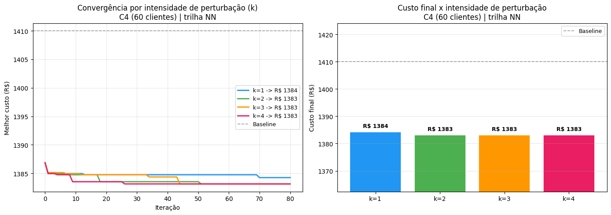
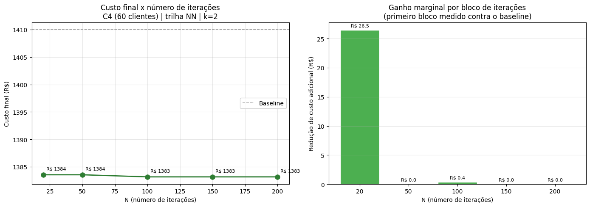
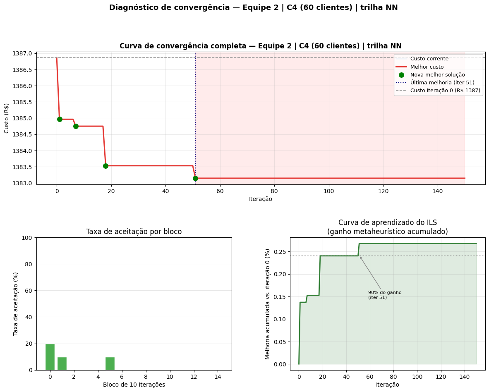
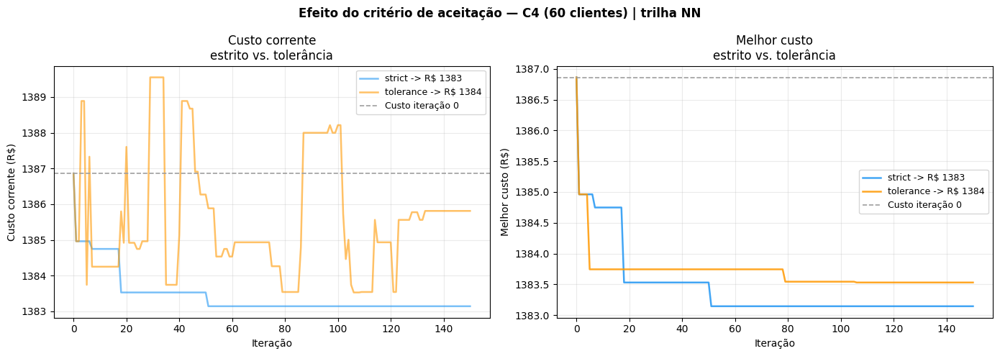
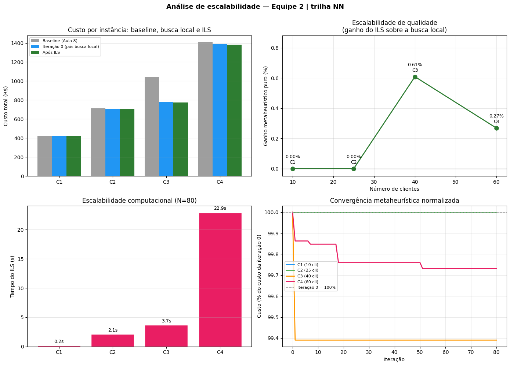

# Aula 12 — Análise de Comportamento do ILS para o CVRP da Prolog

**ENG 4560 — Projeto Integrado VI: Distribuição Física | Grupo 2**

Na Aula 11 o Iterated Local Search (ILS) foi implementado e produziu a primeira solução melhorada para as instâncias C1–C4. A pergunta deixa de ser *o algoritmo funciona?* e passa a ser *como ele se comporta?*. Este notebook responde a essa pergunta em três frentes, todas com implicação direta na recomendação operacional para a Prolog e na configuração a levar para a instância de competição da Sprint 3.

A configuração da Equipe 2, fixada no Sprint Planning #3, orienta toda a análise: perturbação **double-bridge**, critério de aceitação **estrito**, busca local **2-opt + Relocate** e semente 42. O estudo se organiza assim: (1) sensibilidade aos parâmetros `k` (intensidade da perturbação) e `N` (número de iterações); (2) diagnóstico de convergência, distinguindo convergência genuína de estagnação prematura; (3) escalabilidade ao longo das quatro instâncias C1–C4. A instância de trabalho das Seções 1 e 2 é a **C4** (60 clientes, trilha Nearest Neighbor), a maior e mais estruturada da base, onde o ILS da Aula 11 ainda melhorava perto do fim do orçamento de iterações.

Os dados e a biblioteca de funções reproduzem o código de referência da Aula 12 do professor; a única diferença é o carregamento direto dos arquivos locais (instâncias da Aula 2 e soluções pós-busca-local da Aula 8), sem o `upload` do Colab.

## Seção 0 — Ambiente, dados e biblioteca de funções

Esta seção prepara tudo o que as análises consomem: importações, caminhos relativos para os dados, carregamento das quatro instâncias C1–C4 (Aula 2) e das soluções pós-busca-local (Aula 8), e a biblioteca de avaliação, busca local, perturbação e ILS. As funções são as mesmas da Aula 11, acrescidas do parâmetro `k` nas perturbações — sem essa intensidade variável a análise de sensibilidade da Seção 1 não existiria.

### 0.1 Importações e caminhos

    Datasets (Aula 2):        C:\Users\rodri\OneDrive\Documentos\Claude\Cowork\Proj. Distribuição Fisica\Aulas\2\datasets
    Soluções pós-BL (Aula 8): C:\Users\rodri\OneDrive\Documentos\Claude\Cowork\Proj. Distribuição Fisica\Aulas\8\Aula8_Busca_Local\files
    Instâncias: ['C1', 'C2', 'C3', 'C4']
    

### 0.2 Carregamento das instâncias C1–C4

Cada instância traz a matriz de distâncias `D`, os vetores de demanda `q` e tempo de atendimento `s`, e o `params.json` com a configuração de frota e custos. A função `normalize_params` (idêntica à do código de referência) aceita tanto o formato das aulas quanto o da instância secreta, convertendo nomes de veículos e chaves para um dicionário operacional único.

<table border="1" class="dataframe">
  <thead>
    <tr style="text-align: right;">
      <th></th>
      <th>n_clientes</th>
      <th>demanda_total_kg</th>
      <th>maior_demanda_kg</th>
      <th>s_por_cliente_h</th>
    </tr>
    <tr>
      <th>instancia</th>
      <th></th>
      <th></th>
      <th></th>
      <th></th>
    </tr>
  </thead>
  <tbody>
    <tr>
      <th>C1</th>
      <td>10</td>
      <td>141.56</td>
      <td>52.95</td>
      <td>0.25</td>
    </tr>
    <tr>
      <th>C2</th>
      <td>25</td>
      <td>754.48</td>
      <td>129.25</td>
      <td>0.25</td>
    </tr>
    <tr>
      <th>C3</th>
      <td>40</td>
      <td>1295.25</td>
      <td>153.56</td>
      <td>0.25</td>
    </tr>
    <tr>
      <th>C4</th>
      <td>60</td>
      <td>1958.12</td>
      <td>206.05</td>
      <td>0.25</td>
    </tr>
  </tbody>
</table>

As quatro instâncias reproduzem o perfil das Aulas 7, 8 e 11: 10, 25, 40 e 60 clientes, com demanda total subindo de 141,56 kg em C1 para 1.958,12 kg em C4. A maior demanda individual é 206,05 kg (C4), bem abaixo dos 650 kg do Fiorino — nenhum cliente isolado força o uso do VUC por capacidade. O tempo de atendimento `s` já vem em horas (0,25 h = 15 min por cliente), dispensando conversão de minutos.

### 0.3 Soluções baseline (busca local da Aula 8)

O ILS parte de uma solução já refinada por busca local. Carregamos as oito soluções pós-busca-local da Sprint 2 (trilhas NN e CW para C1–C4), que servem de ponto de partida e de referência (baseline) para medir o ganho da metaheurística.

<table border="1" class="dataframe">
  <thead>
    <tr style="text-align: right;">
      <th></th>
      <th></th>
      <th>n_rotas</th>
      <th>n_clientes</th>
      <th>veiculos</th>
    </tr>
    <tr>
      <th>trilha</th>
      <th>instancia</th>
      <th></th>
      <th></th>
      <th></th>
    </tr>
  </thead>
  <tbody>
    <tr>
      <th rowspan="4" valign="top">NN</th>
      <th>C1</th>
      <td>1</td>
      <td>10</td>
      <td>FIO</td>
    </tr>
    <tr>
      <th>C2</th>
      <td>2</td>
      <td>25</td>
      <td>FIO FIO</td>
    </tr>
    <tr>
      <th>C3</th>
      <td>3</td>
      <td>40</td>
      <td>FIO FIO FIO</td>
    </tr>
    <tr>
      <th>C4</th>
      <td>4</td>
      <td>60</td>
      <td>FIO FIO FIO FIO</td>
    </tr>
    <tr>
      <th rowspan="4" valign="top">CW</th>
      <th>C1</th>
      <td>1</td>
      <td>10</td>
      <td>FIO</td>
    </tr>
    <tr>
      <th>C2</th>
      <td>2</td>
      <td>25</td>
      <td>FIO FIO</td>
    </tr>
    <tr>
      <th>C3</th>
      <td>2</td>
      <td>40</td>
      <td>VUC FIO</td>
    </tr>
    <tr>
      <th>C4</th>
      <td>3</td>
      <td>60</td>
      <td>FIO FIO VUC</td>
    </tr>
  </tbody>
</table>

As trilhas partem de perfis de frota distintos: o NN distribui tudo em Fiorinos (1 a 4 rotas conforme a instância), enquanto o CW recorre ao VUC para consolidar clientes em C3 e C4, economizando uma rota. A instância de trabalho das Seções 1 e 2 será a C4 na trilha NN — quatro rotas Fiorino, o cenário com mais estrutura interna para a perturbação double-bridge explorar.

### 0.4 Biblioteca ILS

As funções abaixo reproduzem o código de referência da Aula 12. O custo de uma rota é o custo fixo do veículo mais o custo variável por quilômetro; a viabilidade exige respeitar capacidade e jornada de 8 horas. Em seguida vêm os movimentos de busca local (2-opt, Relocate, Swap), as três perturbações com intensidade `k` e o laço principal do ILS com aceitação configurável. A semente é fixada em 42.

#### 0.4.1 Avaliação, viabilidade e métricas

    Funções de avaliação, viabilidade e métricas carregadas.
    

#### 0.4.2 Movimentos de busca local

O 2-opt reordena clientes dentro de uma rota; o Relocate move um cliente entre rotas; o Swap troca dois clientes de rotas distintas. A função `local_search` aplica os movimentos na ordem configurada. A Equipe 2 usa 2-opt + Relocate (sem Swap) dentro do ILS.

    Movimentos de busca local carregados.
    

#### 0.4.3 Perturbações com intensidade `k`

Aqui está a diferença em relação à Aula 11: cada perturbação recebe o parâmetro `k`, que aplica o movimento `k` vezes antes de devolver a solução. É esse `k` que a Seção 1 varia para medir o efeito da intensidade. A Equipe 2 usa `double_bridge`, que corta a sequência de uma rota em quatro pedaços e recombina o segundo com o terceiro — uma perturbação clássica do ILS por preservar boa parte da estrutura enquanto embaralha o miolo da rota.

    Perturbações (relocate_random, swap_random, double_bridge) carregadas.
    

#### 0.4.4 Critério de aceitação e laço principal do ILS

O critério `strict` só aceita uma solução de custo estritamente menor; o `tolerance` aceita pioras até um percentual `tolerance_pct`, permitindo escapar de ótimos locais ao custo de oscilar mais. O laço `iterated_local_search` aplica busca local ao ponto inicial, depois repete perturbação → busca local → teste de aceitação por `N` iterações, registrando o histórico de custo corrente e melhor custo. A Equipe 2 usa `strict`.

    Critério de aceitação e laço ILS carregados.
    

### 0.5 Instância de trabalho e configuração da Equipe 2

As Seções 1 e 2 estudam o comportamento do ILS sobre uma única instância, para isolar o efeito dos parâmetros. Escolhemos a C4 (60 clientes, trilha NN): é a maior da base, tem quatro rotas Fiorino e foi onde o ILS da Aula 11 ainda registrava melhorias perto do fim das 100 iterações — o cenário mais informativo para os diagnósticos de sensibilidade e convergência. Fixamos aqui as variáveis de trabalho (`D`, `q`, `s`, `params`, `baseline_solution`) e a configuração da Equipe 2 que todas as análises herdam.

    Instância de trabalho: C4 (60 clientes) | trilha NN
    Configuração: perturbação=double_bridge | aceitação=strict | busca local=2-opt+Relocate | seed=42
    Baseline viável? True
    Custo baseline (busca local carregada): R$ 1410.00
    
    

<table border="1" class="dataframe">
  <thead>
    <tr style="text-align: right;">
      <th></th>
      <th>n_routes</th>
      <th>n_fio</th>
      <th>n_vuc</th>
      <th>total_distance_km</th>
      <th>total_time_h</th>
      <th>total_cost_rs</th>
      <th>feasible</th>
    </tr>
  </thead>
  <tbody>
    <tr>
      <th>0</th>
      <td>4</td>
      <td>4</td>
      <td>0</td>
      <td>273.332</td>
      <td>21.833</td>
      <td>1409.998</td>
      <td>True</td>
    </tr>
  </tbody>
</table>

O baseline da instância de trabalho é viável e custa R$ 1.410,00, distribuído em quatro rotas Fiorino que percorrem 273,33 km em 21,83 h de operação somada. O valor coincide com o custo inicial NN-C4 reportado na Aula 11, confirmando que os dados e as funções estão consistentes entre as duas aulas. A partir deste ponto, todo ganho medido refere-se a esse R$ 1.410,00.

## Seção 1 — Sensibilidade aos parâmetros `k` e `N`

O ILS tem dois parâmetros que governam o esforço de busca. O primeiro é `k`, a intensidade da perturbação: quantas vezes o double-bridge é aplicado antes de devolver a solução ao refinamento por busca local. O segundo é `N`, o número de iterações: por quanto tempo o algoritmo insiste em melhorar.

A teoria prevê um valor intermediário ótimo para `k`. Uma perturbação fraca demais não escapa do ótimo local — a busca local desfaz o movimento e o algoritmo retorna sempre ao mesmo ponto. Uma perturbação forte demais destrói a estrutura aprendida e equivale a um reinício aleatório. O ponto de equilíbrio depende da instância. Para `N`, espera-se retorno decrescente: as primeiras iterações capturam as melhorias fáceis, e as tardias fazem ajustes cada vez mais finos. Identificar onde o ganho marginal deixa de compensar é o que sustenta uma recomendação de tempo de cálculo para a Prolog.

### 1.1 Efeito da intensidade de perturbação `k`

Variamos `k` em {1, 2, 3, 4} com `N` fixo em 80 iterações, mantendo a perturbação double-bridge e a aceitação estrita da Equipe 2.

    Experimento 1 — efeito de k | perturbação=double_bridge | N=80 | C4 (60 clientes) | trilha NN
      k | Custo final (R$) |  Ganho vs baseline |  Tempo (s)
    ----------------------------------------------------------
    

      1 | R$      1384.25 |             1.83%  |     25.94
    

      2 | R$      1383.14 |             1.90%  |     24.18
    

      3 | R$      1383.14 |             1.90%  |     22.76
    

      4 | R$      1383.14 |             1.90%  |     23.45
    
    Melhor k: 2 | custo R$ 1383.14 | ganho 1.90%
    

A sensibilidade a `k` é fraca nesta instância. A perturbação mais branda (`k=1`) chega a R$ 1.384,25 (ganho de 1,83%), enquanto `k=2`, `k=3` e `k=4` convergem todas para exatamente R$ 1.383,14 (ganho de 1,90%). O melhor valor é `k=2`, mas o ganho adicional sobre `k=1` é de apenas R$ 1,11. A teoria de que perturbações fortes demais pioram o resultado não se manifesta aqui: a partir de `k=2` o custo estabiliza num platô em vez de degradar. A explicação é estrutural — o double-bridge apenas reordena clientes dentro de uma rota, e a busca local 2-opt + Relocate aplicada logo em seguida reabsorve o excesso de perturbação, de modo que aplicar o movimento duas ou quatro vezes leva ao mesmo ótimo local.

Convém registrar que o ganho de 1,90% medido contra o baseline de R$ 1.410,00 mistura dois efeitos: o refinamento da busca local na iteração inicial do ILS (o 2-opt + Relocate reaplicado sobre a solução da Aula 8, que usou também o Swap) e o ganho propriamente metaheurístico das perturbações. A Seção 2 separa as duas parcelas ao examinar o custo já refinado na iteração 0. O custo de R$ 1.383,14 supera o melhor ILS da Aula 11 para NN-C4 (R$ 1.384,65), coerente com o uso de `k=2`. Cada execução custou cerca de 24 s — o Relocate sobre 60 clientes domina esse tempo.

    

    

As curvas de convergência têm formatos coerentes com a teoria da intensidade, ainda que o custo final seja quase o mesmo. Todas despencam de R$ 1.410,00 para cerca de R$ 1.385,00 nas primeiras dez iterações — quase todo o ganho ocorre nesse trecho inicial. A diferença entre os `k` está na velocidade: `k=4` atinge o piso de R$ 1.383,14 por volta da iteração 10, enquanto `k=1` estaciona um degrau acima (R$ 1.384,25) e não consegue mais escapar até o fim. Perturbações mais intensas, portanto, alcançam o melhor ótimo local mais cedo, mas o teto de qualidade é compartilhado por todos os `k ≥ 2`. O painel de barras confirma a leitura: as quatro configurações ficam visivelmente abaixo do baseline e praticamente empatadas entre si.

### 1.2 Efeito do número de iterações `N`

Fixamos `k` no melhor valor da subseção anterior e variamos `N` em {20, 50, 100, 150, 200}. Como a semente é fixa, uma execução mais longa contém integralmente a trajetória de uma mais curta, o que torna o melhor custo monotonicamente não crescente em `N` e permite ler o ganho marginal de cada bloco adicional de iterações.

    Experimento 2 — efeito de N | k=2 | perturbação=double_bridge | C4 (60 clientes) | trilha NN
       N |  Custo final |  Ganho vs BL |  Tempo (s) |  Ganho marginal
    ----------------------------------------------------------------------
    

      20 | R$   1383.53 |       1.88% |      6.84 | R$      26.47
    

      50 | R$   1383.53 |       1.88% |     15.03 | R$       0.00
    

     100 | R$   1383.14 |       1.90% |     28.00 | R$       0.39
    

     150 | R$   1383.14 |       1.90% |     41.85 | R$       0.00
    

     200 | R$   1383.14 |       1.90% |     55.39 | R$       0.00
    
    Ganho marginal como % do custo baseline:
      N= 20: 1.877%
      N= 50: 0.000%  <- retorno decrescente
      N=100: 0.027%  <- retorno decrescente
      N=150: 0.000%  <- retorno decrescente
      N=200: 0.000%  <- retorno decrescente
    

O retorno decrescente é acentuado e bem definido. Em apenas 20 iterações o ILS já alcança R$ 1.383,53 — uma redução de R$ 26,47 sobre o baseline, ou 1,88% dos 1,90% totais. O bloco de 20 a 50 iterações não acrescenta nada (ganho marginal de R$ 0,00). Entre 50 e 100 iterações surge uma única melhoria adicional de R$ 0,39 (0,027% do baseline), levando ao custo final de R$ 1.383,14. De 100 a 200 iterações, ganho marginal nulo.

A leitura operacional é direta: o ganho marginal cai abaixo de 0,5% do custo já a partir de N = 50, e não há nenhuma melhoria após N = 100. Em termos de tempo, N = 20 custa 6,8 s, N = 100 custa 28,0 s e N = 200 custa 55,4 s. Para a instância de trabalho, gastar mais de 100 iterações é desperdício de cálculo: dobrar o orçamento de 100 para 200 iterações não altera o resultado e apenas duplica o tempo.

    

    

O painel da esquerda mostra a curva de custo praticamente horizontal a partir de N = 20, sempre colada ao piso e distante do baseline tracejado. O painel da direita traduz isso em ganho marginal: uma barra única e dominante de R$ 26,5 no primeiro bloco, seguida de barras nulas ou desprezíveis. Visualmente, fica evidente que o orçamento de iterações relevante para esta instância é pequeno — a curva de aprendizado se esgota antes de N = 100.

Em síntese da Seção 1: o melhor `k` é 2, com sensibilidade fraca (qualquer `k ≥ 2` empata), e o `N` recomendado fica entre 50 e 100, pois além disso o ganho é nulo. Esses valores alimentam o diagnóstico de convergência e a recomendação operacional das próximas seções.

## Seção 2 — Diagnóstico de convergência

A curva de convergência conta onde o algoritmo melhorou, onde ficou preso e o que isso diz sobre a solução final. Falta a ela, porém, distinguir dois motivos para o ILS parar de melhorar. Na convergência genuína o algoritmo explorou bem o espaço e encontrou um bom ótimo local — mais iterações pouco ajudariam. Na estagnação prematura ele ficou preso num ótimo ruim porque a perturbação não foi forte o bastante para escapar — aí mais iterações, com perturbação mais agressiva, poderiam ajudar.

A distinção se faz observando quando ocorreu a última melhoria e o que acontece com o custo corrente depois dela. Se a última melhoria foi na iteração 12 de 150, o algoritmo passou 138 iterações sem progredir — estagnação. Se foi na iteração 145, ainda estava aprendendo quando o orçamento acabou. Rodamos o diagnóstico com a configuração da Equipe 2 (double-bridge + estrito), usando o `k` ótimo da Seção 1 e N = 150 iterações.

    Configuração Equipe 2 | C4 (60 clientes) | trilha NN | k=2 | N=150
    ------------------------------------------------------------
    Custo baseline (busca local Aula 8) : R$ 1410.00
    Custo na iteração 0 (após 2-opt+Reloc): R$ 1386.86
    Custo final ILS                      : R$ 1383.14
    Ganho metaheurístico (iter 0 -> fim) : 0.27%
    Ganho total vs baseline              : 1.90%
    Número de melhorias                  : 4
    Última melhoria                      : iteração 51 / 150
    Iterações sem melhoria               : 99 (66% do total)
    
    Diagnóstico automático: ESTAGNAÇÃO — o algoritmo parou de melhorar cedo.
    

O diagnóstico confirma a decomposição antecipada na Seção 1. Dos 1,90% de ganho total sobre o baseline, a maior parte vem da busca local reaplicada na iteração 0: o 2-opt + Relocate sobre a solução da Aula 8 derruba o custo de R$ 1.410,00 para R$ 1.386,86 (R$ 23,14, ou 1,64%). O ganho propriamente metaheurístico — o que as perturbações double-bridge acrescentam da iteração 0 ao fim — é de apenas R$ 3,72, 0,27%. Foram quatro melhorias ao longo das 150 iterações, a última na iteração 51, deixando 99 iterações (66%) sem progresso.

A regra automática classifica isso como estagnação por ultrapassar 50% de iterações ociosas, mas o cruzamento com a Seção 1 corrige a leitura. Não se trata de uma armadilha que mais iterações ou perturbações mais fortes resolveriam: a análise de `N` mostrou ganho nulo de N = 100 a N = 200, e a análise de `k` mostrou que intensificar a perturbação (k = 4) não melhora o resultado. O algoritmo, portanto, atingiu convergência genuína para esta vizinhança por volta da iteração 51 — esgotou o que double-bridge + 2-opt + Relocate conseguem extrair de C4-NN, e não há sinal de que esteja preso num ótimo ruim escapável. A fração ociosa elevada é consequência do orçamento de 150 iterações ser muito maior do que o necessário, não de uma falha de exploração.

    

    

    90% do ganho metaheurístico atingido na iteração 51 de 150.
    

O painel superior mostra um descida em quatro degraus: o melhor custo cai de R$ 1.386,86 para R$ 1.385,0 (iteração 1), R$ 1.384,75 (iteração 7), R$ 1.383,53 (iteração 18) e R$ 1.383,14 (iteração 51), estabilizando daí em diante. A faixa vermelha cobre as 99 iterações ociosas após a última melhoria. A linha de custo corrente praticamente coincide com a de melhor custo porque o critério estrito só aceita reduções — sob aceitação estrita, a solução corrente nunca piora, então as duas curvas se sobrepõem.

O painel inferior esquerdo confirma o padrão: aceitações ocorrem apenas nos blocos iniciais (cerca de 20% no bloco 0, 10% nos blocos 1 e 5) e zeram completamente depois do bloco 5. A taxa de aceitação cai a zero não por exploração de regiões de custo parecido, mas porque o critério estrito rejeita tudo que não melhora, e melhorias deixam de aparecer após a iteração 51. O painel inferior direito fecha a leitura: a curva de aprendizado metaheurístico sobe em degraus até o teto de 0,27% e satura exatamente na iteração 51, onde os 90% do ganho são atingidos. Confirma-se que, para esta instância, um orçamento de 50 a 60 iterações basta — tudo além disso é tempo de cálculo sem retorno.

### 2.2 Critério de aceitação: estrito × tolerância

A Equipe 2 adota o critério estrito, mas vale medir o que se perde ou se ganha ao permitir pioras controladas. O critério de tolerância aceita soluções até 3% piores que a corrente, na esperança de que oscilar para regiões piores ajude a escapar de ótimos locais. Comparamos as duas configurações com a mesma perturbação, o mesmo `k` e N = 150.

    Critério     | Custo final | Ganho vs iter 0 | Taxa de aceitação
    --------------------------------------------------------------
    strict       | R$  1383.14 |          0.27% |             2.7%
    tolerance    | R$  1383.53 |          0.24% |           100.0%
    

    

    

A comparação favorece o critério estrito da Equipe 2. O painel da esquerda mostra a diferença de regime: o estrito (azul) desce em degraus e fica imóvel no piso de R$ 1.383,14, enquanto a tolerância (laranja) oscila entre R$ 1.383,5 e R$ 1.389,5, subindo várias vezes acima do custo da iteração 0. Essa oscilação é o random walk esperado de um critério que aceita 100% dos candidatos — como a busca local repara cada perturbação, nenhum candidato fica mais de 3% pior que a solução corrente, e tudo é aceito.

O ponto decisivo está no painel da direita: a oscilação da tolerância não se converteu em melhor solução. O melhor custo do estrito termina em R$ 1.383,14, abaixo dos R$ 1.383,53 da tolerância. A exploração mais agressiva foi ruído sem benefício nesta instância — coerente com o diagnóstico de que C4-NN já converge genuinamente, sem ótimos locais ruins dos quais a tolerância precisaria escapar. Para o perfil de instâncias da Prolog, o critério estrito entrega resultado igual ou melhor com trajetória estável e previsível, o que sustenta a escolha da equipe.

## Seção 3 — Escalabilidade: o ILS funciona igual em instâncias maiores?

A demanda diária da Prolog varia, e o algoritmo precisa funcionar bem em diferentes escalas. A escalabilidade responde a duas perguntas práticas: o ganho do ILS cresce ou encolhe com o número de clientes, e o tempo de cálculo cresce de forma aceitável. A teoria sugere que em instâncias pequenas a busca local já encontra bons ótimos por conta própria, sobrando pouco para a metaheurística; em instâncias maiores, com espaço de soluções muito maior e ótimos locais mais distantes, a perturbação ganharia valor.

Rodamos o ILS da Equipe 2 sobre as quatro instâncias C1–C4 na trilha NN, com `k` = 2 e N = 80. Como a Seção 2 mostrou que o ganho contra o baseline carregado mistura o refinamento da busca local na iteração 0 com o ganho metaheurístico, registramos as duas parcelas em separado: o ganho total sobre a solução da Aula 8 e o ganho metaheurístico puro a partir do custo já refinado na iteração 0.

### 3.1 Execução do ILS nas quatro instâncias

<table border="1" class="dataframe">
  <thead>
    <tr style="text-align: right;">
      <th></th>
      <th>n_clientes</th>
      <th>custo_bl</th>
      <th>custo_iter0</th>
      <th>custo_ils</th>
      <th>ganho_total_pct</th>
      <th>ganho_meta_pct</th>
      <th>t_ils</th>
      <th>feasible_ils</th>
    </tr>
    <tr>
      <th>instancia</th>
      <th></th>
      <th></th>
      <th></th>
      <th></th>
      <th></th>
      <th></th>
      <th></th>
      <th></th>
    </tr>
  </thead>
  <tbody>
    <tr>
      <th>C1</th>
      <td>10</td>
      <td>422.38</td>
      <td>422.38</td>
      <td>422.38</td>
      <td>0.00</td>
      <td>0.000</td>
      <td>0.15</td>
      <td>True</td>
    </tr>
    <tr>
      <th>C2</th>
      <td>25</td>
      <td>712.49</td>
      <td>710.47</td>
      <td>710.47</td>
      <td>0.28</td>
      <td>0.000</td>
      <td>2.12</td>
      <td>True</td>
    </tr>
    <tr>
      <th>C3</th>
      <td>40</td>
      <td>1043.69</td>
      <td>779.76</td>
      <td>775.01</td>
      <td>25.74</td>
      <td>0.609</td>
      <td>3.67</td>
      <td>True</td>
    </tr>
    <tr>
      <th>C4</th>
      <td>60</td>
      <td>1410.00</td>
      <td>1386.86</td>
      <td>1383.14</td>
      <td>1.90</td>
      <td>0.268</td>
      <td>22.93</td>
      <td>True</td>
    </tr>
  </tbody>
</table>

A tabela separa com nitidez os dois efeitos e desfaz uma interpretação ingênua. O ganho total sobre o baseline é errático: 0,00% em C1, 0,28% em C2, 25,74% em C3 e 1,90% em C4. O salto de C3 não vem da metaheurística — vem do fato de que a solução NN-C3 salva na Aula 8 estava mal refinada (R$ 1.043,69), e o 2-opt + Relocate reaplicado na iteração 0 a derruba para R$ 779,76. É o mesmo achado de não idempotência documentado na Aula 11, agora quantificado: o Swap aplicado por último na Aula 8 deixou a rota NN-C3 numa configuração que o 2-opt + Relocate melhora em 25%.

O ganho metaheurístico puro, medido a partir do custo já refinado da iteração 0, é pequeno em todas as instâncias: 0,00% (C1), 0,00% (C2), 0,609% (C3) e 0,268% (C4). Ele não cresce monotonicamente com o número de clientes — o pico está em C3 (40 clientes), não em C4 (60). A hipótese de que o ILS se torna mais valioso em instâncias maiores não se confirma para esta base: a busca local já resolve a maior parte do problema, e o que sobra para as perturbações é marginal. O tempo, por outro lado, cresce de forma acentuada — de 0,15 s em C1 para 22,93 s em C4. O salto de C3 (3,67 s) para C4 (22,93 s) é de cerca de seis vezes para 1,5 vez mais clientes, sinal do custo super-linear do Relocate, que reavalia a solução inteira a cada movimento candidato. Todas as soluções permanecem viáveis.

    

    

Os quatro quadros consolidam a leitura. No painel de custos, C1 e C2 têm as três barras praticamente idênticas — não há o que melhorar além da busca local. C3 exibe o degrau característico entre o baseline cinza e a barra da iteração 0, a marca visual da reaplicação do 2-opt + Relocate; já a contribuição do ILS (azul para verde) é imperceptível na escala da figura em todas as instâncias.

O painel de qualidade mostra que o ganho metaheurístico não escala com o tamanho: ele é nulo até 25 clientes, atinge o pico de 0,61% em C3 (40 clientes) e recua para 0,27% em C4 (60 clientes). A curva tem forma de corcova, não de rampa — refuta, para esta base, a hipótese de que o ILS se torna progressivamente mais valioso em instâncias maiores. O painel de tempo conta a história oposta e mais preocupante: o custo computacional cresce de forma super-linear, de 0,15 s em C1 para 22,9 s em C4, com o salto abrupto entre C3 e C4. O painel de convergência normalizada confirma que mesmo a maior descida metaheurística (C3, até 99,39% do custo da iteração 0) é modesta, e que toda a ação ocorre nas primeiras dezenas de iterações. A conclusão operacional é que, com a configuração atual, a restrição determinante para a Prolog é tempo, não qualidade — e o gargalo está no Relocate aplicado a instâncias grandes.

## Seção 4 — Síntese e recomendação para a operação

A pergunta de abertura era como o ILS se comporta. As três análises convergem para uma resposta consistente. Sobre os parâmetros, a sensibilidade a `k` é fraca — qualquer `k ≥ 2` empata no melhor custo, com `k = 2` à frente por uma margem desprezível — e o `N` tem retorno decrescente abrupto: 20 iterações já capturam 1,88% dos 1,90% de ganho total em C4, e não há melhoria alguma além de 100 iterações. Sobre a convergência, o algoritmo atinge convergência genuína por volta da iteração 51 na instância de trabalho; a fração ociosa elevada reflete um orçamento de iterações maior do que o necessário, não uma armadilha de ótimo local, conforme confirmado pela ausência de ganho ao aumentar `N` ou `k`. O critério estrito da equipe iguala ou supera a tolerância de 3%, que apenas oscila sem benefício.

A descoberta central, porém, é a decomposição do ganho. O que parecia ganho do ILS é, em sua quase totalidade, o refinamento da busca local reaplicada na iteração 0: o ganho metaheurístico puro fica entre 0,00% e 0,61% nas quatro instâncias e não cresce com o tamanho do problema. O ILS não é o motor da economia — a busca local é. O papel da metaheurística é um polimento final modesto e barato em instâncias pequenas, que se torna caro em instâncias grandes pelo custo super-linear do Relocate (22,9 s em C4 contra 3,7 s em C3).

Recomendação para a operação diária da Prolog (questão 9). Manter o pipeline Nearest Neighbor + busca local 2-opt + Relocate + Swap como base, e ativar o ILS com a configuração da Equipe 2 — double-bridge, aceitação estrita, `k = 2` — limitando o orçamento a `N = 50` a `100` iterações. Essa faixa esgota o ganho disponível e mantém o tempo na casa de dezenas de segundos para instâncias de até 60 clientes. Gastar mais iterações é desperdício de cálculo comprovado.

Cenários para configuração distinta (questão 10). Sob urgência de roteamento, `N = 20` entrega 98,6% do ganho em C4 em apenas 6,8 s — vale reduzir o orçamento quando o plano precisa sair em segundos. Para instâncias substancialmente maiores que C4, como a instância de competição, o gargalo deixa de ser o número de iterações e passa a ser o tempo por iteração: aí convém manter `N` baixo e, se necessário, restringir a vizinhança do Relocate, sem trocar o critério de aceitação, já que a tolerância não trouxe ganho nesta base.

### 4.1 Salvamento de artefatos

As tabelas das análises e as soluções finais do ILS são gravadas em `files/` para alimentar o relatório consolidado da Sprint 3; as quatro figuras já foram salvas em `images/` ao longo do notebook. São exportações justificadas por consumo externo (o relatório), não armazenamento de resultados intermediários.

    Arquivos salvos em files/:
     - sensibilidade_k_C4.csv
     - sensibilidade_N_C4.csv
     - historico_diagnostico_C4.csv
     - escalabilidade_C1_C4.csv
     - solution_ils_sens_nn_C1.json
     - solution_ils_sens_nn_C2.json
     - solution_ils_sens_nn_C3.json
     - solution_ils_sens_nn_C4.json
    
    Imagens em images/: ['comparacao_criterios.png', 'diagnostico_convergencia.png', 'escalabilidade.png', 'notebook_23_0.png', 'notebook_28_0.png', 'notebook_33_0.png', 'notebook_37_0.png', 'notebook_42_0.png', 'sensibilidade_k.png', 'sensibilidade_N.png']
    
