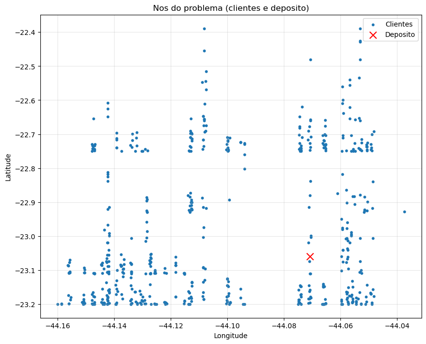
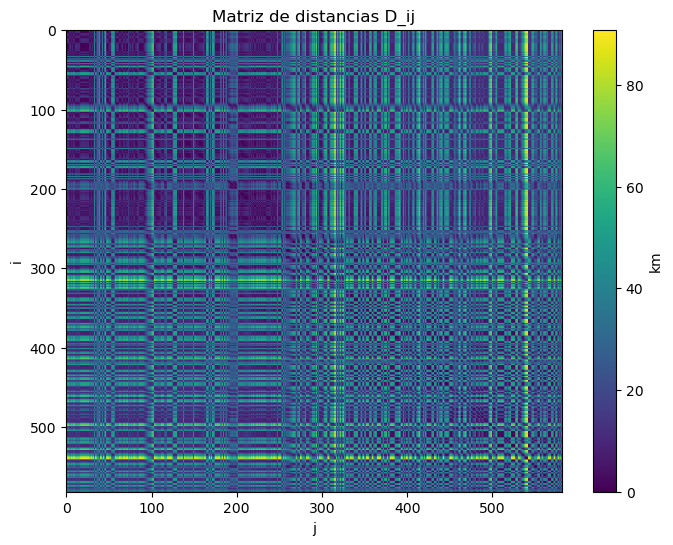
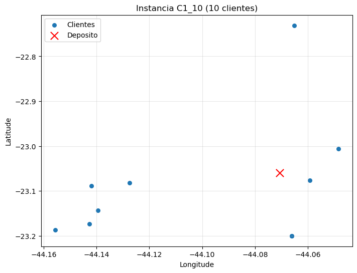
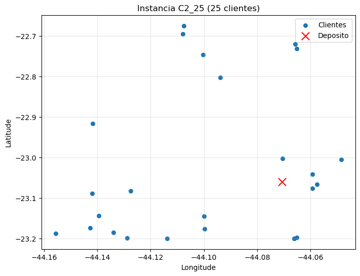
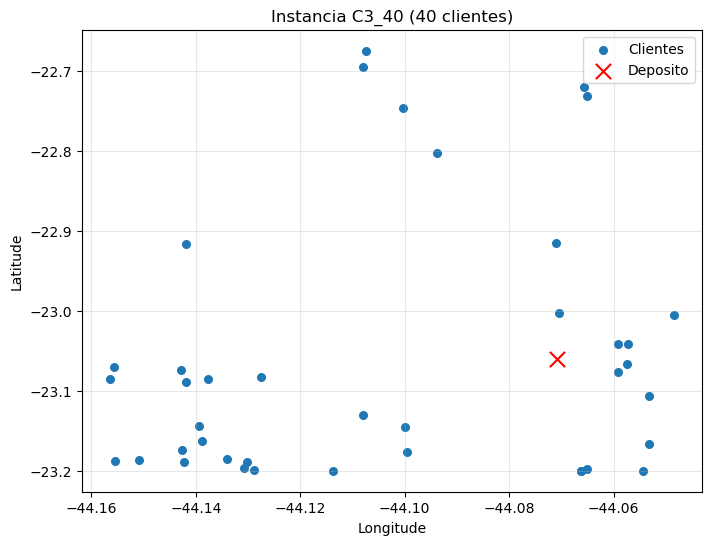
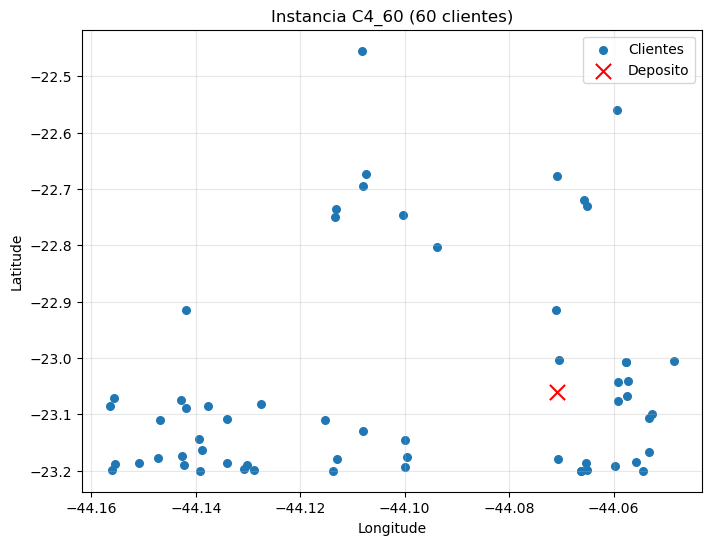

# **PUC-Rio | Departamento de Engenharia Industrial**
# **ENG 4560: Projeto Integrado VI - Distribuicao Fisica**

---

## **Aula 2 -- Preparacao, tratamento e estruturacao da base de dados**

**Grupo 2:** Rodrigo Pimentel, Bernardo Caula, Joao Felipe Leal, Lucas Campos, Lucas Terzi

---

## Objetivos

1. Transformar a base operacional real em estrutura de dados adequada para modelagem do CVRP;
2. Construir as entradas do modelo: conjunto de nos, vetor de demanda, matrizes de distancias, custos e tempos;
3. Gerar instancias C1-C4 com tamanhos crescentes para analise de escalabilidade;
4. Exportar datasets para a Aula 3 (solucao exata via PLI).

## Configuracao logistica do problema (parametros)

## 1. Leitura da base operacional

<table border="1" class="dataframe">
  <thead>
    <tr style="text-align: right;">
      <th></th>
      <th>DataEmissao</th>
      <th>CEP Entrega</th>
      <th>Qtd volumes</th>
      <th>Peso real (kg)</th>
      <th>Valor da mercadoria (R$)</th>
    </tr>
  </thead>
  <tbody>
    <tr>
      <th>0</th>
      <td>2025-06-03</td>
      <td>26383060</td>
      <td>5</td>
      <td>20.424</td>
      <td>724.23</td>
    </tr>
    <tr>
      <th>1</th>
      <td>2025-06-03</td>
      <td>26383080</td>
      <td>3</td>
      <td>9.336</td>
      <td>797.38</td>
    </tr>
    <tr>
      <th>2</th>
      <td>2025-06-03</td>
      <td>26383060</td>
      <td>1</td>
      <td>1.180</td>
      <td>24.46</td>
    </tr>
    <tr>
      <th>3</th>
      <td>2025-06-03</td>
      <td>26325282</td>
      <td>1</td>
      <td>3.174</td>
      <td>595.71</td>
    </tr>
    <tr>
      <th>4</th>
      <td>2025-06-03</td>
      <td>26311110</td>
      <td>14</td>
      <td>120.802</td>
      <td>3600.79</td>
    </tr>
  </tbody>
</table>

    Dimensoes da base bruta: (1021, 5)
    <class 'pandas.core.frame.DataFrame'>
    RangeIndex: 1021 entries, 0 to 1020
    Data columns (total 5 columns):
     #   Column                    Non-Null Count  Dtype         
    ---  ------                    --------------  -----         
     0   DataEmissao               1021 non-null   datetime64[ns]
     1   CEP Entrega               1021 non-null   int64         
     2   Qtd volumes               1021 non-null   int64         
     3   Peso real (kg)            1021 non-null   float64       
     4   Valor da mercadoria (R$)  1021 non-null   float64       
    dtypes: datetime64[ns](1), float64(2), int64(2)
    memory usage: 40.0 KB
    

## 2. Padronizacao e agregacao por cliente (CEP)

No CVRP, cada cliente $i$ deve ser um no unico. Se o mesmo CEP aparece varias vezes, somamos as demandas:

$$q_i = \sum_{\ell \in \text{linhas do CEP}} q_\ell$$

    CEPs repetidos (mesmo cliente em multiplas linhas): 243
    

    CEP
    22631002    10
    22451540     9
    22230060     6
    22753212     6
    22041012     6
    25915000     6
    25576011     6
    22451350     6
    23890001     6
    26155070     6
    Name: count, dtype: int64

    Base consolidada (um cliente por CEP): (581, 4)
    

<table border="1" class="dataframe">
  <thead>
    <tr style="text-align: right;">
      <th></th>
      <th>CEP</th>
      <th>volumes</th>
      <th>peso_kg</th>
      <th>valor_rs</th>
    </tr>
  </thead>
  <tbody>
    <tr>
      <th>0</th>
      <td>20000001</td>
      <td>24</td>
      <td>120.003</td>
      <td>5114.61</td>
    </tr>
    <tr>
      <th>1</th>
      <td>20080003</td>
      <td>4</td>
      <td>3.707</td>
      <td>746.42</td>
    </tr>
    <tr>
      <th>2</th>
      <td>20080004</td>
      <td>1</td>
      <td>1.026</td>
      <td>188.91</td>
    </tr>
    <tr>
      <th>3</th>
      <td>20211260</td>
      <td>1</td>
      <td>4.560</td>
      <td>158.05</td>
    </tr>
    <tr>
      <th>4</th>
      <td>20211270</td>
      <td>10</td>
      <td>40.233</td>
      <td>2278.68</td>
    </tr>
  </tbody>
</table>

## 3. Coordenadas e distancias

### 3.1 Distancia geografica (Haversine)

$$D_{ij} = 2R \arcsin\left(\sqrt{\sin^2\left(\frac{\phi_i-\phi_j}{2}\right) + \cos(\phi_i)\cos(\phi_j)\sin^2\left(\frac{\lambda_i-\lambda_j}{2}\right)}\right)$$

<table border="1" class="dataframe">
  <thead>
    <tr style="text-align: right;">
      <th></th>
      <th>CEP</th>
      <th>volumes</th>
      <th>peso_kg</th>
      <th>valor_rs</th>
      <th>lat</th>
      <th>lon</th>
    </tr>
  </thead>
  <tbody>
    <tr>
      <th>0</th>
      <td>20000001</td>
      <td>24</td>
      <td>120.003</td>
      <td>5114.61</td>
      <td>-23.19991</td>
      <td>-44.16000</td>
    </tr>
    <tr>
      <th>1</th>
      <td>20080003</td>
      <td>4</td>
      <td>3.707</td>
      <td>746.42</td>
      <td>-23.19973</td>
      <td>-44.15864</td>
    </tr>
    <tr>
      <th>2</th>
      <td>20080004</td>
      <td>1</td>
      <td>1.026</td>
      <td>188.91</td>
      <td>-23.19964</td>
      <td>-44.15864</td>
    </tr>
    <tr>
      <th>3</th>
      <td>20211260</td>
      <td>1</td>
      <td>4.560</td>
      <td>158.05</td>
      <td>-23.08660</td>
      <td>-44.15643</td>
    </tr>
    <tr>
      <th>4</th>
      <td>20211270</td>
      <td>10</td>
      <td>40.233</td>
      <td>2278.68</td>
      <td>-23.08570</td>
      <td>-44.15643</td>
    </tr>
  </tbody>
</table>

    

    

## 4. Construcao das matrizes logisticas $D_{ij}$, $c_{ij}$ e $t_{ij}$

- $D_{ij}$: distancia (km)
- $c_{ij} = g \cdot D_{ij}$: custo variavel (R$)
- $t_{ij} = D_{ij} / v$: tempo de deslocamento (h)

    Dimensoes: (582, 582) (582, 582) (582, 582)
    Exemplo D (km) [0:5,0:5]:
    [[0.000e+00 1.808e+01 1.799e+01 1.798e+01 9.260e+00]
     [1.808e+01 0.000e+00 1.400e-01 1.400e-01 1.260e+01]
     [1.799e+01 1.400e-01 0.000e+00 1.000e-02 1.258e+01]
     [1.798e+01 1.400e-01 1.000e-02 0.000e+00 1.257e+01]
     [9.260e+00 1.260e+01 1.258e+01 1.257e+01 0.000e+00]]
    

    

    

    Distancia maxima (km): 90.84171761612939
    

## 5. Vetor de demanda $q_i$ e tempos de atendimento

    Demanda total (kg) no dia: 25324.009
    Tempo de atendimento total (h) se visitar todos: 145.25
    

    Nenhum cliente excede a capacidade maxima da frota.
    

## 6. Instancias C1-C4 (amostragem aleatoria reprodutivel)

- C1: 10 clientes
- C2: 25 clientes
- C3: 40 clientes
- C4: 60 clientes

Selecao com seed fixa para reprodutibilidade. Equipe 2 usa o segundo bloco de 60 clientes.

    Instancias geradas para Equipe 2
      C1_10: 10 clientes
      C2_25: 25 clientes
      C3_40: 40 clientes
      C4_60: 60 clientes
    

    

    

    

    

    

    

    

    

## 7. Checagens de viabilidade (capacidade e jornada)

    
    Instancia C1_10 -- 10 clientes
      Demanda total (kg): 141.6
      Minimo teorico de Fiorinos (capacidade): 1
      Minimo teorico de VUCs (capacidade): 1
    
    Instancia C2_25 -- 25 clientes
      Demanda total (kg): 754.5
      Minimo teorico de Fiorinos (capacidade): 2
      Minimo teorico de VUCs (capacidade): 1
    
    Instancia C3_40 -- 40 clientes
      Demanda total (kg): 1295.3
      Minimo teorico de Fiorinos (capacidade): 2
      Minimo teorico de VUCs (capacidade): 1
    
    Instancia C4_60 -- 60 clientes
      Demanda total (kg): 1958.1
      Minimo teorico de Fiorinos (capacidade): 4
      Minimo teorico de VUCs (capacidade): 1
    

## 8. Exportacao dos datasets por instancia

Para cada instancia: `nodes.csv`, `D.npy`, `Cvar.npy`, `Tmov_h.npy`, `q.npy`, `s.npy`, `params.json`

    Datasets exportados em: C:\Users\rodri\OneDrive\Documentos\Claude\Cowork\Proj. Distribuição Fisica\Sprints\1\datasets
    

## 9. Sanity check

    Validacao:
    

      Equipe_2_C1_10: OK (11 nos, matriz (11, 11))
      Equipe_2_C2_25: OK (26 nos, matriz (26, 26))
    

      Equipe_2_C3_40: OK (41 nos, matriz (41, 41))
      Equipe_2_C4_60: OK (61 nos, matriz (61, 61))
    
    Sanity check OK para todas as instancias.
    
