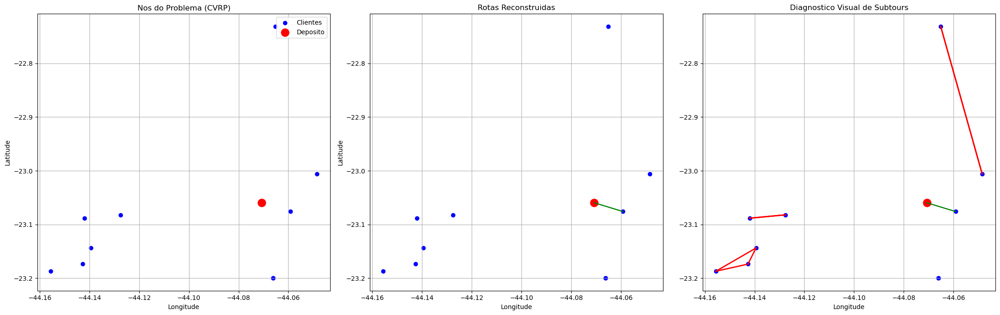

# **PUC-Rio | Departamento de Engenharia Industrial**
# **ENG 4560: Projeto Integrado VI - Distribuicao Fisica**

---

# **Aula 3 — Modelagem matematica do CVRP (Parte 1)**
**Grupo 2** — Rodrigo Pimentel, Bernardo Caula, Joao Felipe Leal, Lucas Campos, Lucas Terzi

---

## Objetivos

1. **Carregar** uma instancia preparada na Aula 2;
2. **Entender a estrutura** de um modelo de Programacao Linear Inteira (PLI/MIP) no Pyomo;
3. Definir variaveis binarias de roteamento $x_{ij}$;
4. Construir a **funcao objetivo** com custo variavel + custo fixo por veiculo (VUC);
5. Implementar restricoes: visita unica, conservacao de fluxo, balanco no deposito, capacidade agregada;
6. Resolver com solver MIP e **interpretar** resultados;
7. Diagnosticar **subtours** (ciclos desconectados do deposito) — nesta etapa **nao usamos MTZ**.

**Atencao:** ao final deste notebook, uma solucao otima do solver nem sempre representa uma solucao operacionalmente aceitavel. Essa constatacao sera fundamental para a Aula 4.

## Estrutura da Aula Pratica

1. Carregar e validar instancia
2. Definir parametros logisticos
3. Construir modelo matematico em Pyomo
4. Resolver com solver MIP
5. Interpretar solucao
6. Diagnosticar limitacoes estruturais

    Instancia selecionada: Equipe_2_C1_10
    Diretorio: ..\1\datasets\Equipe_2_C1_10
    Arquivos disponiveis: ['Cvar.npy', 'D.npy', 'nodes.csv', 'params.json', 'q.npy', 's.npy', 'Tmov_h.npy']
    

    Instancia carregada: 10 clientes + deposito
    Demanda total (kg): 141.6
    Maior demanda (kg): 53.0
    

    Numero de arcos (|A|): 110
    Variaveis binarias: 110
    

    Total aproximado de restricoes ate aqui: 30
      - out_degree: 10
      - in_degree:  10
      - flow:       10
    Isso ainda NAO garante conectividade global (ausencia de subtours).
    

    Numero aproximado de variaveis binarias: 110
    Numero de clientes: 10
    

    Resolvendo com solver: gurobi
    

    Read LP format model from file C:\Users\rodri\AppData\Local\Temp\tmpqm0337_s.pyomo.lp
    Reading time = 0.01 seconds
    x1: 32 rows, 110 columns, 430 nonzeros
    Set parameter TimeLimit to value 120
    

    Gurobi Optimizer version 13.0.1 build v13.0.1rc0 (win64 - Windows 11+.0 (26200.2))
    
    CPU model: 12th Gen Intel(R) Core(TM) i7-1260P, instruction set [SSE2|AVX|AVX2]
    Thread count: 12 physical cores, 16 logical processors, using up to 16 threads
    
    Non-default parameters:
    TimeLimit  120
    
    Optimize a model with 32 rows, 110 columns and 430 nonzeros (Min)
    Model fingerprint: 0xa2cb396b
    Model has 110 linear objective coefficients
    Variable types: 0 continuous, 110 integer (110 binary)
    Coefficient statistics:
      Matrix range     [1e+00, 3e+03]
      Objective range  [2e-02, 6e+02]
      Bounds range     [1e+00, 1e+00]
    

      RHS range        [1e+00, 1e+02]
    
    Found heuristic solution: objective 1408.3466500
    

    Presolve removed 10 rows and 0 columns
    Presolve time: 0.00s
    Presolved: 22 rows, 110 columns, 230 nonzeros
    

    Variable types: 0 continuous, 110 integer (110 binary)
    

    
    Root relaxation: objective 6.687973e+02, 16 iterations, 0.00 seconds (0.00 work units)
    

    
        Nodes    |    Current Node    |     Objective Bounds      |     Work
     Expl Unexpl |  Obj  Depth IntInf | Incumbent    BestBd   Gap | It/Node Time
    
    *    0     0               0     668.7973286  668.79733  0.00%     -    0s
    

    
    Explored 1 nodes (16 simplex iterations) in 0.01 seconds (0.00 work units)
    Thread count was 16 (of 16 available processors)
    

    
    Solution count 2: 668.797 1408.35 
    
    Optimal solution found (tolerance 1.00e-04)
    

    Best objective 6.687973286131e+02, best bound 6.687973286131e+02, gap 0.0000%
    

    
    Status: ok
    Termination condition: optimal
    Tempo de solucao: 0.07 segundos
    Tempo (min): 0.00
    Tempo (h): 0.000
    

    Custo total: R$ 668.80
    Numero de veiculos utilizados: 1
    
    Demanda total: 141.6 kg
    Capacidade total disponivel (Q * m): 3000.0 kg
    

    Total de arcos selecionados: 11
    Alguns arcos: [(0, 5), (1, 7), (2, 8), (3, 9), (4, 10), (5, 0), (6, 4), (7, 1), (8, 2), (9, 3), (10, 6)]
    
    Esperado sem subtours: 12 arcos
    Observado: 11 arcos
    

    Rotas reconstruidas:
      Rota 1 (3 nos): [0, 5, 0]
    
    Clientes totais: 10
    Clientes atendidos via deposito: 1
    

    Limite operacional de jornada: H = 8.00 h
    
    Rota 1: tempo total = 0.36 h (mov=0.11, serv=0.25) -> OK
    
    Total de rotas que violam H: 0
    

    Subtours encontrados: 4
      Subtour 1 (tamanho 2): [1, 7]
      Subtour 2 (tamanho 2): [2, 8]
      Subtour 3 (tamanho 2): [3, 9]
      Subtour 4 (tamanho 3): [4, 10, 6]
    

    

    

## Perguntas para reflexao (Aula 3)

1. **O solver errou ou seguiu exatamente o que formulamos/pedimos?**

O solver seguiu exatamente a formulacao. Ele minimizou a funcao objetivo sujeita as restricoes impostas. Se subtours apareceram, e porque a formulacao nao os proibia — nao e erro do solver, e incompletude do modelo.

2. **O modelo matematico representa completamente a operacao logistica?**

Nao. O modelo usa capacidade e jornada agregadas, sem identificacao individual de veiculos. Alem disso, nao ha restricao de eliminacao de subtours. A solucao pode conter ciclos desconectados do deposito e rotas que violam a jornada maxima.

3. **Qual restricao parece estar faltando?**

Restricoes de eliminacao de subtours (como MTZ — Miller-Tucker-Zemlin). Sem elas, o modelo permite ciclos entre clientes que nao passam pelo deposito.

4. **Como poderiamos impedir ciclos desconectados?**

Adicionando restricoes de subtour elimination. As abordagens classicas sao: (a) restricoes MTZ com variaveis auxiliares de ordem $u_i$; (b) restricoes de corte (SEC — Subtour Elimination Constraints) adicionadas iterativamente. A Aula 4 trata disso.

5. **Capacidade e jornada agregadas vs. individuais: vantagens e desvantagens?**

- **Agregadas** (como neste modelo): formulacao mais simples, menos variaveis, solver mais rapido. Porem nao garante viabilidade operacional por rota — uma rota individual pode ultrapassar capacidade ou jornada.
- **Individuais**: cada veiculo tem suas proprias restricoes, garantindo viabilidade rota a rota. Porem requer identificacao explicita dos veiculos (indice $k$), aumentando significativamente o numero de variaveis ($x_{ijk}$ em vez de $x_{ij}$).

---

## Experimentos computacionais — Todas as instancias (C1 a C4)

A celula abaixo executa o modelo MILP para as 4 instancias e consolida os resultados em uma tabela comparativa.
