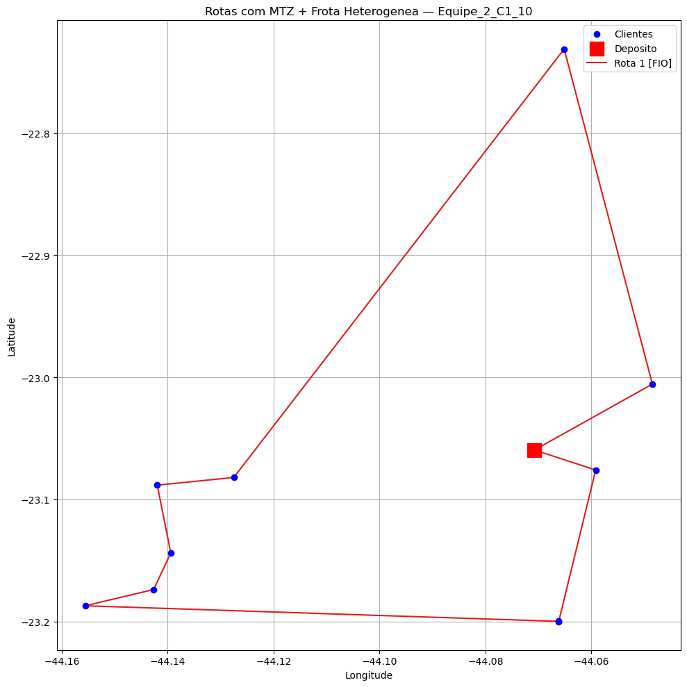
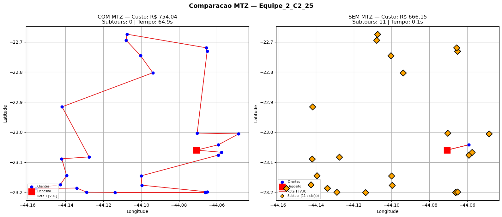
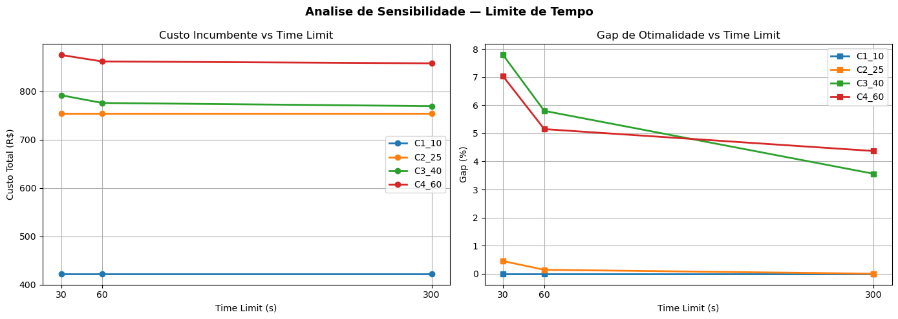

# **PUC-Rio | Departamento de Engenharia Industrial**
# **ENG 4560: Projeto Integrado VI - Distribuicao Fisica**

---

# **Aula 4 — Modelagem matematica do CVRP (Parte 2)**
**Grupo 2** — Rodrigo Pimentel, Bernardo Caula, Joao Felipe Leal, Lucas Campos, Lucas Terzi

---

## Objetivos

1. Carregar instancia preparada na Aula 2;
2. Definir parametros logisticos com **frota heterogenea** (Fiorino + VUC);
3. Construir modelo matematico com variaveis indexadas por tipo de veiculo;
4. Implementar **MTZ (Miller-Tucker-Zemlin)** para eliminacao de subtours;
5. Resolver e comparar desempenho com a Aula 3 (sem MTZ);
6. Interpretar solucao e validar operacionalmente.

**Evolucao em relacao a Aula 3:**

- Aula 3: frota homogenea (so VUC), sem eliminacao de subtours → solucoes com ciclos desconectados.
- Aula 4: frota heterogenea (Fiorino + VUC), restricoes MTZ → solucoes conectadas ao deposito.

Mais realismo → mais restricoes/variaveis → maior custo computacional.

    Instancia selecionada: Equipe_2_C1_10
    Diretorio: ..\..\2\datasets\Equipe_2_C1_10
    Arquivos disponiveis: ['Cvar.npy', 'D.npy', 'nodes.csv', 'params.json', 'q.npy', 's.npy', 'Tmov_h.npy']
    

    Instancia carregada: 10 clientes + deposito
    Demanda total (kg): 141.6
    Maior demanda (kg): 53.0
    

    Tipos de veiculos: ['FIO', 'VUC']
    Capacidades: {'FIO': 650.0, 'VUC': 3000.0}
    Custos fixos: {'FIO': 250.0, 'VUC': 550.0}
    Jornada maxima (referencia): 8.0 h
    

    Numero de arcos (|A|): 220
    Variaveis binarias x[i,j,k]: 220
    

    Variaveis binarias x[i,j,k]: 220
    Clientes: 10
    Tipos de veiculos: ['FIO', 'VUC']
    Numero de restricoes: 139
    

    Resolvendo com solver: gurobi
    Read LP format model from file C:\Users\rodri\AppData\Local\Temp\tmp1594ev5r.pyomo.lp
    Reading time = 0.01 seconds
    x1: 139 rows, 232 columns, 1266 nonzeros
    Set parameter TimeLimit to value 300
    Gurobi Optimizer version 13.0.1 build v13.0.1rc0 (win64 - Windows 11+.0 (26200.2))
    
    CPU model: 12th Gen Intel(R) Core(TM) i7-1260P, instruction set [SSE2|AVX|AVX2]
    Thread count: 12 physical cores, 16 logical processors, using up to 16 threads
    
    Non-default parameters:
    TimeLimit  300
    
    Optimize a model with 139 rows, 232 columns and 1266 nonzeros (Min)
    Model fingerprint: 0x42befacb
    Model has 222 linear objective coefficients
    Variable types: 10 continuous, 222 integer (222 binary)
    Coefficient statistics:
      Matrix range     [1e+00, 3e+03]
      Objective range  [2e-02, 6e+02]
      Bounds range     [1e+00, 1e+01]
      RHS range        [1e+00, 1e+02]
    
    Found heuristic solution: objective 1133.1731167
    Presolve removed 2 rows and 0 columns
    Presolve time: 0.00s
    Presolved: 137 rows, 232 columns, 1246 nonzeros
    Variable types: 10 continuous, 222 integer (222 binary)
    
    Root relaxation: objective 3.775117e+02, 48 iterations, 0.00 seconds (0.00 work units)
    
        Nodes    |    Current Node    |     Objective Bounds      |     Work
     Expl Unexpl |  Obj  Depth IntInf | Incumbent    BestBd   Gap | It/Node Time
    
         0     0  377.51166    0   21 1133.17312  377.51166  66.7%     -    0s
    H    0     0                    1101.5573520  377.51166  65.7%     -    0s
    H    0     0                    1065.9557901  377.51166  64.6%     -    0s
    H    0     0                     558.8903462  377.51166  32.5%     -    0s
    H    0     0                     489.8539372  377.51166  22.9%     -    0s
    H    0     0                     445.2165576  416.80802  6.38%     -    0s
    H    0     0                     441.7210571  416.80802  5.64%     -    0s
    H    0     0                     440.1127413  416.80802  5.30%     -    0s
    H    0     0                     438.8028412  416.80802  5.01%     -    0s
         0     0  416.80802    0   20  438.80284  416.80802  5.01%     -    0s
    H    0     0                     438.2900244  416.80802  4.90%     -    0s
    H    0     0                     431.2052403  416.80802  3.34%     -    0s
    H    0     0                     426.2704791  416.92774  2.19%     -    0s
         0     0  416.92774    0   22  426.27048  416.92774  2.19%     -    0s
         0     0  416.92774    0   16  426.27048  416.92774  2.19%     -    0s
         0     0  416.93967    0   21  426.27048  416.93967  2.19%     -    0s
    H    0     0                     423.6383385  416.93967  1.58%     -    0s
         0     0  417.94896    0   20  423.63834  417.94896  1.34%     -    0s
    H    0     0                     423.6285590  417.94896  1.34%     -    0s
         0     0  417.94896    0   20  423.62856  417.94896  1.34%     -    0s
         0     0  417.94896    0   20  423.62856  417.94896  1.34%     -    0s
         0     0  417.94896    0   20  423.62856  417.94896  1.34%     -    0s
    H    0     0                     422.3815874  417.94896  1.05%     -    0s
         0     0  417.95626    0   16  422.38159  417.95626  1.05%     -    0s
         0     0  417.95626    0   20  422.38159  417.95626  1.05%     -    0s
         0     0  417.95626    0   20  422.38159  417.95626  1.05%     -    0s
         0     0  417.95626    0   20  422.38159  417.95626  1.05%     -    0s
         0     0  417.95626    0   20  422.38159  417.95626  1.05%     -    0s
         0     2  417.95626    0   20  422.38159  417.95626  1.05%     -    0s
    
    Cutting planes:
      Learned: 5
      Gomory: 18
      Cover: 1
      Implied bound: 12
      MIR: 14
      RLT: 19
      Relax-and-lift: 12
    
    Explored 494 nodes (3828 simplex iterations) in 0.21 seconds (0.09 work units)
    Thread count was 16 (of 16 available processors)
    
    Solution count 10: 422.382 423.629 423.638 ... 445.217
    
    Optimal solution found (tolerance 1.00e-04)
    Best objective 4.223815873946e+02, best bound 4.223815873946e+02, gap 0.0000%
    
    Status: ok
    Termination condition: optimal
    Tempo de solucao: 0.29 segundos
    Custo total: R$ 422.38
    Veiculo tipo FIO: y=1
    Veiculo tipo VUC: y=0
    

    Total de arcos selecionados: 11
    Arcos: [(0, 2, 'FIO'), (1, 7, 'FIO'), (2, 8, 'FIO'), (3, 9, 'FIO'), (4, 10, 'FIO'), (5, 0, 'FIO'), (6, 1, 'FIO'), (7, 5, 'FIO'), (8, 3, 'FIO'), (9, 4, 'FIO'), (10, 6, 'FIO')]
    

    Rotas reconstruidas:
      Rota 1 [FIO] (10 clientes): [0, 2, 8, 3, 9, 4, 10, 6, 1, 7, 5, 0]
    

    Limite operacional (referencia): H = 8.00 h
    
    [FIO] Rota 1: 10 clientes | tempo total = 5.37 h (mov=2.87, serv=2.50) -> OK
    
    Total de rotas que violam H: 0
    
    Checagem de atendimento: OK (todos os clientes aparecem nas rotas).
    

    

    

    === CHECK OPERACIONAL (AGREGADO) ===
    Demanda total (kg): 141.6
    Capacidade total disponivel (kg): 650.0
    Tempo deslocamento da solucao (h): 2.87
    Tempo de servico total (h): 2.50
    Tempo total (h): 5.37
    m[VUC] = 0 | m[FIO] = 1
    Termination condition: optimal
    
    Obs.: H=8h NAO foi imposto no MIP. A jornada esta sendo validada por rota/veiculo.
    

## Analises de sensibilidade

Experimentos guiados para observar como a solucao reage a mudancas nos parametros.

    === EXPERIMENTO 1: Custo fixo VUC = R$ 1500 ===
    Custo total: R$ 422.38
      FIO: y=1
      VUC: y=0
    
    === EXPERIMENTO 2: Capacidade VUC = 1000 kg ===
    Custo total: R$ 422.38
      FIO: y=1
      VUC: y=0
    
    Parametros restaurados.
    

## Perguntas para reflexao

1. Por que as restricoes de grau nao garantem conectividade global?
2. Como o MTZ elimina subtours?
3. Qual foi o impacto computacional da inclusao do MTZ?
4. Por que a frota heterogenea aumenta a complexidade?
5. O modelo garante viabilidade individual por veiculo?
6. O que significa resolver ate otimo?
7. Em um sistema real, voce aguardaria a prova de otimalidade?
8. Qual modelo voce adotaria na pratica?
9. O tipo de solver impacta na qualidade da solucao? Por que?

---

## Experimentos computacionais — Todas as instancias (C1 a C4)

A celula abaixo executa o modelo MILP com MTZ e frota heterogenea para as 4 instancias e consolida os resultados em uma tabela comparativa.

    
    ============================================================
    Instancia: Equipe_2_C1_10
    ============================================================
      Custo: R$ 422.38 | VUC=0 FIO=1 | Rotas: 1 | Tempo: 0.27s | optimal
    
    ============================================================
    Instancia: Equipe_2_C2_25
    ============================================================
      Custo: R$ 754.04 | VUC=1 FIO=0 | Rotas: 1 | Tempo: 52.69s | optimal
    
    ============================================================
    Instancia: Equipe_2_C3_40
    ============================================================
    WARNING: Loading a SolverResults object with an 'aborted' status, but
    containing a solution
      Custo: R$ 769.65 | VUC=1 FIO=0 | Rotas: 1 | Tempo: 300.73s | maxTimeLimit
    
    ============================================================
    Instancia: Equipe_2_C4_60
    ============================================================
    WARNING: Loading a SolverResults object with an 'aborted' status, but
    containing a solution
      Custo: R$ 858.31 | VUC=1 FIO=0 | Rotas: 1 | Tempo: 300.88s | maxTimeLimit
    
    ============================================================
    TABELA COMPARATIVA — METODO EXATO COM MTZ + FROTA HETEROGENEA
    ============================================================
    

<table border="1" class="dataframe">
  <thead>
    <tr style="text-align: right;">
      <th></th>
      <th>Instancia</th>
      <th>Clientes</th>
      <th>Demanda (kg)</th>
      <th>Custo total (R$)</th>
      <th>VUC</th>
      <th>FIO</th>
      <th>Rotas</th>
      <th>Clientes atendidos</th>
      <th>Violacoes jornada</th>
      <th>Tempo (s)</th>
      <th>Status</th>
    </tr>
  </thead>
  <tbody>
    <tr>
      <th>0</th>
      <td>Equipe_2_C1_10</td>
      <td>10</td>
      <td>141.6</td>
      <td>422.38</td>
      <td>0</td>
      <td>1</td>
      <td>1</td>
      <td>10</td>
      <td>0</td>
      <td>0.27</td>
      <td>optimal</td>
    </tr>
    <tr>
      <th>1</th>
      <td>Equipe_2_C2_25</td>
      <td>25</td>
      <td>754.5</td>
      <td>754.04</td>
      <td>1</td>
      <td>0</td>
      <td>1</td>
      <td>25</td>
      <td>1</td>
      <td>52.69</td>
      <td>optimal</td>
    </tr>
    <tr>
      <th>2</th>
      <td>Equipe_2_C3_40</td>
      <td>40</td>
      <td>1295.3</td>
      <td>769.65</td>
      <td>1</td>
      <td>0</td>
      <td>1</td>
      <td>40</td>
      <td>1</td>
      <td>300.73</td>
      <td>maxTimeLimit</td>
    </tr>
    <tr>
      <th>3</th>
      <td>Equipe_2_C4_60</td>
      <td>60</td>
      <td>1958.1</td>
      <td>858.31</td>
      <td>1</td>
      <td>0</td>
      <td>1</td>
      <td>60</td>
      <td>1</td>
      <td>300.88</td>
      <td>maxTimeLimit</td>
    </tr>
  </tbody>
</table>

---

## Experimentos Computacionais — Sprint 1 (Aula 5)

Avaliacao sistematica do comportamento do modelo matematico, conforme exigido na Aula 5.

**Experimentos obrigatorios:**
1. Utilizacao e remocao da formulacao MTZ
2. Analise do gap x time limit (30s, 60s, 300s)
3. Comparacao de solvers

**Experimentos opcionais (ja realizados acima):**
- Variacao do custo fixo do VUC (Experimento 1, celula 20)
- Variacao da capacidade do VUC (Experimento 2, celula 20)

    Funcoes auxiliares carregadas.
    Instancias: ['Equipe_2_C1_10', 'Equipe_2_C2_25', 'Equipe_2_C3_40', 'Equipe_2_C4_60']
    Veiculos: ['FIO', 'VUC']
    Parametros: Q={'FIO': 650.0, 'VUC': 3000.0}, f={'FIO': 250.0, 'VUC': 550.0}, v=40.0 km/h
    

### Experimento 1: Utilizacao e remocao da formulacao MTZ

Comparacao sistematica do modelo **com** e **sem** as restricoes MTZ para todas as instancias (C1–C4).

Sem MTZ, o solver pode encontrar solucoes com **subtours** (ciclos desconectados do deposito), mesmo que tenham custo menor. Com MTZ, a conectividade global e garantida, ao custo de mais restricoes e maior tempo computacional.

    
    ============================================================
    Instancia: Equipe_2_C1_10
    ============================================================
      COM MTZ: R$ 422.38 | Restricoes: 139 | Subtours: 0 | Tempo: 0.79s | optimal
      SEM MTZ: R$ 368.80 | Restricoes: 49 | Subtours: 4 | Tempo: 0.13s | optimal
        Subtours encontrados: [[1, 7], [2, 8], [3, 9], [4, 6, 10]]
    
    ============================================================
    Instancia: Equipe_2_C2_25
    ============================================================
      COM MTZ: R$ 754.04 | Restricoes: 709 | Subtours: 0 | Tempo: 65.01s | optimal
      SEM MTZ: R$ 666.15 | Restricoes: 109 | Subtours: 11 | Tempo: 0.20s | optimal
        Subtours encontrados: [[1, 7, 17], [2, 18], [3, 9], [4, 10], [5, 20], [6, 19], [8, 12, 21], [13, 22], [14, 25], [15, 24], [16, 23]]
    
    ============================================================
    Instancia: Equipe_2_C3_40
    ============================================================
    WARNING: Loading a SolverResults object with an 'aborted' status, but
    containing a solution
      COM MTZ: R$ 769.65 | Restricoes: 1729 | Subtours: 0 | Tempo: 300.98s | maxTimeLimit
      SEM MTZ: R$ 676.69 | Restricoes: 169 | Subtours: 19 | Tempo: 0.17s | optimal
        Subtours encontrados: [[1, 7, 17], [2, 18], [3, 39], [4, 26], [5, 20, 35], [6, 34], [8, 12], [9, 31], [10, 40], [11, 29], [13, 28], [14, 22], [15, 24], [16, 21], [19, 30], [23, 32], [25, 38], [27, 37], [33, 36]]
    
    ============================================================
    Instancia: Equipe_2_C4_60
    ============================================================
    WARNING: Loading a SolverResults object with an 'aborted' status, but
    containing a solution
      COM MTZ: R$ 858.31 | Restricoes: 3789 | Subtours: 0 | Tempo: 300.54s | maxTimeLimit
      SEM MTZ: R$ 734.59 | Restricoes: 249 | Subtours: 28 | Tempo: 0.18s | optimal
        Subtours encontrados: [[1, 7, 17], [2, 56], [3, 39], [4, 26], [5, 20], [6, 34], [8, 12], [9, 31], [10, 49], [11, 29], [13, 28], [14, 54], [15, 24, 58], [16, 21], [18, 52], [19, 30], [22, 41], [23, 32], [25, 38], [27, 53], [33, 36], [35, 60], [37, 55], [40, 44, 47], [42, 43], [45, 48], [46, 51], [50, 57, 59]]
    
    ============================================================
    TABELA COMPARATIVA — COM vs SEM MTZ
    ============================================================
    

<table border="1" class="dataframe">
  <thead>
    <tr style="text-align: right;">
      <th></th>
      <th>Instancia</th>
      <th>Clientes</th>
      <th>MTZ</th>
      <th>Custo (R$)</th>
      <th>Gap (%)</th>
      <th>Tempo (s)</th>
      <th>Restricoes</th>
      <th>Subtours</th>
      <th>Status</th>
    </tr>
  </thead>
  <tbody>
    <tr>
      <th>0</th>
      <td>Equipe_2_C1_10</td>
      <td>10</td>
      <td>COM MTZ</td>
      <td>422.38</td>
      <td>0.00</td>
      <td>0.79</td>
      <td>139</td>
      <td>0</td>
      <td>optimal</td>
    </tr>
    <tr>
      <th>1</th>
      <td>Equipe_2_C1_10</td>
      <td>10</td>
      <td>SEM MTZ</td>
      <td>368.80</td>
      <td>0.00</td>
      <td>0.13</td>
      <td>49</td>
      <td>4</td>
      <td>optimal</td>
    </tr>
    <tr>
      <th>2</th>
      <td>Equipe_2_C2_25</td>
      <td>25</td>
      <td>COM MTZ</td>
      <td>754.04</td>
      <td>0.00</td>
      <td>65.01</td>
      <td>709</td>
      <td>0</td>
      <td>optimal</td>
    </tr>
    <tr>
      <th>3</th>
      <td>Equipe_2_C2_25</td>
      <td>25</td>
      <td>SEM MTZ</td>
      <td>666.15</td>
      <td>0.00</td>
      <td>0.20</td>
      <td>109</td>
      <td>11</td>
      <td>optimal</td>
    </tr>
    <tr>
      <th>4</th>
      <td>Equipe_2_C3_40</td>
      <td>40</td>
      <td>COM MTZ</td>
      <td>769.65</td>
      <td>3.56</td>
      <td>300.98</td>
      <td>1729</td>
      <td>0</td>
      <td>maxTimeLimit</td>
    </tr>
    <tr>
      <th>5</th>
      <td>Equipe_2_C3_40</td>
      <td>40</td>
      <td>SEM MTZ</td>
      <td>676.69</td>
      <td>0.00</td>
      <td>0.17</td>
      <td>169</td>
      <td>19</td>
      <td>optimal</td>
    </tr>
    <tr>
      <th>6</th>
      <td>Equipe_2_C4_60</td>
      <td>60</td>
      <td>COM MTZ</td>
      <td>858.31</td>
      <td>4.37</td>
      <td>300.54</td>
      <td>3789</td>
      <td>0</td>
      <td>maxTimeLimit</td>
    </tr>
    <tr>
      <th>7</th>
      <td>Equipe_2_C4_60</td>
      <td>60</td>
      <td>SEM MTZ</td>
      <td>734.59</td>
      <td>0.00</td>
      <td>0.18</td>
      <td>249</td>
      <td>28</td>
      <td>optimal</td>
    </tr>
  </tbody>
</table>

    

    

### Experimento 2: Analise do gap x time limit

Avalia como a qualidade da solucao incumbente evolui com o aumento do tempo disponivel para o solver. Para instancias pequenas (C1, C2) o solver encontra o otimo rapidamente; para instancias maiores (C3, C4), mais tempo geralmente resulta em menor gap de otimalidade.

Time limits testados: **30s, 60s, 300s**.

    
    ============================================================
    Instancia: Equipe_2_C1_10
    ============================================================
      TL= 30s: R$ 422.38 | Gap: 0.00% | Tempo: 1.08s | optimal
      TL= 60s: R$ 422.38 | Gap: 0.00% | Tempo: 0.47s | optimal
      TL=300s: R$ 422.38 | Gap: 0.00% | Tempo: 0.45s | optimal
    
    ============================================================
    Instancia: Equipe_2_C2_25
    ============================================================
    WARNING: Loading a SolverResults object with an 'aborted' status, but
    containing a solution
      TL= 30s: R$ 754.04 | Gap: 0.45% | Tempo: 30.27s | maxTimeLimit
    WARNING: Loading a SolverResults object with an 'aborted' status, but
    containing a solution
      TL= 60s: R$ 754.04 | Gap: 0.14% | Tempo: 60.38s | maxTimeLimit
      TL=300s: R$ 754.04 | Gap: 0.00% | Tempo: 64.55s | optimal
    
    ============================================================
    Instancia: Equipe_2_C3_40
    ============================================================
    WARNING: Loading a SolverResults object with an 'aborted' status, but
    containing a solution
      TL= 30s: R$ 792.17 | Gap: 7.79% | Tempo: 30.53s | maxTimeLimit
    WARNING: Loading a SolverResults object with an 'aborted' status, but
    containing a solution
      TL= 60s: R$ 776.20 | Gap: 5.80% | Tempo: 60.39s | maxTimeLimit
    WARNING: Loading a SolverResults object with an 'aborted' status, but
    containing a solution
      TL=300s: R$ 769.65 | Gap: 3.56% | Tempo: 300.92s | maxTimeLimit
    
    ============================================================
    Instancia: Equipe_2_C4_60
    ============================================================
    WARNING: Loading a SolverResults object with an 'aborted' status, but
    containing a solution
      TL= 30s: R$ 875.61 | Gap: 7.03% | Tempo: 30.54s | maxTimeLimit
    WARNING: Loading a SolverResults object with an 'aborted' status, but
    containing a solution
      TL= 60s: R$ 862.20 | Gap: 5.15% | Tempo: 60.46s | maxTimeLimit
    WARNING: Loading a SolverResults object with an 'aborted' status, but
    containing a solution
      TL=300s: R$ 858.31 | Gap: 4.37% | Tempo: 301.50s | maxTimeLimit
    
    ============================================================
    TABELA — GAP x TIME LIMIT
    ============================================================
    

<table border="1" class="dataframe">
  <thead>
    <tr style="text-align: right;">
      <th></th>
      <th>Instancia</th>
      <th>Clientes</th>
      <th>TimeLimit (s)</th>
      <th>Custo (R$)</th>
      <th>Gap (%)</th>
      <th>Tempo real (s)</th>
      <th>Status</th>
    </tr>
  </thead>
  <tbody>
    <tr>
      <th>0</th>
      <td>Equipe_2_C1_10</td>
      <td>10</td>
      <td>30</td>
      <td>422.38</td>
      <td>0.00</td>
      <td>1.08</td>
      <td>optimal</td>
    </tr>
    <tr>
      <th>1</th>
      <td>Equipe_2_C1_10</td>
      <td>10</td>
      <td>60</td>
      <td>422.38</td>
      <td>0.00</td>
      <td>0.47</td>
      <td>optimal</td>
    </tr>
    <tr>
      <th>2</th>
      <td>Equipe_2_C1_10</td>
      <td>10</td>
      <td>300</td>
      <td>422.38</td>
      <td>0.00</td>
      <td>0.45</td>
      <td>optimal</td>
    </tr>
    <tr>
      <th>3</th>
      <td>Equipe_2_C2_25</td>
      <td>25</td>
      <td>30</td>
      <td>754.04</td>
      <td>0.45</td>
      <td>30.27</td>
      <td>maxTimeLimit</td>
    </tr>
    <tr>
      <th>4</th>
      <td>Equipe_2_C2_25</td>
      <td>25</td>
      <td>60</td>
      <td>754.04</td>
      <td>0.14</td>
      <td>60.38</td>
      <td>maxTimeLimit</td>
    </tr>
    <tr>
      <th>5</th>
      <td>Equipe_2_C2_25</td>
      <td>25</td>
      <td>300</td>
      <td>754.04</td>
      <td>0.00</td>
      <td>64.55</td>
      <td>optimal</td>
    </tr>
    <tr>
      <th>6</th>
      <td>Equipe_2_C3_40</td>
      <td>40</td>
      <td>30</td>
      <td>792.17</td>
      <td>7.79</td>
      <td>30.53</td>
      <td>maxTimeLimit</td>
    </tr>
    <tr>
      <th>7</th>
      <td>Equipe_2_C3_40</td>
      <td>40</td>
      <td>60</td>
      <td>776.20</td>
      <td>5.80</td>
      <td>60.39</td>
      <td>maxTimeLimit</td>
    </tr>
    <tr>
      <th>8</th>
      <td>Equipe_2_C3_40</td>
      <td>40</td>
      <td>300</td>
      <td>769.65</td>
      <td>3.56</td>
      <td>300.92</td>
      <td>maxTimeLimit</td>
    </tr>
    <tr>
      <th>9</th>
      <td>Equipe_2_C4_60</td>
      <td>60</td>
      <td>30</td>
      <td>875.61</td>
      <td>7.03</td>
      <td>30.54</td>
      <td>maxTimeLimit</td>
    </tr>
    <tr>
      <th>10</th>
      <td>Equipe_2_C4_60</td>
      <td>60</td>
      <td>60</td>
      <td>862.20</td>
      <td>5.15</td>
      <td>60.46</td>
      <td>maxTimeLimit</td>
    </tr>
    <tr>
      <th>11</th>
      <td>Equipe_2_C4_60</td>
      <td>60</td>
      <td>300</td>
      <td>858.31</td>
      <td>4.37</td>
      <td>301.50</td>
      <td>maxTimeLimit</td>
    </tr>
  </tbody>
</table>

    

    

### Experimento 3: Comparacao de solvers

Compara o desempenho de diferentes solvers (ou configuracoes de solver) na resolucao do CVRP. Se houver apenas o Gurobi disponivel, compara diferentes estrategias do Gurobi (MIPFocus).

- **MIPFocus=0** (default): balanco entre encontrar solucoes e provar otimalidade.
- **MIPFocus=1**: prioriza encontrar solucoes viaveis rapidamente.
- **MIPFocus=2**: prioriza provar otimalidade (reduzir gap).

Executado apenas nas instancias C1 e C2 para viabilidade de tempo.

    Solvers disponiveis: ['gurobi', 'appsi_highs']
    
    Comparando 2 solvers diferentes.
    
    ============================================================
    Instancia: Equipe_2_C1_10
    ============================================================
      gurobi: R$ 422.38 | Gap: 0.00% | Tempo: 0.58s | optimal
      appsi_highs: R$ 422.38 | Gap: 0.01% | Tempo: 6.39s | optimal
    
    ============================================================
    Instancia: Equipe_2_C2_25
    ============================================================
      gurobi: R$ 754.04 | Gap: 0.00% | Tempo: 77.05s | optimal
    WARNING: Loading a feasible but suboptimal solution. Please set
    load_solution=False and check results.termination_condition and
    results.found_feasible_solution() before loading a solution.
      appsi_highs: R$ 760.18 | Gap: 6.07% | Tempo: 300.23s | maxTimeLimit
    
    ============================================================
    TABELA COMPARATIVA — SOLVERS
    ============================================================
    

<table border="1" class="dataframe">
  <thead>
    <tr style="text-align: right;">
      <th></th>
      <th>Instancia</th>
      <th>Clientes</th>
      <th>Solver</th>
      <th>Custo (R$)</th>
      <th>Gap (%)</th>
      <th>Tempo (s)</th>
      <th>Status</th>
    </tr>
  </thead>
  <tbody>
    <tr>
      <th>0</th>
      <td>Equipe_2_C1_10</td>
      <td>10</td>
      <td>gurobi</td>
      <td>422.38</td>
      <td>0.00</td>
      <td>0.58</td>
      <td>optimal</td>
    </tr>
    <tr>
      <th>1</th>
      <td>Equipe_2_C1_10</td>
      <td>10</td>
      <td>appsi_highs</td>
      <td>422.38</td>
      <td>0.01</td>
      <td>6.39</td>
      <td>optimal</td>
    </tr>
    <tr>
      <th>2</th>
      <td>Equipe_2_C2_25</td>
      <td>25</td>
      <td>gurobi</td>
      <td>754.04</td>
      <td>0.00</td>
      <td>77.05</td>
      <td>optimal</td>
    </tr>
    <tr>
      <th>3</th>
      <td>Equipe_2_C2_25</td>
      <td>25</td>
      <td>appsi_highs</td>
      <td>760.18</td>
      <td>6.07</td>
      <td>300.23</td>
      <td>maxTimeLimit</td>
    </tr>
  </tbody>
</table>

