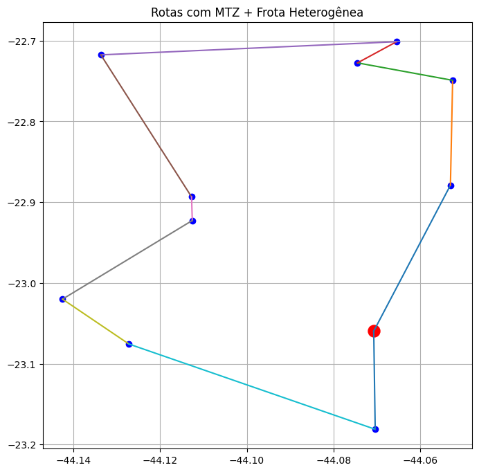

# **PUC-Rio | Departamento de Engenharia Industrial**
# **ENG 4560: Projeto Integrado VI - Distribuição Física**

---

# **Aula 4 — Modelagem matemática do CVRP (Parte 2)**  
**Prof. Marcello Congro (marcellocongro@puc-rio.br)**

---

## 🎯 Estrutura da Aula:
1. Carregar instância
2. Definir parâmetros logísticos (heterogêneo)
3. Construir modelo matemático
4. Resolver
5. Comparar desempenho
6. Interpretar solução

---

## 🧠 Ideia central desta aula (por que ela existe?)

Na **Aula 3**, construímos um primeiro modelo para o CVRP e vimos um comportamento clássico quando a formulação ainda está incompleta:

- o solver pode encontrar uma solução "ótima" **com subtours** (ciclos desconectados do depósito).

Nesta **Aula 4**, vamos fazer duas melhorias fundamentais **no modelo** (não no solver):

1. **Frota heterogênea** (1 VUC + 3 Fiorinos): aproxima a modelagem da operação real.
2. **MTZ (Miller–Tucker–Zemlin)**: adiciona conectividade global e **elimina subtours**.

⚠️ Mensagem-chave: **mais realismo → mais restrições/variáveis → maior custo computacional**.  
Isso prepara o terreno para discutir escalabilidade, limites de métodos exatos e (nas próximas aulas) heurísticas.

---

## ✅ O que você deve conseguir responder ao final

1. Por que "restrições de grau" (entrar/sair 1x) **não** garantem uma rota conectada ao depósito?
2. O que o MTZ faz *na prática* e por que ele aumenta a dificuldade computacional?
3. Em que sentido a frota heterogênea muda o espaço de decisão do problema?
4. Por que uma solução ótima (MILP) pode ser inviável como decisão gerencial se o tempo de solução for alto?

## **Como trabalhar neste notebook**

Este material foi estruturado como estudo guiado.

Recomenda-se:

1. Ler antes de executar;
2. Discutir em grupo as perguntas indicadas;
3. Observar cuidadosamente os tempos de solução.

Evite executar todas as células de uma vez.

    Get:1 http://security.ubuntu.com/ubuntu jammy-security InRelease [129 kB]
    Get:2 https://cloud.r-project.org/bin/linux/ubuntu jammy-cran40/ InRelease [3,632 B]
    Get:3 https://cli.github.com/packages stable InRelease [3,917 B]
    Get:4 https://r2u.stat.illinois.edu/ubuntu jammy InRelease [6,555 B]
    Hit:5 http://archive.ubuntu.com/ubuntu jammy InRelease
    Get:6 https://cloud.r-project.org/bin/linux/ubuntu jammy-cran40/ Packages [85.0 kB]
    Get:7 http://archive.ubuntu.com/ubuntu jammy-updates InRelease [128 kB]
    Get:8 https://cli.github.com/packages stable/main amd64 Packages [355 B]
    Get:9 http://security.ubuntu.com/ubuntu jammy-security/main amd64 Packages [3,737 kB]
    Get:10 https://ppa.launchpadcontent.net/deadsnakes/ppa/ubuntu jammy InRelease [18.1 kB]
    Get:11 http://security.ubuntu.com/ubuntu jammy-security/universe amd64 Packages [1,301 kB]
    Get:12 http://security.ubuntu.com/ubuntu jammy-security/restricted amd64 Packages [6,538 kB]
    Get:13 https://r2u.stat.illinois.edu/ubuntu jammy/main all Packages [9,766 kB]
    Get:14 https://ppa.launchpadcontent.net/ubuntugis/ppa/ubuntu jammy InRelease [24.6 kB]
    Get:15 http://archive.ubuntu.com/ubuntu jammy-backports InRelease [127 kB]
    Get:16 http://security.ubuntu.com/ubuntu jammy-security/multiverse amd64 Packages [62.6 kB]
    Get:17 https://ppa.launchpadcontent.net/deadsnakes/ppa/ubuntu jammy/main amd64 Packages [39.2 kB]
    Get:18 https://r2u.stat.illinois.edu/ubuntu jammy/main amd64 Packages [2,908 kB]
    Get:19 http://archive.ubuntu.com/ubuntu jammy-updates/universe amd64 Packages [1,613 kB]
    Get:20 https://ppa.launchpadcontent.net/ubuntugis/ppa/ubuntu jammy/main amd64 Packages [75.3 kB]
    Get:21 http://archive.ubuntu.com/ubuntu jammy-updates/main amd64 Packages [4,070 kB]
    Get:22 http://archive.ubuntu.com/ubuntu jammy-updates/multiverse amd64 Packages [70.9 kB]
    Get:23 http://archive.ubuntu.com/ubuntu jammy-updates/restricted amd64 Packages [6,749 kB]
    Fetched 37.5 MB in 4s (10.7 MB/s)
    Reading package lists... Done
    W: Skipping acquire of configured file 'main/source/Sources' as repository 'https://r2u.stat.illinois.edu/ubuntu jammy InRelease' does not seem to provide it (sources.list entry misspelt?)
    Reading package lists... Done
    Building dependency tree... Done
    Reading state information... Done
    The following additional packages will be installed:
      coinor-libcbc3 coinor-libcgl1 coinor-libclp1 coinor-libcoinutils3v5
      coinor-libosi1v5
    The following NEW packages will be installed:
      coinor-cbc coinor-libcbc3 coinor-libcgl1 coinor-libclp1
      coinor-libcoinutils3v5 coinor-libosi1v5
    0 upgraded, 6 newly installed, 0 to remove and 82 not upgraded.
    Need to get 2,908 kB of archives.
    After this operation, 8,310 kB of additional disk space will be used.
    Get:1 http://archive.ubuntu.com/ubuntu jammy/universe amd64 coinor-libcoinutils3v5 amd64 2.11.4+repack1-2 [465 kB]
    Get:2 http://archive.ubuntu.com/ubuntu jammy/universe amd64 coinor-libosi1v5 amd64 0.108.6+repack1-2 [275 kB]
    Get:3 http://archive.ubuntu.com/ubuntu jammy/universe amd64 coinor-libclp1 amd64 1.17.5+repack1-1 [937 kB]
    Get:4 http://archive.ubuntu.com/ubuntu jammy/universe amd64 coinor-libcgl1 amd64 0.60.3+repack1-3 [420 kB]
    Get:5 http://archive.ubuntu.com/ubuntu jammy/universe amd64 coinor-libcbc3 amd64 2.10.7+ds1-1 [799 kB]
    Get:6 http://archive.ubuntu.com/ubuntu jammy/universe amd64 coinor-cbc amd64 2.10.7+ds1-1 [11.6 kB]
    Fetched 2,908 kB in 1s (2,784 kB/s)
    Selecting previously unselected package coinor-libcoinutils3v5:amd64.
    (Reading database ... 117540 files and directories currently installed.)
    Preparing to unpack .../0-coinor-libcoinutils3v5_2.11.4+repack1-2_amd64.deb ...
    Unpacking coinor-libcoinutils3v5:amd64 (2.11.4+repack1-2) ...
    Selecting previously unselected package coinor-libosi1v5:amd64.
    Preparing to unpack .../1-coinor-libosi1v5_0.108.6+repack1-2_amd64.deb ...
    Unpacking coinor-libosi1v5:amd64 (0.108.6+repack1-2) ...
    Selecting previously unselected package coinor-libclp1.
    Preparing to unpack .../2-coinor-libclp1_1.17.5+repack1-1_amd64.deb ...
    Unpacking coinor-libclp1 (1.17.5+repack1-1) ...
    Selecting previously unselected package coinor-libcgl1:amd64.
    Preparing to unpack .../3-coinor-libcgl1_0.60.3+repack1-3_amd64.deb ...
    Unpacking coinor-libcgl1:amd64 (0.60.3+repack1-3) ...
    Selecting previously unselected package coinor-libcbc3:amd64.
    Preparing to unpack .../4-coinor-libcbc3_2.10.7+ds1-1_amd64.deb ...
    Unpacking coinor-libcbc3:amd64 (2.10.7+ds1-1) ...
    Selecting previously unselected package coinor-cbc.
    Preparing to unpack .../5-coinor-cbc_2.10.7+ds1-1_amd64.deb ...
    Unpacking coinor-cbc (2.10.7+ds1-1) ...
    Setting up coinor-libcoinutils3v5:amd64 (2.11.4+repack1-2) ...
    Setting up coinor-libosi1v5:amd64 (0.108.6+repack1-2) ...
    Setting up coinor-libclp1 (1.17.5+repack1-1) ...
    Setting up coinor-libcgl1:amd64 (0.60.3+repack1-3) ...
    Setting up coinor-libcbc3:amd64 (2.10.7+ds1-1) ...
    Setting up coinor-cbc (2.10.7+ds1-1) ...
    Processing triggers for man-db (2.10.2-1) ...
    Processing triggers for libc-bin (2.35-0ubuntu3.11) ...
    /sbin/ldconfig.real: /usr/local/lib/libtbbmalloc_proxy.so.2 is not a symbolic link
    
    /sbin/ldconfig.real: /usr/local/lib/libumf.so.1 is not a symbolic link
    
    /sbin/ldconfig.real: /usr/local/lib/libtcm_debug.so.1 is not a symbolic link
    
    /sbin/ldconfig.real: /usr/local/lib/libur_adapter_opencl.so.0 is not a symbolic link
    
    /sbin/ldconfig.real: /usr/local/lib/libur_adapter_level_zero_v2.so.0 is not a symbolic link
    
    /sbin/ldconfig.real: /usr/local/lib/libur_loader.so.0 is not a symbolic link
    
    /sbin/ldconfig.real: /usr/local/lib/libtbbbind.so.3 is not a symbolic link
    
    /sbin/ldconfig.real: /usr/local/lib/libtcm.so.1 is not a symbolic link
    
    /sbin/ldconfig.real: /usr/local/lib/libtbbbind_2_5.so.3 is not a symbolic link
    
    /sbin/ldconfig.real: /usr/local/lib/libhwloc.so.15 is not a symbolic link
    
    /sbin/ldconfig.real: /usr/local/lib/libtbb.so.12 is not a symbolic link
    
    /sbin/ldconfig.real: /usr/local/lib/libtbbbind_2_0.so.3 is not a symbolic link
    
    /sbin/ldconfig.real: /usr/local/lib/libur_adapter_level_zero.so.0 is not a symbolic link
    
    /sbin/ldconfig.real: /usr/local/lib/libtbbmalloc.so.2 is not a symbolic link
    
    

    Faça upload dos arquivos da instância
    

     <input type="file" id="files-13887c15-2b99-4ba6-bbdd-7eaf7828698c" name="files[]" multiple disabled
        style="border:none" />
     <output id="result-13887c15-2b99-4ba6-bbdd-7eaf7828698c">
      Upload widget is only available when the cell has been executed in the
      current browser session. Please rerun this cell to enable.
      </output>
       

    Saving Cvar.npy to Cvar.npy
    Saving D.npy to D.npy
    Saving nodes.csv to nodes.csv
    Saving params.json to params.json
    Saving q.npy to q.npy
    Saving s.npy to s.npy
    Saving Tmov_h.npy to Tmov_h.npy
    Arquivos disponíveis:
    ['.config', 'q.npy', 'Cvar.npy', 'D.npy', 'nodes.csv', 'params.json', 's.npy', 'Tmov_h.npy', 'sample_data']
    

    Instância carregada: 10 clientes + depósito
    

### Pergunta rápida

Se cada cliente possui exatamente uma entrada e uma saída,
por que ainda podem existir ciclos desconectados?

Discuta com sua equipe antes de continuar.

    Variáveis binárias: 220
    Clientes: 10
    Tipos de veículos: ['FIO', 'VUC']
    Número de restrições: 141
    

    Collecting gurobipy
      Downloading gurobipy-13.0.1-cp312-cp312-manylinux2014_x86_64.manylinux_2_17_x86_64.whl.metadata (16 kB)
    Downloading gurobipy-13.0.1-cp312-cp312-manylinux2014_x86_64.manylinux_2_17_x86_64.whl (14.8 MB)
       ━━━━━━━━━━━━━━━━━━━━━━━━━━━━━━━━━━━━━━━━ 14.8/14.8 MB 62.2 MB/s eta 0:00:00
    [?25hInstalling collected packages: gurobipy
    Successfully installed gurobipy-13.0.1
    

    Status: ok
    Termination: optimal
    Tempo: 4.663939952850342
    Custo total: 722.9807851623269
    Veículos tipo FIO: 0.0
    Veículos tipo VUC: 1.0
    

    Arcos selecionados: [(0, 5, 'VUC'), (1, 9, 'VUC'), (2, 6, 'VUC'), (3, 0, 'VUC'), (4, 7, 'VUC'), (5, 2, 'VUC'), (6, 4, 'VUC'), (7, 10, 'VUC'), (8, 3, 'VUC'), (9, 8, 'VUC'), (10, 1, 'VUC')]
    

    Limite operacional (referência): H = 8.00 h
    
    [VUC] Rota 1: tempo total = 5.38 h (mov=2.88, serv=2.50) -> OK
    
    Total de rotas que violam H: 0
    
    Checagem de atendimento: OK (todos os clientes aparecem nas rotas).
    

        Clientes atendidos: 10
        Tempo médio total por cliente: 0.54 h/cliente
        Tempo médio de serviço por cliente: 0.25 h/cliente
        Tempo médio de deslocamento por cliente: 0.29 h/cliente
        % tempo em deslocamento: 53.6%
    

    

    

    === CHECK OPERACIONAL (AGREGADO) ===
    Demanda total (kg): 2562.8
    Capacidade total disponível (kg): 3000.0
    Tempo deslocamento da solução (h): 2.88
    Tempo de serviço total (h): 2.50
    Tempo total (h): 5.38
    m[VUC] = 1.0 | m[FIO] = 0.0
    Termination condition: optimal
    
    Obs.: H=8h NÃO foi imposto no MIP. A jornada está sendo validada por rota/veículo.
    

    
    Resolvendo com limite de 300 segundos...
    
    Set parameter TimeLimit to value 300
    Gurobi Optimizer version 13.0.1 build v13.0.1rc0 (linux64 - "Ubuntu 22.04.5 LTS")
    
    CPU model: Intel(R) Xeon(R) CPU @ 2.20GHz, instruction set [SSE2|AVX|AVX2]
    Thread count: 1 physical cores, 2 logical processors, using up to 2 threads
    
    Non-default parameters:
    TimeLimit  300
    
    Optimize a model with 141 rows, 232 columns and 1268 nonzeros (Min)
    Model fingerprint: 0xb884c1ff
    Model has 222 linear objective coefficients
    Variable types: 10 continuous, 222 integer (222 binary)
    Coefficient statistics:
      Matrix range     [1e+00, 3e+03]
      Objective range  [5e+00, 6e+02]
      Bounds range     [1e+00, 1e+01]
      RHS range        [1e+00, 3e+03]
    
    Found heuristic solution: objective 1203.4506756
    Presolve removed 5 rows and 1 columns
    Presolve time: 0.01s
    Presolved: 136 rows, 231 columns, 1242 nonzeros
    Variable types: 10 continuous, 221 integer (221 binary)
    
    Root relaxation: objective 6.661802e+02, 28 iterations, 0.00 seconds (0.00 work units)
    
        Nodes    |    Current Node    |     Objective Bounds      |     Work
     Expl Unexpl |  Obj  Depth IntInf | Incumbent    BestBd   Gap | It/Node Time
    
         0     0  666.18017    0   20 1203.45068  666.18017  44.6%     -    0s
    H    0     0                    1126.1400990  666.18017  40.8%     -    0s
    H    0     0                    1108.9119166  666.18017  39.9%     -    0s
         0     0  667.53595    0   20 1108.91192  667.53595  39.8%     -    0s
    H    0     0                    1072.3346199  667.53595  37.7%     -    0s
    H    0     0                    1070.0530323  667.53595  37.6%     -    0s
         0     0  667.53595    0   20 1070.05303  667.53595  37.6%     -    0s
         0     0  667.53595    0   20 1070.05303  667.53595  37.6%     -    0s
         0     0  667.53595    0   20 1070.05303  667.53595  37.6%     -    0s
         0     0  667.53595    0   20 1070.05303  667.53595  37.6%     -    0s
         0     0  667.53595    0   20 1070.05303  667.53595  37.6%     -    0s
    H    0     0                    1059.2696474  667.53595  37.0%     -    0s
    H    0     0                    1054.8066001  667.53595  36.7%     -    0s
    H    0     0                    1051.0159042  667.53595  36.5%     -    0s
    H    0     0                    1049.3211780  667.53595  36.4%     -    0s
         0     2  668.18941    0   20 1049.32118  668.18941  36.3%     -    0s
    H   18    18                    1048.7490940  668.18941  36.3%   6.0    0s
    H   40    40                    1029.5068358  668.18941  35.1%   5.2    0s
    H   40    40                     779.5068358  668.18941  14.3%   5.2    0s
    *   43    42              34     755.8673671  668.18941  11.6%   5.6    0s
    *   44    41              35     735.7100254  668.18941  9.18%   5.6    0s
    H  104    86                     728.0047954  670.63493  7.88%   5.0    0s
    H  817   370                     726.8224056  680.53413  6.37%   5.5    0s
    H 1095   433                     722.9807852  681.48567  5.74%   6.1    0s
    
    Explored 4040 nodes (25784 simplex iterations) in 1.92 seconds (0.65 work units)
    Thread count was 2 (of 2 available processors)
    
    Solution count 10: 722.981 726.822 728.005 ... 1051.02
    
    Optimal solution found (tolerance 1.00e-04)
    Best objective 7.229807851623e+02, best bound 7.229807851623e+02, gap 0.0000%
    
    Status: ok
    Termination condition: optimal
    Tempo de solução: 1.99 segundos
    Custo incumbente: 722.9807851623269
    

## **Para Casa**: Análises de sensibilidade

Responda brevemente às perguntas abaixo:

1. Por que as restrições de grau não garantem conectividade global?

2. Como o MTZ elimina subtours?

3. Qual foi o impacto computacional da inclusão do MTZ?

4. Por que a frota heterogênea aumenta a complexidade?

5. O modelo garante viabilidade individual por veículo?

6. O que significa resolver até ótimo?

7. Em um sistema real, você aguardaria a prova de otimalidade?

8. Qual modelo você adotaria na prática?

9. O tipo de solver impacta na qualidade da solução? Por quê?

- Na Aula 3, vimos que o solver pode gerar subtours porque o modelo não impunha conectividade global.  

- Na Aula 4, o MTZ corrige isso, mas aumenta a dificuldade computacional, motivando a inclusão de limites de tempo ou utilização de outros métodos para resolver o problema (heurísticas e metaheurísticas).
